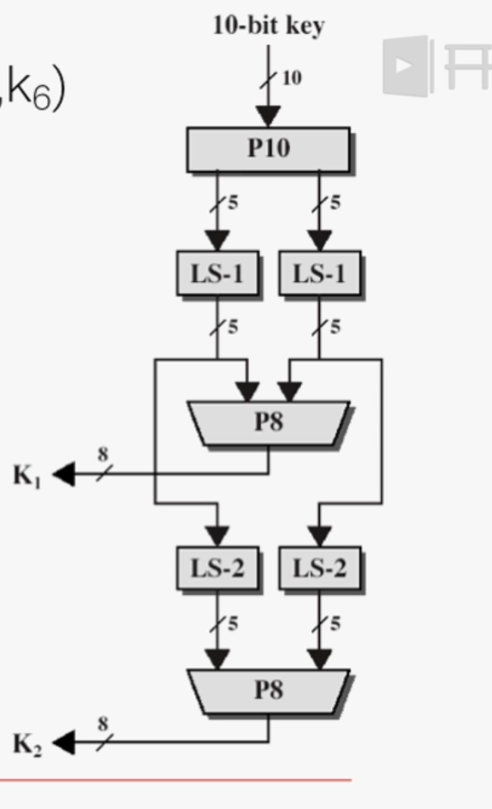

# S-DES（简化数据加密标准）——密钥生成详解

# 1. 总体流程（概览）

1. 输入：**10 位主密钥**（记作 K = k1 k2 ... k10）。
2. 先对主密钥做 **P10** 置换（把 10 位按指定顺序重排）。
3. 将置换结果左右各分为 5 位（左半 L，右半 R）。
4. 对左右半分别做 **循环左移（LS）**，一次左移得到 LS-1；把 LS-1 的左右拼回再经 **P8** 置换得到子密钥 **K1**（8 位）。
5. 在 LS-1 的基础上再对左右半各做两位循环左移（LS-2），拼回再经 **P8** 得到子密钥 **K2**（8 位）。



---

# 2. 具体置换与移位定义

* **P10**（把 10 位按此顺序重排）：
  P10 = \[3, 5, 2, 7, 4, 10, 1, 9, 8, 6]
  也就是说，P10 输出的第 1 位是原来第 3 位，第 2 位是原来第 5 位，……第 10 位是原来第 6 位。
* **P8**（从 10 位中选 8 位并重排，形成子密钥）：
  P8 = \[6, 3, 7, 4, 8, 5, 10, 9]
* **循环左移（LS）**：对 5 位半字进行循环左移（左移一位或两位）：

  * LS-1：每个半字左移 1 位（最左的位移到最右）。
  * LS-2：在 LS-1 的结果上再左移 2 位（等同于从原半字左移 3 位，但通常按步骤做：LS-1 后再做 LS-2）。

---

# 3. 逐步示例（常用示例：主密钥 1010000010）

我们以主密钥 `K = 1 0 1 0 0 0 0 0 1 0`（写作 `1010000010`）为例，按步骤求出 K1 和 K2。

1. **P10 置换**（按 P10 = 3 5 2 7 4 10 1 9 8 6）：
   原键 `1 0 1 0 0 0 0 0 1 0` 的第 3 位是 `1`，第 5 位是 `0`，……得到：
   `P10(K) = 1 0 0 0 0 0 1 1 0 0` （写作 `1000001100`）
2. **分左右半**（各 5 位）：
   L = `10000`
   R = `01100`
3. **LS-1**（左右各循环左移 1 位）：
   L1 = `00001`（把 `10000` 左移 1 位）
   R1 = `11000`（把 `01100` 左移 1 位）
4. **拼回并做 P8 → 得到 K1**：
   拼回 `L1|R1 = 0000111000`，按 P8 取位 `[6,3,7,4,8,5,10,9]`：
   结果 `K1 = 10100100`（8 位）
5. **在 LS-1 基础上做 LS-2（对 L1、R1 各左移 2 位）**：
   L2 = 把 `00001` 左移 2 位 → `00100`
   R2 = 把 `11000` 左移 2 位 → `00011`
6. **拼回并做 P8 → 得到 K2**：
   拼回 `L2|R2 = 0010000011`，按 P8：
   结果 `K2 = 01000011`（8 位）

所以对于主密钥 `1010000010`，得到：

* K1 = `10100100`
* K2 = `01000011`

（上面是 S-DES 教材/论文中最常见的示例结果，便于验证实现是否正确。）

---

# 4. 为什么这么做？设计意图与要点

* S-DES 的目的在于教学：展示经典分组密码（如 DES）的核心思想（置换、选择、轮键、移位、S-盒等），但把规模降得小，便于手工计算与教学。
* **P10** 和 **P8** 是固定的置换（相当于把主密钥错位并选择特定位），这能打散原始密钥的位分布。
* **循环左移** 提供轮间差异（同一主密钥经过不同的移位产生不同轮密钥），这类似于真实 DES 的子密钥日程（但 S-DES 极其简化）。
* 产生两个不同子密钥用于两轮 Feistel，加密/解密时子密钥的使用顺序会影响操作（解密时使用 K2 然后 K1，即逆序）。

---

# 5. 简短伪代码（帮助实现）

```
输入: key10 (长度10字符串)
P10 = [3,5,2,7,4,10,1,9,8,6]
P8  = [6,3,7,4,8,5,10,9]

# 1. P10
p10 = permute(key10, P10)   # 返回长度10字符串

# 2. split
L = p10[0:5]
R = p10[5:10]

# 3. LS-1
L1 = leftshift(L,1)
R1 = leftshift(R,1)
K1 = permute(L1+R1, P8)

# 4. LS-2 (在 L1,R1 基础上再左移2)
L2 = leftshift(L1,2)
R2 = leftshift(R1,2)
K2 = permute(L2+R2, P8)

返回 K1, K2
```

---
