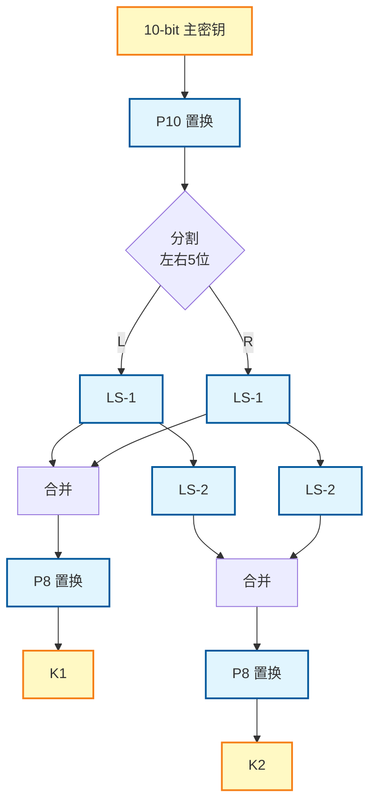
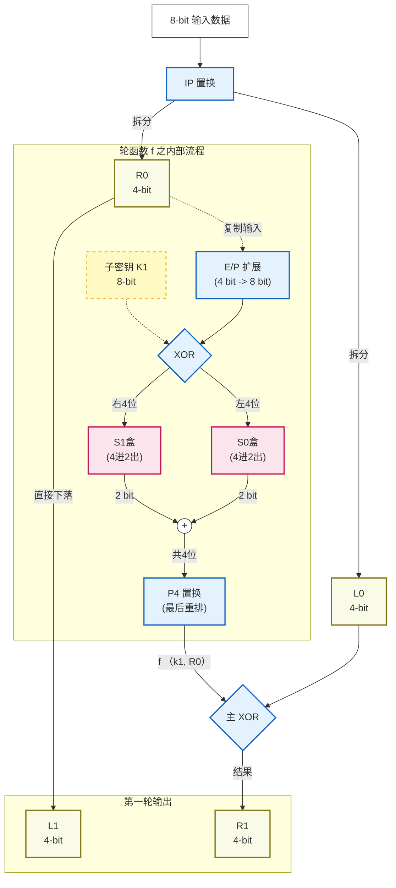

# 第三章 分组密码与DES 学习笔记

## 1. 分组密码与Feistel密码

### 1.1 什么是分组密码 (Block Cipher)？

* **核心思想**：将要加密的明文消息分割成固定长度的“组”（Block），然后使用同一个密钥对每个组分别进行加密。
* **过程**：
  1. **划分**：将明文序列划分为长度为n的组。
  2. **加密**：在密钥的控制下，将每个明文组变换成等长的密文组。
* **本质**：分组密码可以看作是一个非常庞大的、可逆的“代换”操作。对于一个n位的分组，存在 $2^{2^n}$ 种可能的可逆变换。

### 1.2 混乱 (Confusion) 与扩散 (Diffusion)

这是由信息论创始人克劳德·香农（Claude Shannon）提出的设计理想密码系统的两个基本原则：

* **混乱 (Confusion)**：使密文的统计特性与密钥之间的关系尽可能复杂。简单来说，就是让攻击者无法通过分析密文来推断出密钥的任何信息。主要通过“代换”（S盒）来实现。
* **扩散 (Diffusion)**：将明文的统计结构扩散、打乱到长串的密文中。简单来说，就是让明文中的任何一位变化，都能影响到密文中的许多位。主要通过“置换”（P盒）来实现。

现代分组密码的基础就是基于“代换-置换网络”（Substitution-Permutation Network, SPN）来实现混乱和扩散。

### 1.3 Feistel 密码结构

这是现代许多对称分组密码（包括DES）所采用的核心结构。

#### 设计思想：

1. 将输入的明文块分成左右两半：L0 和 R0。
2. 进行多轮（Rounds）迭代处理。
3. 在每一轮迭代中，使用一个“轮函数” F 来处理数据。

#### 加密过程（第 i 轮）：

* **新的左半部分$L_i$**：直接来自上一轮的右半部分：

  $$
  L_i = R_{i-1}
  $$
* **新的右半部分$R_i$**：由上一轮的左半部分与轮函数 $F$ 的输出进行异或（XOR）：

  $$
  R_i = L_{i-1} \oplus F\!\bigl(R_{i-1}, K_i\bigr)
  $$
* **下一轮输出**即 $(L_i, R_i)$。

#### 解密过程：

  Feistel结构最巧妙的优点在于：无论轮函数 F 多么复杂，加密和解密的过程都非常相似。
  只需将子密钥按相反的顺序使用，复用加密流程即可。这大大简化了硬件实现。

## 2. S-DES (简化版DES)

S-DES是一个教学版的DES，保留了DES的核心思想，但参数规模小得多，便于理解和手动计算。

* **输入**：8位明文，10位密钥。
* **输出**：8位密文。
* **5阶段架构**：

$$
Cipher = IP^{-1} \circ f_{K2} \circ SW \circ f_{K1} \circ IP(Plain)
$$

其中：IP（初始置换）$\to$ $f_{K1}$（第一轮）$\to$ **SW（显式交换函数）** $\to$ $f_{K2}$（第二轮）$\to$ $IP^{-1}$（逆置换）

> **SW 的说明**：在S-DES 中，用的不是标准的Fesitel操作，而是将其$L_i=R_{i-1} \ ; \ R_i = L_{i-1} \oplus F\!\bigl(R_{i-1}, K_i\bigr)$中隐含的交换逻辑进行显式说明，仅供教学使用。。

### 2.0.1  **S-DES 整体密钥生成流程图**:



### 2.0.2 **S-DES Fesitel操作流程图(省略了所谓的显式交换函数SW)：**



### 2.1 S-DES 密钥生成详解

从10位主密钥 K 生成两个8位的子密钥 K1 和 K2。这个过程本身就是一个迷你的加密过程，目的是打乱和变换原始密钥。

1. **P10置换 (Permutation 10\)**
   * **什么是置换？** 置换就是“重新排列位置”。P10置换表规定了如何将输入的10个比特重新排序(而p8置换同理)。
   * **工作原理**：假设P10置换表是 (3, 5, 2, 7, 4, 10, 1, 9, 8, 6)。这意味着，输出的第1位是输入的第3位，输出的第2位是输入的第5位，以此类推。它只改变位置，不改变比特的值。
2. **分割**
   * **工作原理**：将经过P10置换后的10位密钥，简单地从中间分开，变成左、右两个各5位的部分。
3. **生成K1**
   * **循环左移1位 (LS-1)**：对分割后的左、右两个5位部分分别执行循环左移1位。
   * **P8置换 (Permutation 8\)**：将在上一步移位后合并成的10位密钥中，根据P8置换表，挑选出8位并重新排列，得到第一个子密钥 K1。
4. **生成K2**
   * **循环左移2位 (LS-2)**：在当前生成K1的移位结果的基础上的，再对左、右两半分别执行循环左移2位。
   * **P8置换**：将再次移位并合并后的10位密钥，通过同一个P8置换表，生成第二个子密钥 K2。

#### 2.1.1 密钥生成实例

假设主密钥 K \= (1010000010)。
P10置换表为 (3, 5, 2, 7, 4, 10, 1, 9, 8, 6\)
P8置换表为 (6, 3, 7, 4, 8, 5, 10, 9\)

1. **P10置置换**
   * 输入 (K): 1 0 1 0 0 0 0 0 1 0 (位置 1 到 10\)
   * 输出: 1 0 0 0 0 0 1 1 0 0
2. **分割**
   * 输入: 1000001100
   * 左半部分 (L): 10000
   * 右半部分 (R): 01100
3. **生成 K1**
   * 循环左移1位 (LS-1):
     * L: 10000 \-\> 00001
     * R: 01100 \-\> 11000
   * 合并: 0000111000
   * P8置换:
     * 输入: 0 0 0 0 1 1 1 0 0 0 (位置 1 到 10\)
     * 输出 (K1): 10100100
4. **生成 K2**
   * 在LS-1结果上再循环左移2位 (LS-2):
     * L: 00001 \-\> 00100
     * R: 11000 \-\> 00011
   * 合并: 0010000011
   * P8置换:
     * 输入: 0 0 1 0 0 0 0 0 1 1 (位置 1 到 10\)
     * 输出 (K2): 01000011

最终，我们从主密钥 1010000010 得到了两个子密钥:
K1 \= 10100100
K2 \= 01000011

### 2.2 S-DES 加密流程详解

本质就是利用Feistel结构，和上面生成的子密钥，进行两轮加密处理。

1. **初始置換 (IP \- Initial Permutation)**

   * **工作原理**：IP是一个固定的置换表，它将输入的8个比特按照一个预设的规则重新排列位置。
   * **互逆关系**：每一个置换操作（IP），都有一个唯一的逆置换操作（$IP^{-1}$）。如果在IP操作之后立即执行（$IP^{-1}$）操作，数据就会恢复到原始的顺序。
   * **作用**：在DES设计的年代，初始和最终置换主要是为了方便数据在硬件上的加载。从现代密码学角度看，它们不提供任何加密强度。
2. **第一轮 (使用K1)**

   * 将经过IP置换的数据分为左右各4位 (L0, R0)。
   * **轮函数 f(R0, K1)**：这是S-DES最核心的部分。
     1. **扩展/置换 (E/P)**：**“扩展 P盒” (Expansion P-Box)**，本质是个特殊的P盒子。**目的是将4位的右半部分R0扩展成8位，以便和8位的子密钥进行异或**。其算法也和一般P盒相似，具体的**硬编码映射规则**如下（这就是所谓的“置换表”）：

        `| `
     2. **与子密钥 K1 异或**：将E/P扩展后的8位数据与8位的子密钥K1进行按位异或（XOR）操作。
     3. **S盒代换**：

        1. 将异或后的8位数据**分为两半**，分别输入S0盒和S1盒（4位输入 ，2位输出）
        2. 其中，首尾2位决定行、中间2位决定列，在DES中亦然，不过其是6位输入，对应4*16的s盒子。
        3. 这是算法中唯一的非线性组件，是安全性的关键。
     4. **P4置换**：将两个S盒输出的2位结果（共4位）合并，再通过P4置换表进行最后一次重排，得到轮函数最终结果。
   * **计算第一轮输出 (L1, R1)**：
     * L1 \= R0
     * R1 \= L0 XOR f(R0, K1)
3. **中间交换 (SW - Switch Function)**

   **定义**：本质上，电路中是L0去异或输出，R0不变，所有说要交换；在 S-DES 标准中，SW 被定义为一个显式的部件。理解为执行Fesitel逻辑上的交换即可。

   **与 DES 的区别**：在标准 DES 中，交换隐含在每一轮迭代公式中 ($L_i = R_{i-1}$)，而 S-DES 将其作为两轮中间的物理连接层单独定义。
4. **第二轮 (使用K2)**

   * 将交换后的数据 (R1, L1) 作为输入，重复整个轮函数过程，但这一次使用的是第二个子密钥 K2。
   * **计算第二轮输出 (L2, R2)**：
     * L2 \= L1
     * R2 \= R1 XOR f(L1, K2)
   * **注意**：在最后一轮之后，**不再进行交换**。
5. **逆初始置换 (IP^-1)**

   * 将第二轮的输出 (L2, R2) 合并，然后通过逆初始置换表得到最终的8位密文。

#### 2.2.1 加密流程实例

假设 明文 P = (01101011)，使用子密钥 K1 = 10100100 和 K2 = 01000011。

**1. 初始置换 (IP)**

* 输入: 01101011
* 输出: 10100111
* 分割: L0 = 1010, R0 = 0111

**2. 第一轮 (使用 K1 = 10100100)**

* **轮函数 f(R0, K1)** :
* E/P扩展 (对 R0=0111): 输出 10111110
* 异或 K1: 10111110 XOR 10100100 = 00011010
* S盒代换:
  * S0输入 `0001` (行1列0) -> 3 -> `11`
  * S1输入 `1010` (行2列1) -> 0 -> `00`
  * S盒输出: `1100`
* P4置换 (对 `1100`): 输出 **1001**
* **计算 L1, R1** :
* L1 = R0 = 0111
* R1 = L0 XOR f输出 = 1010 XOR 1001 = **0011**
* **第一轮结果** : (0111, 0011)

**3. 中间交换 (SW)**

* 逻辑上我们将 (0111, 0011) 视为下一轮的输入。
* **关键点** : 在Feistel结构中，下一轮的 f 函数**总是**作用于右半部分（即刚才计算出的新值 R1）。

**4. 第二轮 (使用 K2 = 01000011)**

1. **轮函数 f(R1, K2)** : ( **修正点** : 操作对象必须是 R1 = 0011，而非 L1)
2. E/P扩展 (对 R1=0011):
   * 规则 (4123 2341) -> 输出 **10010110**
3. 异或 K2:
   * 10010110 XOR 01000011 = **11010101**
4. S盒代换:
   * S0输入 `1101` (行3, 列2):
     * S0第3行 [3,1,3,2], 第2列是 **3** -> 二进制 `11`
   * S1输入 `0101` (行1, 列2):
     * S1第1行 [2,0,1,3], 第2列是 **1** -> 二进制 `01`
   * S盒输出: **1101**
5. P4置换 (对 `1101`):
   * 规则 (2431) -> 输出 **1101**
6. **计算 L2, R2** :
   1. **L2** (即本轮未变动部分) = R1 = 0011
   2. **R2** (即本轮更新部分) = L1 XOR f输出 = 0111 XOR 1101 = **1010**
7. **第二轮结果 (合并前)** :***通常记为 (R2, L2) 或直接拼接为 `1010 0011` (左边是最终计算值，右边是上一轮的输入值)***

**5. 逆初始置换 (IP^-1)**

* 输入: **10100011**
* IP^-1 规则: (4, 1, 3, 5, 7, 2, 8, 6)
  * 第4位 -> 0
  * 第1位 -> 1
  * 第3位 -> 1
  * 第5位 -> 0
  * 第7位 -> 1
  * 第2位 -> 0
  * 第8位 -> 1
  * 第6位 -> 0
* **输出 (密文 C)** : **01101010**

 **结论** : 明文 01101011 经过加密后的正确密文为  **01101010** 。

### 2.3 S-DES 解密流程详解

S-DES的解密是加密的逆过程。通过逆序使用子密钥（先用K2，再用K1）并应用Feistel结构的逆向公式，可以从密文恢复出明文。

我们从加密的最终状态 (L2, R2)（即 IP(C)）开始回溯。

**加密过程回顾:**

* 第一轮后: (L1, R1) 其中 L1 \= R0 且 R1 \= L0 XOR f(R0, K1)
* 交换后: (R1, L1)
* 第二轮后: (L2, R2) 其中 L2 \= L1 且 R2 \= R1 XOR f(L1, K2)

**解密推导 (从 L2, R2 开始):**

1. **恢复 (R1, L1) (使用 K2):**
   * 根据第二轮加密公式 L2 \= L1，我们可以直接得到 L1 \= L2。
   * 根据第二轮加密公式 R2 \= R1 XOR f(L1, K2)，利用异或的自反性，我们可以推导出 R1 \= R2 XOR f(L1, K2)。因为已经知道 L1=L2，所以 R1 \= R2 XOR f(R2, K2)。
   * 至此，我们已经从 (L2, R2) 恢复出了 (R1, L1)。
2. **撤销交换 (SW^-1):**
   * 加密过程中有 (L1, R1) \-\> SW \-\> (R1, L1) 的步骤。
   * 因此，我们将上一步恢复的 (R1, L1) 交换回来，得到 (L1, R1)。
3. **恢复 (L0, R0) (使用 K1):**
   * 根据第一轮加密公式 L1 \= R0，我们可以直接得到 R0 \= L1。
   * 根据第一轮加密公式 R1 \= L0 XOR f(R0, K1)，我们可以推导出 L0 \= R1 XOR f(R0, K1)。因为已经知道 R0=L1，所以 L0 \= R1 XOR f(L1, K1)。
   * 至此，我们已经从 (L1, R1) 恢复出了 (L0, R0)，这正是初始置换后的明文。

最后，对 (L0, R0) 执行逆初始置换 IP^-1 即可得到原始明文P。

## 3. DES (数据加密标准)

DES是真正被广泛应用的加密标准，其结构比S-DES复杂得多，但基本原理——Feistel网络、S盒、P盒、密钥调度——是完全一致的。

* **输入**：64位明文，64位密钥（其中56位有效，8位为奇偶校验位）
* **输出**：64位密文
* **核心结构**：16轮Feistel网络

### 3.1 DES 轮函数 F 详解

轮函数是DES的核心，将32位输入和48位子密钥转换为32位输出：

**F(R, K) 的四个步骤**：

1. **扩展置换 EP**：将32位的R扩展为48位
2. **密钥混合**：EP(R) ⊕ K(i) （48位异或操作）
3. **S盒代换**：将48位分为8组，每组6位

   * 每组输入一个S盒（S1-S8），输出4位
   * S盒是4×16的查找表，首尾2位确定行，中间4位确定列
   * 8个S盒输出合并为32位
4. **P盒置换 P**：对32位S盒输出进行位重排，增强扩散

**流程图**:

```
32位 R(i-1) → [E扩展] → 48位 → [⊕ K(i)] → 48位 → [8个S盒混淆] → 32位 → [P置换扩散] → 32位输出
```

### 3.2 DES 密钥生成（与S-DES的区别）

| 项目       | S-DES         | DES                          |
| ---------- | ------------- | ---------------------------- |
| 主密钥长度 | 10位          | 64位（56位有效+8位校验）     |
| 子密钥长度 | 8位           | 48位                         |
| 轮数       | 2轮           | 16轮                         |
| 初始置换   | P10           | PC-1（去除校验位）           |
| 分割后长度 | 5位×2        | 28位×2（C和D）              |
| 循环移位   | 固定1位或2位  | 第1,2,9,16轮移1位，其余移2位 |
| 压缩置换   | P8（10→8位） | PC-2（56→48位）             |

**DES密钥生成流程**：

1. **PC-1置换**：64位 → 去除8个校验位 → 56位置换
2. **分割**：56位 → （C0, D0），各28位
3. **16轮迭代**：
   ```
   第i轮:
   C(i) = LS(C(i-1))  // 循环左移1或2位
   D(i) = LS(D(i-1))
   K(i) = PC-2(C(i) + D(i))  // 56位压缩为48位
   ```

### 3.3 DES 完整加密流程

**整体结构**：

```
明文 P (64位)
   ↓
[IP 初始置换]
   ↓
分为 L0(32位) 和 R0(32位)
   ↓
┌─────────── 16轮Feistel迭代 ───────────┐
│  第i轮 (i=1到16):                      │
│    L(i) = R(i-1)                      │
│    R(i) = L(i-1) ⊕ F(R(i-1), K(i))   │
└────────────────────────────────────────┘
   ↓
得到 (L16, R16)
   ↓
[32位交换] → (R16, L16)
   ↓
[IP⁻¹ 逆初始置换]
   ↓
密文 C (64位)
```

**详细步骤示例**：

假设明文 P = `0123456789ABCDEF` (Hex)，密钥 K = `133457799BBCDFF1` (Hex)

1. **初始置换 IP**

   * IP(P) = `C000C000F0AAF0AA`
   * 分割：L0 = `C000C000`，R0 = `F0AAF0AA`
2. **第1轮（使用K1）**

   * 生成K1：K经PC-1 → (C0,D0) → LS-1 → PC-2 → K1 = `1B1A011728033834`
   * 计算F(R0, K1)：
     - E(R0)：`F0AAF0AA` → 48位扩展
     - ⊕ K1：得到48位结果
     - S盒：分8组，每组6→4位，合并为32位
     - P置换：最终得到 `20008041`
   * L1 = R0 = `F0AAF0AA`
   * R1 = L0 ⊕ `20008041` = `E0008041`
3. **第2-16轮**

   * 重复相同过程，使用K2-K16
   * 每轮更新（Li, Ri）
4. **最终处理**

   * 交换：(L16, R16) → (R16, L16)
   * IP⁻¹：得到密文 C = `85E813540F0AB405`

**解密**：使用相同流程，但子密钥逆序（K16→K1）即可。

## 4. DES 的设计原理与密码分析

### 4.1 设计原理

DES 的设计遵循“混乱”和“扩散”两大原则：

1. **混乱 (Confusion)**

   * 通过 S 盒（S-boxes）实现非线性替换，隐藏密钥与密文之间的关系。
   * S 盒将输入的 6 位数据映射为 4 位输出，打乱线性关系，使密钥的微小变化导致密文的显著变化。
2. **扩散 (Diffusion)**

   * 通过 P 盒（P-boxes）和 Feistel 结构实现明文变化的传播。
   * P 盒重新排列 S 盒输出的位，增强数据的扩散效果。
   * Feistel 结构通过左右数据块的交替处理和 16 轮迭代，将明文的微小变化扩散到整个密文块。

这两者的结合确保了 DES 的安全性，使得攻击者难以通过分析密文推断明文或密钥。

### 4.2 密码分析与强度

* **密钥长度**：DES的56位密钥是其最大的弱点。在现代计算能力下，2^56 种可能的密钥可以通过\*\*暴力破解（Brute-force Attack）\*\*在很短时间内被穷尽。
* **差分密码分析**：一种选择明文攻击。DES的16轮结构和S盒设计使其具有较强的抗差分分析能力。
* **线性密码分析**：一种已知明文攻击。通过找到加密过程中明文、密钥、密文之间的线性近似关系来破解密码。

## 5. DES 的工作模式 (Modes of Operation)

为了加密长度超过64位的消息，需要定义不同的工作模式。

### 5.1 电子密码本 (Electronic Codebook - ECB)

* **工作方式**：最简单的模式，每个明文块都独立地使用相同的密钥进行加密。
* **公式**：C(i) \= E(K, P(i))
* **优点**：简单，可并行计算。
* **缺点**：**极其不安全！** 相同的明文块会产生相同的密文块，无法隐藏数据模式。

### 5.2 密码分组链接 (Cipher Block Chaining - CBC)

* **工作方式**：在加密当前明文块之前，先将其与前一个密文块进行异或。第一个块需要一个初始向量 (IV)。
* **公式**：C(i) \= E(K, P(i) XOR C(i-1)) (其中 C(0) \= IV)
* **优点**：隐藏了明文的模式，是应用最广泛的模式之一。
* **缺点**：加密过程是串行的，无法并行。

### 5.3 计数器模式 (Counter - CTR) 深度解析

#### 1. 核心构造原理：分组密码作为密钥流生成器 (PRNG)

CTR 模式的本质是 **解耦** 。它不再直接利用分组密码算法（如 AES）去“锁住”明文，而是利用它来生成一个伪随机的 **密钥流（Keystream）** 。

* 定义密钥流生成函数：
  设 $E_K$ 为加密函数（如 AES-Encrypt），$K$ 为密钥，$T_i$ 为第 $i$ 个数据块对应的输入（即计数器块）。
  生成的密钥流块 $Z_i$ 为：
  $$
  Z_i = E_K(T_i)
  $$
* 加密与解密操作（异或）：
  CTR 模式下，加密和解密是完全对称的，都只使用加密函数 $E_K$（这是硬件实现的一大优势，无需实现解密电路）。
  * **加密：** **$C_i = P_i \oplus Z_i = P_i \oplus E_K(T_i)$**
  * **解密：** **$P_i = C_i \oplus Z_i = C_i \oplus E_K(T_i)$**

#### 2. AES-CTR 实例中的计数器构造 (Counter Block Construction)

在标准的 **AES-128** 中，输入块 **$T_i$** 的长度固定为 128 bits。为了满足“同一密钥下不重用”的安全要求，工业界（如 NIST SP 800-38A, TLS 1.2/1.3）通常采用 **Nonce + Counter** 的拼接结构。

* 结构划分：

  $$
  T_i = \underbrace{\text{Nonce}}_{96 \text{ bits}} \ || \ \underbrace{\text{Counter}_i}_{32 \text{ bits}}
  $$

  * **Nonce (96 bits):**  **消息级唯一** 。通常由 4 字节的固定域（Salt）和 8 字节的显式 IV（Explicit IV）组成。对于每条新消息，必须生成新的 Nonce。
  * **Counter (32 bits):**  **块级递增** 。对于消息内的第 **$i$** 个数据块，计数器值为 **$i$**（通常从 1 或 0 开始）。
* 位操作视角：
  假设 Nonce 为 $N$，则第 $i$ 个密钥流块的生成公式为：

  $$
  Z_i = \text{AES}(K, \ N \cdot 2^{32} + i)
  $$

  注：这里的加法通常是模 $2^{32}$ 加法，只影响低 32 位，不进位到 Nonce 部分。

#### 3. 关键特性推导

* **并行计算 (Parallelism):**
  在 CBC 模式中，$C_i$ 依赖于 $C_{i-1}$，必须串行。
  在 CTR 模式中，输入 $T_i$ 是可预测的（已知 Nonce 直接算出所有 $T_0, T_1, \dots$）。

  $$
  Z_0, Z_1, Z_2 \dots \text{ can be computed simultaneously}
  $$

  这意味着现代 CPU/GPU 可以利用 SIMD 指令集预先计算好所有密钥流，等明文 IO 到达时，仅需一步 XOR 即可完成加密。
* **随机访问 (Random Access):**
  若需解密第 100 个数据块（例如流媒体视频拖拽进度条）：

  $$
  P_{100} = C_{100} \oplus E_K(\text{Nonce} \ || \ 100)
  $$

  无需像 CBC 那样解密前 99 个块。

#### 4. 安全性形式化描述 (Security Implications)

“不可重用”，其数学本质是一次一密（One-Time Pad）的退化。

若攻击者截获了两组密文 **$C$** 和 **$C'$**，它们使用了相同的 Key 和 **$T_i$**（即 Nonce 重用）：

$$
\begin{aligned}
C_i &= P_i \oplus E_K(T_i) \\
C'_i &= P'_i \oplus E_K(T_i) \\
\implies C_i \oplus C'_i &= P_i \oplus P'_i
\end{aligned}
$$

**后果：** 密钥流 **$E_K(T_i)$** 被消除，攻击者直接获得两段明文的异或值。对于自然语言或结构化数据（如 HTTP, JSON），这等同于明文裸奔。

## 6. 说明

### 6.1 Swap 操作的本质

#### 核心理解：Feistel 结构中的交换

Feistel 循环内部的公式 $L_i = R_{i-1}$ 本质上就是一次 Swap。不同的设计方式如下：

- **S-DES**：由于只有两轮，教材将其结构拆解为 "Round 1 → Explicit SW → Round 2"。这里的 SW 是结构部件。
- **DES**：由于是 16 轮循环，交换隐含在循环中。为了使解密可以使用完全相同的硬件/代码（仅逆序密钥），DES 标准规定最后一轮输出后必须"撤销"循环自带的交换。

#### 标准设计规范 (Standard Specification)

完成 16 轮 Feistel 迭代后得到 $(L_{16}, R_{16})$。标准要求输出 $(R_{16}, L_{16})$，这在工程上通常通过"循环内交换 + 最终交换"实现。

设密文经过初始置换后为：

$$
(L_0', R_0') = (R_{16}, L_{16})
$$

则第 1 轮解密（使用子密钥逆序 $K_{16}, K_{15}, \dots, K_1$）遵循相同结构：

$$
\begin{cases}
L_i' = R_{i-1}' \\
R_i' = L_{i-1}' \oplus f(R_{i-1}', K_{17-i})
\end{cases}
$$

验证第 1 轮：

$$
L_1' = R_0' = L_{16} = R_{15}, \quad R_1' = L_0' \oplus f(R_0', K_{16}) = R_{16} \oplus f(L_{16}, K_{16})
$$

由加密第 16 轮定义：$R_{16} = L_{15} \oplus f(R_{15} = L_{16}, K_{16})$

因此：

$$
R_1' = (L_{15} \oplus f(R_{15}, K_{16})) \oplus f(R_{15}, K_{16}) = L_{15}
$$

得到 $(L_1', R_1') = (R_{15}, L_{15})$，成功回到加密的前一轮。

✅ **结论**：标准设计保证解密能正确反推每一轮，仅需反转密钥顺序。

#### 若缺少 Final Swap (结构失配)

如果最后输出的是 $(L_{16}, R_{16})$ 而非 $(R_{16}, L_{16})$：

则解密时 $(L_0', R_0') = (L_{16}, R_{16})$，第 1 轮解密输出：

$$
L_1' = R_{16}, \quad R_1' = L_{16} \oplus f(R_{16}, K_{16})
$$

但根据加密公式，$R_{16} = L_{15} \oplus f(R_{15}, K_{16})$，此时无法化简回 $L_{15}$，导致 Feistel 结构对称性破裂。

❌ **结果**：解密失败。结构错位无法简单复用相同的轮函数。

#### 补充辨析：

需要区分：

1. **S-DES 的显式 Swap**：由于只有两轮，教材将结构拆解为清晰的五阶段：IP → $f_{K1}$ → **Explicit SW** → $f_{K2}$ → $IP^{-1}$。这里的 SW 是独立的功能部件。
2. **DES 的隐式 Swap 及其抵消**：16 轮循环隐含了 16 次交换。为了维护加解密的对称性（使解密能仅通过逆序密钥来完成），DES 标准规定在第 16 轮后执行一次 Final Swap 来"抵消"循环自带的最后一次交换，使最终输出为 $(R_{16}, L_{16})$ 而非 $(L_{16}, R_{16})$。

**结论**：无论是 S-DES 的中间 SW 还是 DES 的 Final Swap，都是为了维护 Feistel 网络在加解密方向上的完全对称性，确保解密能使用相同的硬件/算法，仅改变密钥顺序。

### 6.2 主密钥长度与密码安全性说明

#### 1. 密钥空间与蛮力攻击

主密钥的长度 $k$ 决定了密钥空间的大小：$2^k$。密钥空间越大，蛮力攻击（Brute-Force Attack）破解密码的难度越高。

- **S-DES 的 10 bit 密钥**：$2^{10} = 1024$ 种可能，现代计算机可在毫秒内穷尽。
- **AES 的 128 bit 密钥**：$2^{128}$ 是天文数字，穷尽所有可能需要超过宇宙的寿命。

#### 2. DES 的历史背景与强度

**DES 的 56 bit 密钥**是 1970 年代的权衡结果，当时 $2^{56}$ 足够抵抗蛮力攻击。但随着计算能力提升，1990 年代已被证明不安全。1998 年，专用设备"Deep Crack"几天内破解了 DES。

主密钥通过密钥生成算法扩散为多轮子密钥（如 DES 的 16 轮，每轮 48 bit）。密钥过短会导致子密钥间存在数学关联性，易被分析攻击（如关联密钥攻击）利用。

---
