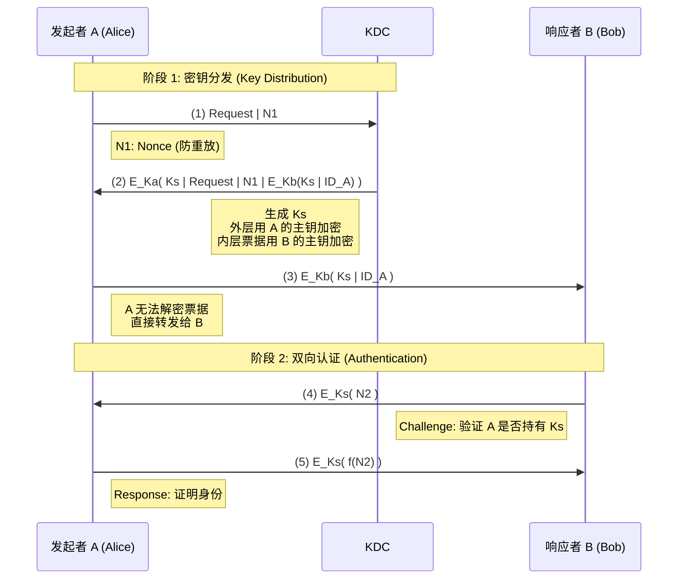
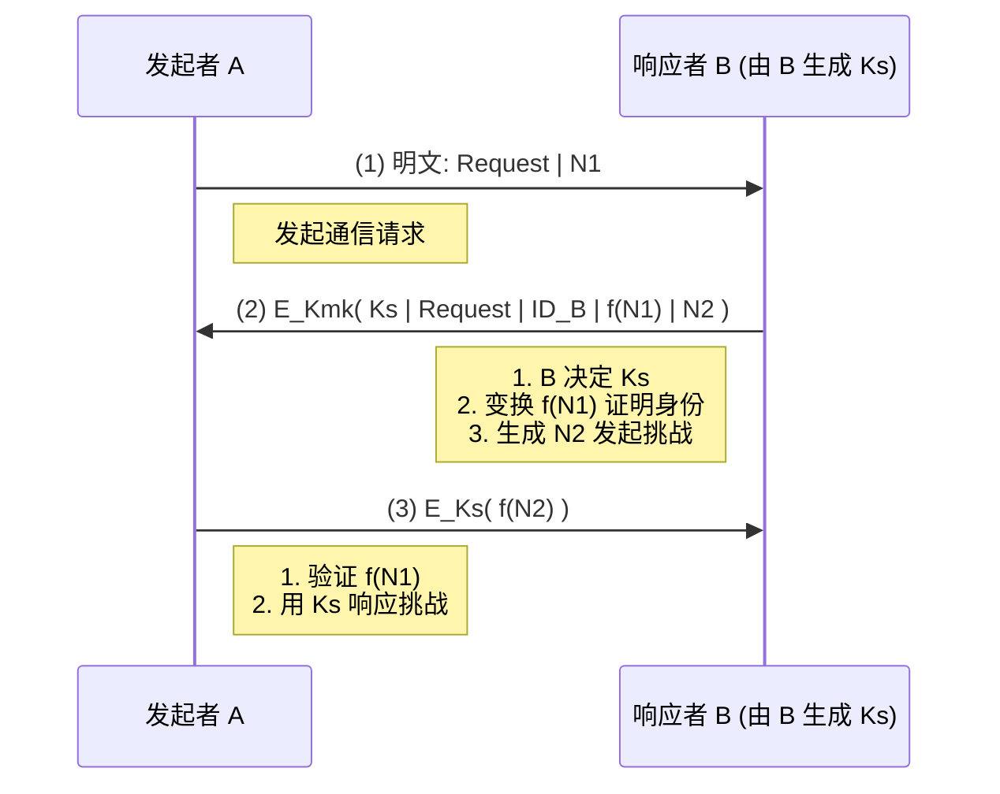

# **第四章 现代对称加密及其传输保密性 \- 学习笔记**

## **第一部分：现代对称加密算法**

在DES的密钥长度（56位）逐渐无法满足安全需求的背景下，密码学界发展出了一系列强度更高、设计更现代的对称分组加密算法。

### **1.1 三重DES (Triple DES / 3DES)**

3DES是为了替代DES而设计的方案，通过对DES进行多重加密来极大地增强其安全性。

#### **为什么不是双重DES？—— 中间相遇攻击 (Meet-in-the-Middle Attack)**

单纯地用两个不同密钥进行两次DES加密（双重DES）并不能将密钥长度有效地扩展到112位（56\*2）。攻击者可以采用**中间相遇攻击**来破解它：

1. **攻击原理**：
   * 对于加密过程 C \= E\_K2(E\_K1(P))，存在一个中间值 X，使得 X \= E\_K1(P) 且 X \= D\_K2(C)。
   * 攻击者已知一对明文 P 和密文 C。
2. **攻击步骤**：
   * 用所有 2^56 个可能的密钥 K1 加密明文 P，将得到的结果 {X} 和对应的 {K1} 存储起来。
   * 用所有 2^56 个可能的密钥 K2 解密密文 C，将得到的结果 {X} 和对应的 {K2} 存储起来。
   * 通过比较两个存储集合，找到匹配的中间值 X。对应的 K1 和 K2 就是密钥对。
3. **结论**：这种攻击的计算复杂度约为 2^56 \+ 2^56 \= 2^57，与暴力破解单DES的 2^55 复杂度在同一数量级，因此双重DES的安全性提升有限。

#### **3DES的工作原理**

为了有效抵抗中间相遇攻击，3DES采用了加密-解密-加密（EDE）的结构。

* **双密钥3DES (Two-Key 3DES)**
  * **过程**: C \= E\_K1(D\_K2(E\_K1(P)))
  * **特点**:
    * 使用两个独立的密钥K1和K2。
    * 有效密钥长度为 56 \* 2 \= 112 位。
    * 当 K1 \= K2 时，该过程等价于单次DES加密，从而实现了对DES的向后兼容。这是采用EDE结构而非EEE（加密-加密-加密）的一个重要原因。
  * **防御中间相遇攻击**:
    * 之所以能防御该攻击，是因为攻击者无法将加密过程干净地分成两半（每一半只依赖一个密钥）。在 C \= E\_K1(D\_K2(E\_K1(P))) 中，密钥 K1 同时出现在了运算的“首”和“尾”。
    * 攻击者如果想从两端向中间计算，例如计算 D\_K1(C) 和 D\_K2(E\_K1(P))，就必须在运算一端同时猜测 K1 和 K2 才能得到中间值，这使得攻击的复杂度回到了 2^112 级别，失去了中间相遇攻击的优势。
* **三密钥3DES (Three-Key 3DES)**
  * **过程**: C \= E\_K3(D\_K2(E\_K1(P)))
  * **特点**:
    * 使用三个独立的密钥K1, K2, K3。
    * 有效密钥长度为 56 \* 3 \= 168 位，是目前最安全的3DES变体。
    * 广泛应用于PGP、S/MIME等安全协议中。
  * **防御中间相遇攻击**:
    * 防御能力更强。攻击者若想在中间点例如： X \= D\_K2(E\_K1(P)) 相遇，需要从明文端计算所有 (K1, K2) 组合（2^112 种可能性），从密文端计算所有 K3（2^56 种可能性）。
    * 攻击的整体复杂度由计算量较大的一方（即 2^112）决定，因此该攻击方法对于三密钥3DES是无效的。

### **1.2 Blowfish**

* **设计者**: Bruce Schneier (1993/94年设计)
* **特点**:
  1. **快速**: 可在32位CPU上快速实现，每加密一个字节约需18个时钟周期。
  2. **紧凑**: 内存占用少，只需约5KB。
  3. **简单**: 算法结构简单，易于实现和分析其强度。
  4. **安全性可变**: 密钥长度是可变的，最长可达448位，提供了灵活的安全等级。

### **1.3 RC5**

* **设计者**: Ron Rivest (RSA公司，1994年设计)
* **特点**:
  1. **高度灵活/参数化**:
     * **可变的字长 (w)**: 可适应不同位数的CPU（如16, 32, 64位）。
     * **可变的加密轮数 (r)**: 轮数越多，安全性越高，但速度越慢。
     * **可变的密钥长度 (b)**: 密钥长度可灵活调整。
  2. **核心操作**: 其安全性强依赖于**数据相关的循环移位**，这一设计能有效增强其抵抗差分和线性密码分析的能力。
  3. **设计简洁**: 易于在不同的CPU上实现，且对内存要求低。

### **1.4 常用分组算法比较**

| 算法名称           | 分组长度 (bits)     | 密钥长度 (bits)      | 加密速度 (cycle/byte) |
| :----------------- | :------------------ | :------------------- | :-------------------- |
| DES                | 64                  | 56                   | 45                    |
| **3DES**     | **64**        | **168**        | **108**         |
| **Blowfish** | **64**        | **128 \~ 448** | **18**          |
| **RC5**      | **64 \~ 256** | **64 \~ 256**  | **23**          |
| AES                | 128                 | 128\~ 256            | 20-27                 |

*注：加密速度为奔腾CPU上的参考值（加密一字节所用的时钟周期数）*

### **1.5 流密码 (Stream Ciphers)**

与分组密码一次处理一个数据块不同，流密码一次处理一位或一个字节的数据。

* **工作原理**:
  * 核心思想是**生成一个与明文长度相同的、看似随机的密钥流（Keystream）。然后使用简单的异或 (XOR) 操作将明文流与密钥流结合，生成密文流**。
  * **加密**: C\_i \= M\_i ⊕ StreamKey\_i
  * **解密**: M\_i \= C\_i ⊕ StreamKey\_i （因为 M ⊕ K ⊕ K \= M）
  * 密钥流本身由一个**伪随机数生成器 (PRNG)** 根据一个较短的初始密钥生成。
* **设计原则**:
  1. **绝对不能重用密钥流**: 这是流密码的“黄金法则”。如果用同一个密钥流加密两个不同的明文（P1, P2），攻击者可以截获两个密文（C1, C2）并进行异或：C1 ⊕ C2 \= (P1 ⊕ K) ⊕ (P2 ⊕ K) \= P1 ⊕ P2。这将消除密钥，直接暴露两个明文的异或结果，攻击者可利用语言的统计特性从中破解出明文。
  2. **密钥流周期要长**: 密钥流最终会重复，这个重复的长度称为周期。周期必须足够长，以避免在加密长消息时重复使用密钥流。
  3. **统计上随机**: 密钥流应通过所有标准的随机性测试，不能有任何可被利用的统计偏差。
  4. **依赖于足够大的密钥**: 伪随机数生成器的初始密钥必须足够长，以抵抗暴力破解攻击。

### **1.6 讨论**

#### **1.6.1 3DES 密码设计的兼容性与结构选择**

3DES结构的关键巧思在于采用 **E-D-E（加密-解密-加密）** 而非简单的 **E-E-E**。其最核心动机是对既有单 DES 系统的向后兼容：

* **向后兼容的机制**：
  * 公式 ( C = E_{K_3}(D_{K_2}(E_{K_1}(P))) )。若刻意设置 ( K_1 = K_2 = K_3 = K )，则中间步骤 ( D_{K}(E_{K}(P)) ) 抵消，化简为 ( C = E_{K}(P) )，与单次 DES 完全一致，使新设备可“降级”与旧系统通信。
  * 相反，E-E-E 在密钥全相同时得到的是 ( C = E_K(E_K(E_K(P))) )，无法化简成单 DES。
* **为何解密操作居中**：
  * 若结构改成 D-E-E 或 E-E-D，则在密钥相同时不能同样自然且对称地实现与单 DES 的直接等价（D-E-E 即E(E(D)) 根本无法化简；
  * E-E-D 虽可在密钥相同情形下形式上接近，但历史上 IBM 的原始设计及当时的密码学直觉更偏好在中间插入一次解密以“打断”连续的正向变换，增加代数复杂度，降低潜在结构性弱点风险）。
* **安全与实用平衡**：E-D-E 不仅提供三重操作带来的更高安全性，还通过保留“单密钥退化”路径，实现升级平滑、部署成本低、替换周期短。

简言之，E-D-E 的选择同时满足：提高强度、保持兼容、避免潜在代数弱点，这正是 3DES 设计的精妙所在。

## **第二部分：传输安全性**

保证数据在网络中传输时的机密性，需要考虑加密的设置、密钥的分配和随机数的生成。

### **2.1 加密设置 (两种模式)**

传输安全性的核心在于确定在网络中"**在哪一层**"对数据进行加密保护。从宏观角度看,加密设置有两种基本模式:**端到端加密**和**链路加密**。

#### **2.1.1\. 端到端加密 (End-to-End Encryption)**

##### **2.1.1.1 基本原理**

数据在**发送端**被加密,直到**最终接收端**才被解密。整个传输过程中,无论经过多少中间节点,数据内容始终是加密的。

**封装逻辑示例 (以传输层为例)**:

$$
\text{Header}_{\text{IP}} \parallel \text{Header}_{\text{TCP}} \parallel \mathbf{Encrypted(Data)}
$$

*符号说明:`||` 表示拼接,`Encrypted()` 表示加密内容*

##### **2.1.1.2 特性分析**

| 特征项                   | 说明                                                        |
| :----------------------- | :---------------------------------------------------------- |
| **通信实体**       | 进程 (Port) 或用户 (User)                                   |
| **中间节点行为**   | 仅读取明文的路由头部(如IP地址)进行转发,对负载内容"视而不见" |
| **末端系统的安全** | 消息在发送主机时为**密文**                            |
| **中间系统的安全** | 消息在中间节点时为**密文**                            |
| **用户角色**       | 用户决定加密算法、选择加密体制、控制每条消息是否加密        |
| **实现方式**       | 通常为软件实现                                              |
| **密钥需求**       | 每对用户需一个密钥                                          |

##### **2.1.1.3 优势与局限**

* **优势**:

  * 提供最高级别的安全性,即使中间节点不可信,数据内容也是安全的。
  * 用户拥有完全的加密控制权。
* **局限**:

  * **无法防止流量分析 (Traffic Analysis)**:网络头部信息(如IP地址、端口)必须保持明文以便路由,攻击者虽然解不开内容,但可以推断"谁在和谁通信"、"业务类型是什么"(如443端口通常是Web)。

##### **2.1.1.4 典型应用场景**

**工作层次**:主要在**传输层及以上**,以及**网络层的传输模式**。

* **传输层 (TLS/SSL)**:

  * **示例**:HTTPS网站访问(浏览器↔Web服务器)
  * **特点**:加密应用层完整报文,TCP头明文
  * **数据包结构**:`[TCP头][{应用层报文}]`
* **应用层 (PGP, S/MIME)**:

  * **示例**:加密电子邮件
  * **特点**:加密消息体 + 数字签名
* **网络层传输模式 (IPSec-ESP)**:

  * **场景**:两台主机直接通信
  * **特点**:加密传输层报文,保留原IP头
  * **数据包结构**:`[原IP头][ESP头][{传输层头+数据}][ESP尾]`

#### **2.1.2\. 链路加密 (Link-to-Link Encryption)**

##### **2.1.2.1 基本原理**

数据在从一个节点到下一个节点的**每一段物理链路**上都被**独立**加密和解密。在每个**中间节点**(如路由器),数据包被**解密以读取路由信息**,然后**用下一段链路的密钥重新加密**。

**封装逻辑示例 (以链路层为例)**:

$$
\text{Header}_{\text{MAC}} \parallel \mathbf{Encrypted(\text{Header}_{\text{IP}} \parallel \text{Data})}
$$

##### **2.1.2.2 特性分析**

| 特征项                   | 说明                                                  |
| :----------------------- | :---------------------------------------------------- |
| **通信实体**       | 网卡 (NIC) 到网卡,或基站到手机                        |
| **中间节点行为**   | **必须解密**,读取路由信息后用下一跳密钥重新加密 |
| **末端系统的安全** | 消息在发送主机时为**明文**                      |
| **中间系统的安全** | 消息在中间节点时为**明文**(短暂存在)            |
| **用户角色**       | 加密过程对用户透明,由网络服务提供商管理               |
| **实现方式**       | 通常为硬件实现,所有用户共用加密设备                   |
| **密钥需求**       | 每个中间节点和每两个相邻节点需一个密钥                |

##### **2.1.2.3 优势与局限**

* **优势**:

  * **流量机密性极高**:在链路上截获数据的人,连源IP和目的IP都看不到(被加密在帧载荷里)。
  * 对用户透明,易于部署。
  * 可硬件实现,速度快。
* **局限**:

  * **信任链脆弱**:路径上所有路由器必须可信,任何一个节点被攻破,全链路明文暴露。
  * **延迟高**:每一跳都要进行 `解密 → 路由 → 加密` 操作。

##### **2.1.2.4 典型应用场景**

**工作层次**:主要在**数据链路层及以下**,以及**网络层的隧道模式**。

* **数据链路层 (Wi-Fi加密)**:

  * **示例**:WPA2/WPA3(设备↔无线路由器)
  * **特点**:加密网络层分组,MAC帧头明文
  * **数据包结构**:`[MAC头][{网络层数据包}][FCS]`
* **物理层 (专线加密)**:

  * **示例**:SONET加密、专线加密机
  * **特点**:加密链路层帧(比特流级别)
* **网络层隧道模式 (IPSec-ESP Tunnel)**:

  * **场景**:VPN网关之间(如北京分部↔上海分部)
  * **特点**:将整个原IP包加密,外套新IP头(源=入口网关,目=出口网关)
  * **数据包结构**:`[新IP头][ESP头][{原IP包}][ESP尾]`
  * **性质**:虚拟的"逐跳"(实为段到段加密),公网路由器只看到两个网关在通信

#### **2.1.3\. 对比总结**

| 特点                 | 链路加密                          | 端到端加密                     |
| :------------------- | :-------------------------------- | :----------------------------- |
| **工作层次**   | 链路层、物理层、网络层隧道模式    | 传输层、应用层、网络层传输模式 |
| **加密范围**   | 包括路由头部(IP地址等)            | 仅加密负载,路由头部明文        |
| **信任模型**   | 必须信任所有中间节点              | 仅需信任通信端点               |
| **防护目标**   | 防止链路窃听(包括流量分析)        | 防止数据内容泄露               |
| **性能开销**   | 每跳解密/重加密,延迟较高          | 端点加密一次,延迟较低          |
| **部署复杂度** | 需在每个节点部署,通常由运营商负责 | 仅需在端点部署,用户可控        |

#### **2.1.4\. 特殊情况:网络层的"双面性" (IPSec)**

网络层处于承上启下的位置,**IPSec协议的两种模式完美诠释了加密范围的权衡**:

| 模式               | 加密范围         | 典型场景         | 加密模式         | 信任边界     |
| :----------------- | :--------------- | :--------------- | :--------------- | :----------- |
| **传输模式** | 仅加密传输层负载 | 两台主机直接通信 | **端到端** | 信任双方主机 |
| **隧道模式** | 加密整个原IP包   | VPN网关之间通信  | **段到段** | 信任隧道端点 |

#### **2.1.5\. 实际部署中的分层组合策略**

现代网络通常**分层组合**多种加密策略以实现纵深防御。

**场景示例**:员工通过VPN访问公司内网HTTPS服务

```
用户主机 ←→ WiFi AP ←→ ISP路由器 ←→ 互联网 ←→ 公司VPN网关 ←→ 内网Web服务器

加密层次:
├─ 链路层:WPA2加密(用户↔WiFi AP)
├─ 网络层:IPSec隧道(用户↔VPN网关)
└─ 传输层:TLS加密(用户浏览器↔Web服务器)
```

**分层防护效果**:

1. **WPA2 (链路层)**:防止WiFi环境的本地窃听
2. **IPSec隧道 (网络层)**:在公网上隐藏真实通信端点和流量特征
3. **TLS (传输层)**:提供应用层的端到端机密性,即使VPN网关也无法解密HTTP内容

**核心思想**:不同层次解决不同威胁,共同构建完整的安全防线。

### **2.2 密钥分配 (Key Distribution)**

#### 2.2.1. 核心设计原则：密钥分层 (Hierarchical Key Control)

这是现代对称密钥分配系统的 **理论基础** 。为了平衡安全性与性能，系统不使用单一密钥完成所有任务，而是构建了密钥的层级结构。

##### 2.2.1.1 核心逻辑

通过引入**主密钥**来加密保护 **会话密钥** ，从而限制主密钥的暴露次数，并解决大量数据加密的效率问题。

##### 2.2.1.2 两种密钥类型对比

| 类型           | 名称 (Eng)                       | 符号示例             | 特性                 | 用途                                                                    |
| -------------- | -------------------------------- | -------------------- | -------------------- | ----------------------------------------------------------------------- |
| **底层** | **主密钥 (Master Key)**    | $K_{MK}, K_A, K_B$ | 长期有效、离线分发   | **仅用于加密会话密钥** 。它是信任的根基（Trust Anchor）。         |
| **上层** | **会话密钥 (Session Key)** | $K_S, K_{AB}$      | 临时生成、生命周期短 | **用于加密实际通信数据** 。用完即弃，即便泄露也不影响主密钥安全。 |

#### 2.2.2. 架构实现一：集中式密钥分配 (Centralized)

基于密钥分层原则的星型拓扑实现，即经典的  ***Needham-Schroeder Protocol*** 。

##### 2.2.2.1 先决条件与场景

* **核心组件** ：存在一个可信第三方  **KDC (密钥分配中心)** 。
* **信任模型** ：每个用户 $X$ 只需与 KDC 共享一个主密钥 $K_X$。
* **适用性** ：适用于小型或局域网系统（由 KDC 统一管理）。

##### 2.2.2.2 关键步骤解析

**步骤 1:**

$$
A \rightarrow KDC: \text{Request} \parallel N_1
$$

*发送请求和随机数(Nonce),确保 KDC 的响应是针对本次请求的，其中，Request包含$ID_A,ID_B$*

**步骤 2:**

$$
KDC \rightarrow A: E_{K_A}\left(K_S \parallel \{\text{Request} \parallel N_1\} \parallel E_{K_B}(K_S \parallel ID_A)\right)
$$

*KDC 生成会话密钥 $K_S$,外层用 A 的主密钥加密,内层票据用 B 的主密钥加密。A 解密外层获得 $K_S$ 和票据*

**步骤 3:**

$$
A \rightarrow B: E_{K_B}(K_S \parallel ID_A)
$$

*A 将票据转发给 B。B 用 $K_B$ 解密票据,获得 $K_S$ 和 A 的身份*

**步骤 4:**

$$
B \rightarrow A: E_{K_S}(N_2)
$$

*B 发起挑战,验证 A 是否真正持有 $K_S$*

**步骤 5:**

$$
A \rightarrow B: E_{K_S}(f(N_2))
$$

*A 响应挑战,证明自己持有 $K_S$,完成双向认证*

##### 2.2.2.3 协议交互流程



#### 2.2.3. 架构实现二：分散式密钥分配 (Decentralized)

基于密钥分层原则的 P2P 拓扑实现。

##### 2.2.3.1 先决条件与场景

* **核心区别** ：**不需要** KDC，由Bob 生成会话密钥 $K_S$。
* **信任模型** ：Alice 和 Bob 预先共享一个主密钥 $K_{MK}$。
* **适用性** ：适用于节点较少且关系固定的环境（因为 $N$ 个用户需要维护 $N(N-1)/2$ 个主密钥）。

##### 2.2.3.2 关键步骤解析

**步骤 1:**

$$
A \rightarrow B: \text{Request} \parallel N_1
$$

*A 以明文方式发起通信请求*

**步骤 2:**

$$
B \rightarrow A: E_{K_{MK}}\left(K_S \parallel \text{Request} \parallel ID_B \parallel f(N_1) \parallel N_2\right)
$$

*B 生成会话密钥 $K_S$,用共享主密钥 $K_{MK}$ 加密。通过 $f(N_1)$ 证明非重放,同时发起挑战 $N_2$*

**步骤 3:**

$$
A \rightarrow B: E_{K_S}(f(N_2))
$$

*A 验证 $f(N_1)$ 确认 B 的身份,解密获得 $K_S$,用 $K_S$ 响应挑战完成握手*

##### 2.2.3.3 协议交互流程



#### 2.2.4. 替代方案：基于公钥的分配 (Public-Key Approach)

当无法预先物理共享主密钥（Master Key）时采用的策略。主要有以下三种演进模式：

##### 2.2.4.1 简单模式 (Simple Mode)

* **流程** ：A 直接向 B 发送自己的公钥 $KU_A$，B 用它加密 $K_S$ 发回。
* **缺陷** ：极易受到  **中间人攻击 (Man-in-the-Middle Attack)** 。攻击者可以拦截并替换公钥，从而劫持会话密钥。

##### 2.2.4.2 保密与认证模式 (Confidentiality & Auth Mode)

* **核心机制** ：引入公钥授权中心 (PKA) 和双重随机数挑战。
* **流程特点** ：
  1. 双方分别向 PKA 请求对方的公钥（由 PKA 私钥签名保证真实性）。
  2. **双向挑战** ：A 发送 $E_{KU_B}(N_1)$，B 回复 $E_{KU_A}(N_1, N_2)$。确保对方不仅有公钥，还在线且拥有私钥。
  3. 最后由 A 生成 $K_S$，用 $KU_B$ 加密传输（双重保护：签名保真 + 随机数保活）。

##### 2.2.4.3 混合方法 (Hybrid Approach) [重点]

这是现实系统（如 Windows Domain/Kerberos PKINIT）中解决“初始信任”的主流方案。

* **核心思想** ：

  * **第一步（低频、高安全）** ：利用**公钥体制**解决用户与 KDC 之间 **主密钥 (** $K_{MK}$**)** 的分发问题。避免了物理传输密码的困难。
  * **第二步（高频、高性能）** ：一旦建立了共享的主密钥，后续所有服务访问均切换回**集中式 KDC (Needham-Schroeder)** 流程，分发对称会话密钥。
* **工作流** ：

  1. **初始认证** ：用户 A 使用智能卡（存有私钥）向 KDC 证明身份。
  2. **主钥协商** ：A 与 KDC 通过公钥加密通道，安全协商出一个临时的对称主密钥 $K_A$。
  3. **服务票据** ：A 使用 $K_A$ 向 KDC 请求访问文件服务器 B 的票据（回归经典的 3 步握手）。
* **优势 (Pros)** ：

  * **解决分发难题** ：不需要管理员人工录入初始密码。
  * **性能卓越** ：只有登录时使用慢速的公钥算法，后续通信全为高速对称加密。
  * **兼容性** ：后端服务依然可以沿用旧的 Kerberos 架构，只需升级登录接口。
