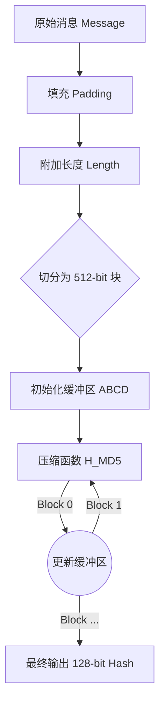
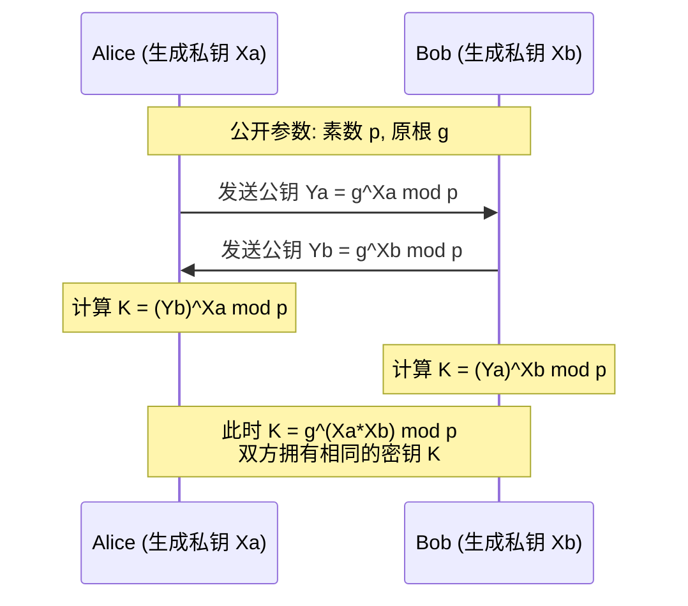
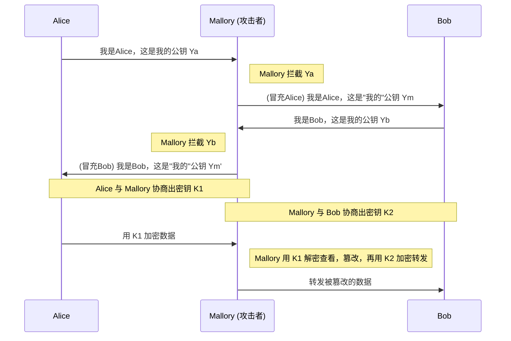
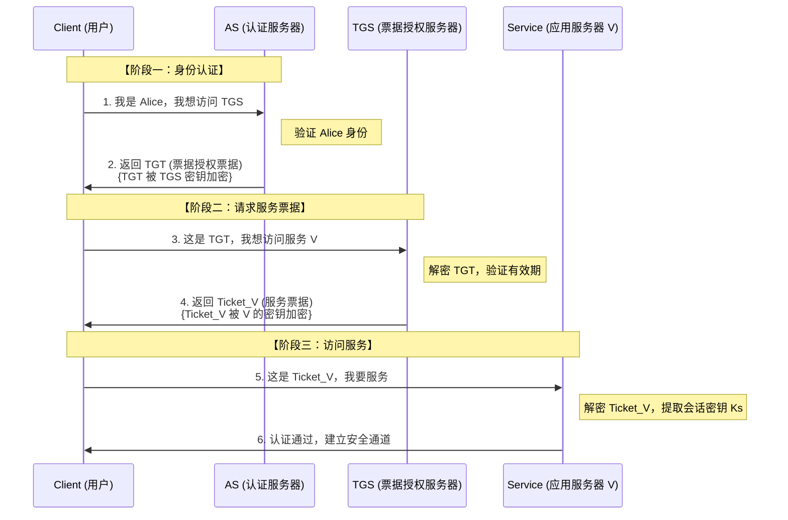
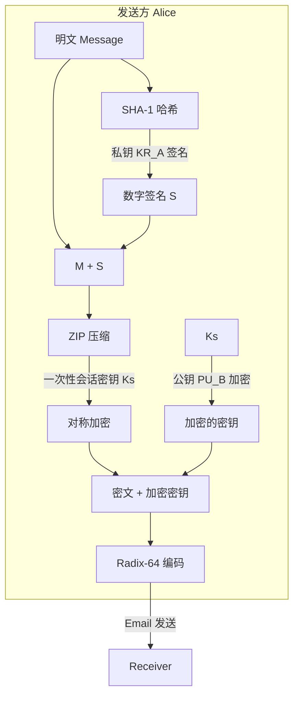
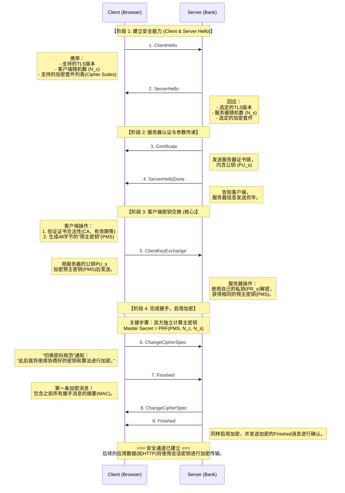

# 序言：在不可信网络上构建安全通信

## 1. TCP/IP：互联优先，安全缺失

作为计算机专业学生，我们必须正视互联网安全的根本矛盾：**TCP/IP协议栈在设计之初（1970年代），其核心目标是互联互通与鲁棒性，而非安全性。** ARPANET的设计者们处于冷战时期的学术网络环境，他们的核心关切是"核打击后网络能否自愈"，而非"数据会不会被窃听"。

这种设计哲学带来了深远的后果。当你的HTTP请求离开网卡，穿越ISP的路由器、骨干网交换机，最终到达服务器时，这些数据包在链路层和网络层都是**明文传输**的。任何中间节点——包括恶意的公共Wi-Fi热点、被攻陷的边界路由器——都可以：

* **截获（Interception）**：读取你的登录凭证、信用卡号、隐私通信；
* **篡改（Modification）**：修改交易金额、注入恶意脚本、劫持DNS响应；
* **伪造（Fabrication）**：冒充合法身份发起请求，实施钓鱼攻击。

**密码学的使命，就是在这个本质上不可信的信道中，通过数学手段构建安全策略的强制执行机制。**

## 2. 安全目标：CIA三元组与威胁模型

本次复习不是离散知识点的堆砌，而是基于**OSI安全架构**的工程化梳理。密码学中的每一个技术组件，都是为了应对特定的**威胁模型**（Threat Model），并提供相应的**安全服务**（Security Service）。这些安全目标可归纳为CIA三元组：

* **保密性（Confidentiality）**：对抗截获威胁。确保信息仅能被授权方访问。技术实现：从古典的Caesar密码演进到现代的AES对称加密。
* **完整性（Integrity）**：对抗篡改威胁。确保数据在传输和存储过程中未被修改。技术实现：密码学哈希函数（SHA-256）、消息认证码（HMAC）。
* **认证（Authentication）与不可否认性（Non-repudiation）**：对抗伪造威胁。确认通信方的真实身份，并防止事后抵赖。技术实现：数字签名（RSA Signature）、公钥基础设施（PKI）。

这三（四）个目标相互关联但不可替代：**AES能保证你看不到，但不能保证你改不了；Hash能发现篡改，但不能证明是谁篡改的；RSA签名能证明身份，但加密大文件太慢。** 理解这些技术的适用边界，是掌握密码学的关键。

## 3. 技术演进的四阶段逻辑

这份笔记将沿着一条清晰的技术演进链条展开，每一阶段都在解决前一阶段遗留的核心问题：

**Phase 1：保密性的实现与演进**

* **核心问题**：如何防止窃听？如何让数据在公开信道上保持机密？
* **技术路线**：从依赖"算法保密"的古典密码，转向遵循**Kerckhoffs原则**（算法公开，密钥保密）的现代对称加密。深入分析Feistel结构、DES/AES算法，以及工作模式（ECB/CBC/CTR）。
* **遗留问题**：对称加密速度极快，但留下了致命的**密钥分发难题**——Alice和Bob如何在不安全的网络上协商共享密钥？此外，对称加密无法提供完整性和不可否认性。

**Phase 2：信任建立与完整性保障**

* **核心问题**：如何在不见面的情况下安全地交换密钥？如何证明数据未被篡改？如何防止发送方事后抵赖？
* **技术路线**：引入**密码学哈希函数**（SHA系列）检测篡改；引入**公钥密码学**（RSA/ECC）解决密钥分发和数字签名；通过Diffie-Hellman协议实现密钥交换。
* **遗留问题**：RSA计算开销大，不适合直接加密大数据；DH协议容易遭受中间人攻击。更关键的是：**谁来证明这个公钥确实属于Bob，而不是攻击者伪造的？**

**Phase 3：密钥管理与信任基础设施**

* **核心问题**：在大规模系统中（企业内网、互联网），如何管理密钥？如何建立信任锚点？
* **技术路线**：对比两种信任体系——基于对称密码的**KDC（密钥分发中心）**与**Kerberos协议**（适用于企业内网）；基于公钥密码的**PKI（公钥基础设施）**与**X.509证书体系**（适用于互联网）。引入混合加密体系：用RSA交换AES密钥，用AES加密数据。
* **遗留问题**：理论和基础设施已就绪，但如何将这些组件组装成可部署的工程协议？

**Phase 4：协议落地与工程实践**

* **核心问题**：如何将密码学原语组装成真实世界的安全协议？
* **技术路线**：分析四大应用场景——**PGP**（电子邮件安全）、**SSL/TLS**（Web安全）、**SET**（电子商务安全）、**IPsec**（网络层安全）。理解协议设计中的工程权衡：性能与安全的平衡、向后兼容性、会话复用等优化。

## 4. 学习方法论

在复习过程中，避免陷入纯数学推导的细节，而应聚焦于**设计哲学**：

* **问题驱动**：每个技术的引入都源于前一代技术的缺陷。例如，为什么ECB模式不安全？为什么需要IV？为什么3DES采用E-D-E结构？
* **攻击视角**：理解安全机制的同时，必须理解对应的攻击方式。例如，中间相遇攻击、生日攻击、重放攻击、中间人攻击。
* **工程权衡**：密码学不是纯理论，而是工程实践。理解为什么HTTPS使用混合加密（RSA+AES），为什么Kerberos引入TGT机制，为什么TLS握手需要四次往返。

---

# **Phase 1: 保密性的实现与演进**

## 0. 引言：古典密码的致命缺陷

**Phase 1的核心任务：实现保密性（Confidentiality），防止窃听者Eve读取明文。**

在现代密码学诞生之前，人类使用了两千多年的古典密码（Caesar、Vigenère、Playfair）都存在一个致命缺陷：**安全性依赖于算法的保密性（Security by Obscurity）**。一旦算法泄露（通过逆向工程、内部人员叛变等），整个系统立即崩溃，所有历史通信都将暴露。

更糟糕的是，古典密码的密钥空间极小（Caesar仅26种可能），且对频率分析（Frequency Analysis）毫无抵抗力。二战期间，盟军破解Enigma密码机的案例证明：**算法复杂度不等于密码强度，密钥管理才是核心。**

**现代密码学的根本转变**：遵循**Kerckhoffs原则**——系统的安全性应完全依赖于密钥（Key），算法可以完全公开。这一原则催生了DES、AES等标准算法，它们的设计细节完全透明，却能在密钥保密的前提下保持安全性。

## **1. 逻辑演进：从算法保密到密钥保密**

* **古典密码 (Classical Cryptography)**：
  * **核心缺陷**：安全性依赖于“算法不公开”。一旦算法泄露，系统即崩溃。
  * **两大原子操作**：
    * **代换 (Substitution)**：将明文中的元素映射为另一个元素（如 Caesar, Playfair）。这是**混淆 (Confusion)** 的雏形。
    * **置换 (Permutation)**：重新排列明文元素的顺序（如栅栏密码）。这是**扩散 (Diffusion)** 的雏形。
* **现代密码学 (Modern Cryptography)**：
  * **Kerckhoffs 原则**：系统的安全性应完全依赖于**密钥 (Key)**，而假设算法是完全公开的。
  * **分类**：
    * **流密码 (Stream Cipher)**：逐比特/字节加密，通过伪随机数生成器 (PRNG) 产生密钥流进行异或。
    * **分组密码 (Block Cipher)**：将明文切分为固定长度的数据块（Block），对每个块独立加密。这是本阶段的重点。

---

## **2. 核心架构：Feistel 网络结构 (The Feistel Network)**

这是 DES 以及许多现代分组密码的灵魂。Horst Feistel 设计这种结构的**根本目的**是：**让加密和解密可以使用完全相同的硬件电路/代码逻辑，只需逆序使用子密钥。**

### **2.1 结构解析**

对于一个 $2w$ 位宽的分组，Feistel 将其均分为左右两半：$L_{i-1}$ (左半部分) 和 $R_{i-1}$ (右半部分)。

* **迭代公式 (第 $i$ 轮)**：

  $$
  \begin{cases}
  L_i = R_{i-1} \\
  R_i = L_{i-1} \oplus F(R_{i-1}, K_i)
  \end{cases}
  $$

  * **$F$ (轮函数)**：这是核心非线性部件，负责混淆数据。
  * **$K_i$ (子密钥)**：由主密钥通过密钥调度算法生成。
  * **$\oplus$ (XOR)**：异或操作的可逆性 ($A \oplus B \oplus B = A$) 保证了解密的可行性。

### **2.2 设计要素 (Shannon's Theory)**

DES 的设计严格遵循了香农提出的两个信息论原则：

1. **混淆 (Confusion)**：
   * **目标**：使密文与密钥之间的统计关系变得尽可能复杂。
   * **手段**：主要由 **S盒 (Substitution Box)** 实现。这是 DES 中唯一的**非线性**组件。
2. **扩散 (Diffusion)**：
   * **目标**：让明文的每一位影响密文的许多位，或者说让明文的统计特征散布到整个密文中（雪崩效应）。
   * **手段**：主要由 **P盒 (Permutation Box)** 和 轮函数的结构实现。

---

## **3. 典型实例：DES (Data Encryption Standard)**

虽然 DES 因密钥过短已被淘汰，但它是理解现代密码学的基石。

### **3.1 关键参数**

* **分组长度**：64 bits。
* **密钥长度**：64 bits（其中 8 位用于奇偶校验，**有效密钥 56 bits**）。
* **轮数**：16 轮。

### **3.2 安全性短板与 3DES 的补救**

由于 $2^{56}$ 的密钥空间在现代算力下可被暴力破解，工业界引入了 **3DES (Triple DES)**。

* **结构：EDE (Encrypt-Decrypt-Encrypt)**

  $$
  C = E_{K3}( D_{K2}( E_{K1}(P) ) )
  $$
* **为什么是 E-D-E 而不是 E-E-E？**

  * **兼容性**：当 $K_1 = K_2 = K_3$ 时，计算结果等同于单次 DES。这允许新设备与旧 DES 系统通信。
* **为什么不是双重 DES (2DES)？**

  * **中间相遇攻击 (Meet-in-the-Middle Attack)**：
    对于 $C = E_{K2}(E_{K1}(P))$，攻击者可以构建中间变量 $X$。
    1. 正向计算：$X = E_{K1}(P)$
    2. 逆向计算：$X = D_{K2}(C)$
       通过存储空间换取时间，攻击复杂度从 $2^{112}$ 降至 **$2^{57}$** 左右，仅比单次 DES 略难。因此，必须使用三重加密（密钥长度有效提升至 112位 或 168位）。

---

## **4. 工程落地：分组工作模式 (Modes of Operation)**

算法本身只能处理 64 位或 128 位的数据块。对于任意长度的文件传输，必须采用特定的**工作模式**。

### **4.1 语义安全 (Semantic Security) 的必要性**

在分析工作模式之前，必须理解一个核心安全目标：**语义安全**。它要求即使攻击者获得大量密文样本，也无法推断出任何关于明文的统计信息。

**为什么需要IV/Nonce？**

- 如果直接使用 $C = E_K(P)$，相同的明文将始终产生相同的密文
- 攻击者可通过**统计分析**识别模式：例如检测到两个数据包密文相同，就知道它们是重复内容
- **解决方案**：引入初始化向量 (IV) 或 Nonce，使得即使明文相同，密文也不同

这类似于HTTPS握手中的随机数 (Client Random / Server Random)：即使相同的客户端重复连接同一服务器，每次协商的会话密钥也不同，防止重放攻击。

### **4.2 三种典型工作模式对比**

| 模式                         | 描述 (Mechanism)                                   | 优点 (Pros)                                                                                | 缺点 (Cons)                                                                                                    | 典型场景                           |
| :--------------------------- | :------------------------------------------------- | :----------------------------------------------------------------------------------------- | :------------------------------------------------------------------------------------------------------------- | :--------------------------------- |
| **ECB**   (电子密码本) | $C_i = E_K(P_i)$各块独立加密                     | 1. 简单 2.**可并行计算** 3. 误差不传播                                               | **极不安全**：相同的明文块产生相同的密文块，导致数据模式泄露（如企鹅图片实验）。**违反语义安全。** | 仅用于加密极短的数据（如密钥本身） |
| **CBC** (密码分组链接) | $C_i = E_K(P_i \oplus C_{i-1})$$C_0 = IV$      | 1. 隐蔽明文模式 2. 安全性高 3.**IV保证语义安全**                                     | 1.**加密不可并行** (串行)2. 误差传播：一个密文块损坏会影响两个解密块。                                   | 通用文件加密、IPSec                |
| **CTR** (计数器模式)   | $C_i = P_i \oplus E_K(Nonce \| i)$本质变成流密码 | 1.**可并行计算** 2. 支持随机访问 3. 无需填充 (Padding)4. **Nonce保证语义安全** | 必须保证 (Key, Counter) 唯一，否则导致密钥流重用（致命弱点）。                                                 | 现代网络协议、AES-GCM 基础         |

---

## **5. 传输层面的保密性：链路 vs 端到端**

在第4章笔记中，还提到了网络层面的部署策略：

* **链路加密 (Link Encryption)**：
  * **机制**：每一跳（Router-to-Router）都解密再加密。
  * **隐患**：数据在中间节点以**明文**出现；若中间节点被攻破，全盘皆输。
* **端到端加密 (End-to-End Encryption)**：
  * **机制**：源端加密，目的端解密 (Source-to-Destination)。
  * **隐患**：虽然内容保密，但**包头 (Header)** 必须明文（否则无法路由），因此无法抵抗**流量分析 (Traffic Analysis)**。

---

## **6. Phase 1总结：保密性已实现，但遗留三大问题**

### 6.1 已解决的问题

* 我们现在拥有了强大的"锁"（DES/AES）和"使用方法"（CBC/CTR），解决了数据的**机密性 (Confidentiality)** 问题
* 通过Feistel结构和Shannon的混淆/扩散理论，确保了密文的随机性
* 通过IV/Nonce机制，实现了语义安全，防止统计分析攻击

### 6.2 遗留的核心问题

尽管对称加密体系已经成熟，但它无法解决以下三个死穴：

1. **密钥分发难题 (Key Distribution)**

   * Alice和Bob如何在不安全的网络上协商一个共享密钥？
   * 如果提前面对面交换密钥，那互联网就失去了意义
   * 如果使用另一个密钥加密这个密钥，只是将问题递归，没有本质解决
2. **完整性无保障 (Integrity)**

   * AES只能保证"看不到"，但无法防止"改得到"
   * 攻击者可以盲目翻转密文的某些比特，导致解密后的明文被篡改
   * 例如：$C' = C \oplus \Delta$ 将导致 $P' = P \oplus \Delta$（在CTR模式下）
3. **不可否认性缺失 (Non-repudiation)**

   * 对称加密中，Alice和Bob使用相同的密钥
   * 如果Bob收到一条消息，他无法向第三方证明这条消息是Alice发的（因为Bob自己也能生成）
   * 这在法律纠纷中是致命的：双方都能伪造消息

**这三个问题催生了Phase 2的两大技术：哈希函数（解决完整性）和公钥密码学（解决密钥分发与签名）。**

---

# **Phase 2: 信任建立与完整性 (Trust, Integrity & Asymmetric)**

## 0. 引言：对称加密的三大死穴

我们将面对对称加密体系中三个无法解决的死穴：

1. **完整性 (Integrity)**：如何证明密文没有被黑客篡改过？（AES 只能保证你看不到，不能保证你改不了）
2. **密钥分发**：如何在不安全的网络上安全地交换 AES 密钥？
3. **不可否认性**：如何防止发送方事后抵赖？

这催生了**哈希函数**与**公钥密码学**。

---

## **1. 完整性的基石：哈希函数 (Hash Functions)**

哈希函数的本质是**将任意长度的输入压缩为固定长度的摘要 (Digest)**。它是数据的“数字指纹”。

### **1.1 核心特性**

* **单向性 (Pre-image Resistance)**：已知 $y$，求 $x$ 使得 $H(x)=y$ 在计算上不可行。
* **抗强碰撞性 (Collision Resistance)**：找到任意两个不同的 $x_1 \neq x_2$ 使得 $H(x_1) = H(x_2)$ 在计算上不可行。
  * *注：MD5 和 SHA-1 因无法满足此特性已被淘汰（王小云教授的贡献）。*

### **1.2 深入解剖：MD5 算法结构**

虽然 MD5 不再安全，但它完美展示了现代哈希算法的迭代压缩结构（Merkle-Damgård 结构）。

**MD5 处理流水线 (Process Pipeline)：**



**关键技术细节（考点）：**

1. **填充规则 (Padding)**：即便消息长度正好符合要求，也**必须**填充。
   * 规则：先填一个 `1`，然后填无数个 `0`，直到满足 $L \equiv 448 \pmod{512}$。
2. **附加长度**：最后 64 位用于存储原始消息长度（小端序）。这防止了通过简单截断或拼接消息来构造碰撞。
3. **压缩函数 (Compression Function)**：
   * 核心是一个 4 轮循环，每轮 16 步，共 64 步。
   * 每一步混合了当前的缓冲区 $(A,B,C,D)$、消息子块 $M_k$ 和 常量 $T_i$（正弦函数值，用于消除规律性）。

---

## **2. 认证的进阶：从 MAC 到 数字签名**

有了哈希，我们就能发现篡改。但谁来为哈希值背书？

### **2.1 消息认证码 (MAC)**

* **原理**：$T = \text{MAC}(K, M)$。发送方用**共享密钥** $K$ 对消息生成标签。
* **局限**：只能防第三方，**不能防内鬼**。因为 Alice 和 Bob 都有 $K$，Bob 可以伪造一条消息说是 Alice 发的。即：**无不可否认性 (Non-repudiation)**。

### **2.2 数字签名 (Digital Signature)**

利用**公钥密码学**解决抵赖问题。

* **原理**：
  * **签名**：$S = \text{Sign}(PR_{Alice}, H(M))$ —— 用私钥加密哈希。
  * **验证**：$H(M) \stackrel{?}{=} \text{Verify}(PU_{Alice}, S)$ —— 用公钥解密并比对。
* **逻辑闭环**：只有 Alice 有私钥 -> 只有 Alice 能签 -> Alice 无法抵赖。

---

## **3. 公钥密码学的皇冠：RSA 算法**

RSA 的安全性基于**大整数分解难题**。它是数论在密码学中的完美应用。

### **3.1 数学基石 (Math Foundation)**

理解 RSA 必须掌握以下数学基础：

1. **欧拉函数 (Euler's Totient)**：$\phi(n)$ 表示小于 $n$ 且与 $n$ 互质的正整数个数。
   * 若 $p, q$ 为素数，则 $\phi(pq) = (p-1)(q-1)$。
2. **欧拉定理**：若 $\gcd(a, n) = 1$，则 $a^{\phi(n)} \equiv 1 \pmod n$。
3. **模逆元 (Modular Inverse)**：$e \cdot d \equiv 1 \pmod{\phi(n)}$。

### **3.2 算法过程与推导**

| 步骤               | 操作                                                                                                     | 数学解释                                                                                                                                               |
| :----------------- | :------------------------------------------------------------------------------------------------------- | :----------------------------------------------------------------------------------------------------------------------------------------------------- |
| **密钥生成** | 1. 选大素数$p, q$ 2. $n = p \times q$3. $\phi(n) = (p-1)(q-1)$4. 选公钥指数 $e$5. 算私钥指数 $d$ | `<br><br>`这是陷门信息，必须保密。满足 $\gcd(e, \phi(n))=1$。**核心计算**：用**扩展欧几里得算法**求解 $ed \equiv 1 \pmod{\phi(n)}$。 |
| **加密**     | $C = M^e \pmod n$                                                                                      | 公钥$(e, n)$ 公开。                                                                                                                                  |
| **解密**     | $M = C^d \pmod n$                                                                                      | 私钥$(d, n)$ 保密。                                                                                                                                  |

### **3.3 为什么解密一定成功？(Hardcore Proof)**

我们要证明 $(M^e)^d \equiv M \pmod n$。

$$
(M^e)^d = M^{ed} = M^{k\phi(n) + 1} = (M^{\phi(n)})^k \cdot M
$$

根据欧拉定理 $M^{\phi(n)} \equiv 1 \pmod n$，故：

$$
1^k \cdot M \equiv M \pmod n
$$

*注：这是 RSA 正确性的根本保障。*

---

## **4. 密钥交换：Diffie-Hellman (DH)**

在没有 RSA 之前，Alice 和 Bob 如何在全世界都能听到的网络上协商出一个**保密的** Session Key？

### **4.1 离散对数问题 (Discrete Logarithm)**

Diffie-Hellman协议的核心思想可以用一个直观的类比理解:**颜色混合的不可逆性**。

**类比模型**:

* **公开参数**:基础颜色(如黄色) —— 对应数学中的原根 $g$ 和素数 $p$
* **私钥**:Alice选择秘密颜色(如红色),Bob选择秘密颜色(如蓝色) —— 对应 $X_a$, $X_b$
* **公钥**:Alice公开"黄色+红色=橙色",Bob公开"黄色+蓝色=绿色" —— 对应 $Y_a = g^{X_a} \bmod p$
* **共享密钥**:Alice将Bob的绿色加上自己的红色得到"棕色",Bob将Alice的橙色加上自己的蓝色也得到"棕色" —— 对应 $K = g^{X_a \cdot X_b} \bmod p$

**数学原理**:

* **正向计算易**:$Y = g^X \bmod p$ —— 给定基数和指数,模幂运算快速可计算
* **逆向计算难**:已知 $Y, g, p$,求 $X$ 是**离散对数问题**,当 $p$ 是1024位以上的大素数时,没有已知的多项式时间算法

**为什么窃听者Eve无法破解?**

* Eve能看到公开的 $g, p, Y_a, Y_b$
* 但她无法从 $Y_a$ 反推出 $X_a$(就像无法从"橙色"分离出"红色")
* 因此无法计算出 $K = g^{X_a \cdot X_b}$

### **4.2 交换流程**



### **4.3 致命缺陷：中间人攻击 (Man-in-the-Middle Attack)**

DH 协议本身**没有身份认证**。Mallory 可以卡在中间，分别与 Alice 和 Bob 协商密钥。



**结论**：DH 解决了密钥协商，但没解决“我在和谁协商”的问题。这再次印证了 **Phase 3** 中**公钥基础设施 (PKI)** 存在的必要性。

---

## **5. 总结：**

### 5.1 解决的问题：

* 我们引入了 **Hash** 保证**完整性**
* 引入 **RSA/DH** 同时解决了**密钥分发**和**签名**问题。

### 5.2 遗留的问题

* RSA 计算太慢，不适合直接加密大数据；且 DH 容易被中间人攻击。
* 我们需要一种机制，既能利用 RSA 的信任，又能利用 AES 的极速，还要有一个可信的“老大哥”来证明 Alice 确实是 Alice。

---

# **Phase 3: 密钥管理与基础设施 (Infrastructure & Key Management)**

## 0. 引言:从密码学原语到工程系统的鸿沟

Phase 2为我们提供了强大的密码学工具箱:AES提供保密性,Hash检测篡改,RSA实现签名与密钥交换。但当我们试图将这些技术部署到现实世界时,立即面临**规模化挑战**(Scalability Challenge):

**问题1:密钥数量的组合爆炸**

* 在一个拥有 $n$ 个用户的系统中,如果每两个用户都需要一个共享密钥,总密钥数为 $\frac{n(n-1)}{2} \approx O(n^2)$
* 对于10万员工的企业,这意味着50亿个密钥;对于互联网级应用,这根本不可行

**问题2:公钥归属的信任危机**

* Alice收到一个声称属于Bob的公钥 $PU_B$,她如何确认这不是攻击者Mallory伪造的?
* 在Phase 2的DH协议中,我们看到了中间人攻击的致命性——没有身份认证,一切密钥交换都是空中楼阁

**Phase 3的核心任务**:构建**信任基础设施**,引入**可信第三方**(Trusted Third Party, TTP),将"信任"从个人关系转化为可扩展的制度。我们将对比两种截然不同的设计哲学:

| 维度               | KDC/Kerberos(对称密码体系)                                                          | PKI/X.509(公钥密码体系)                                            |
| :----------------- | :---------------------------------------------------------------------------------- | :----------------------------------------------------------------- |
| **信任模式** | **在线+中心化**:所有密钥协商必须实时联系KDC                                   | **离线+分布式**:证书签发后可离线验证,CA无需在线              |
| **架构类比** | **微服务鉴权中心**:类似OAuth2的Authorization Server,所有token分发都需要经过它 | **现实护照体系**:政府(CA)签发护照,边检(Verifier)离线验证即可 |
| **性能瓶颈** | KDC是**单点瓶颈**,所有会话建立都要找它                                        | CA仅负责签发,验证由客户端自行完成,**可水平扩展**             |
| **故障影响** | KDC宕机导致**全网瘫痪**(单点故障)                                             | CA宕机不影响已签发证书的使用(仅影响新证书签发)                     |
| **适用场景** | **封闭环境**:企业内网、Windows域                                              | **开放环境**:互联网、HTTPS、数字证书                         |

接下来,我们将深入剖析这两种体系的技术细节和工程权衡。

---

## **1. 对称密码的中心化治理：KDC 与 Kerberos**

在企业内网（封闭环境）中，我们通常采用**密钥分发中心 (KDC)** 模式。Kerberos 是这一模式的巅峰之作（Windows 域认证的核心）。

### **1.1 核心概念：主密钥与会话密钥**

为了降低风险，系统必须区分两种密钥：

* **主密钥 (Master Key, $K_m$)**：长期有效，极少在网络上传输。用户与 KDC 共享。
* **会话密钥 (Session Key, $K_s$)**：临时生成，仅用于单次通信，用完即弃。由 KDC通过主密钥加密下发。

### **1.2 Kerberos 协议的三阶段票据流转 (Hardcore Process)**

Kerberos 的设计目标是 **单点登录 (SSO)**：登录一次，即可访问所有服务。它引入了两个核心服务器：**AS (认证服务器)** 和 **TGS (票据授权服务器)**。

请务必理解这“三步走”的逻辑，这是考试的重灾区：



### **1.3 技术细节深度解析**

#### **TGT (Ticket-Granting Ticket)**：

* **作用**：它就像一张“入场券”。有了 TGT，用户在有效期内无需再次输入密码，即可向 TGS 申请访问各种服务（邮件、打印、文件）的票据。
* **加密**：TGT 是用 **KDC 自己的密钥**加密的。用户解不开，只能原样转发。

#### **Ticket 的结构**：

* $Ticket_V = E(K_v, [ID_C || AD_C || ID_V || Lifetime || K_{s}])$
* 注意：票据中包含了**会话密钥 $K_s$**。服务器 $V$ 解密票据后拿到 $K_s$，用户 $C$ 从 TGS 的响应中也拿到 $K_s$，双方实现密钥同步。

#### **防重放 (Anti-Replay)**：

* Kerberos 严重依赖**时间戳 (Timestamp)**。如果黑客截获了 Ticket\_V 并重放，但时间戳超出了服务器允许的偏差窗口（通常 5 分钟），请求会被拒绝。

---

## **2. 公钥密码的去中心化治理：PKI 与 X.509**

在开放的互联网上，没有一个 KDC 能管理全世界的用户。我们需要一种离线的、分布式的信任机制：**公钥基础设施 (PKI)**。

### **2.1 核心难题：公钥的归属**

攻击者 Mallory 可以生成一对公私钥，然后宣称：“我是 Bob，这是我的公钥”。
**解决方案**：**数字证书 (Digital Certificate)**。它相当于“数字身份证”，由权威机构 **CA (Certificate Authority)** 担保。

### **2.2 X.509 证书结构与验证原理**

X.509 是证书的标准格式。

* **证书包含什么？**

  * **主体信息**：$ID_{Bob}$ (如 `www.google.com`)
  * **主体公钥**：$PU_{Bob}$
  * **有效期**：$Validity$
  * **签发者**：$CA Name$
  * **CA 的数字签名**：$S = E(PR_{CA}, H(\text{Info}))$ —— **这是信任的根源！**
* **如何验证证书？(Trust Logic)**

  当浏览器收到 Bob 的证书时：

  1. 看签发者是谁（例如 DigiCert）。
  2. 在浏览器的“受信任根证书存储区”中查找 DigiCert 的**公钥** $PU_{CA}$。
  3. 执行签名验证：$H(\text{Info}) \stackrel{?}{=} D(PU_{CA}, S)$。
  4. 如果匹配，说明证书未被篡改，且确实由 CA 签发 -> **信任 $PU_{Bob}$**。

### **2.3 信任链 (Chain of Trust)**

现实中不是单层信任，而是链式结构：

* **Root CA (根证书)**：自签名，内置在操作系统/浏览器中（信任的锚点）。
* **Intermediate CA (中间证书)**：由 Root CA 签名。
* **End-Entity Cert (终端证书)**：由中间 CA 签名。
* **验证逻辑**：沿着链条向上验证，直到找到受信任的根。

---

## **3. 基础设施对比：KDC vs CA**

| 维度               | KDC (Kerberos)                                 | CA (PKI/X.509)                                                              |
| :----------------- | :--------------------------------------------- | :-------------------------------------------------------------------------- |
| **基础算法** | **对称加密** (DES/AES)                   | **公钥加密** (RSA/ECC)                                                |
| **信任模式** | **完全中心化**。KDC 知道所有人的主密钥。 | **相对去中心化**。CA 只要签发证书，验证可以在离线状态下由客户端完成。 |
| **性能瓶颈** | **高**。每次会话都要找 KDC 申请 Ticket。 | **低**。证书可以缓存、复用，无需频繁联系 CA（除非查吊销列表）。       |
| **单点故障** | KDC 挂了，全网瘫痪。                           | CA 挂了，已签发的证书依然有效（直到过期）。                                 |
| **适用场景** | 企业内网、域管理。                             | 互联网、HTTPS、电子邮件。                                                   |

---

## **4. 最终形态：混合加密系统 (Hybrid Encryption)**

结合 Phase 1 (AES 速度快) 和 Phase 3 (RSA 证书可信) 的优势，我们得到了现代通信的标准范式。

**通用混合加密流程：**

1. **认证 (PKI)**：Alice 获取 Bob 的证书，验证通过，拿到 $PU_{Bob}$。
2. **密钥交换 (Asymmetric)**：
   * Alice 生成一个临时的随机对称密钥（会话密钥 $K_s$）。
   * Alice 用公钥加密 $K_s$：$C_{key} = E(PU_{Bob}, K_s)$。
   * 发送 $C_{key}$ 给 Bob。
3. **数据传输 (Symmetric)**：
   * Bob 用私钥解密得到 $K_s$。
   * 双方使用 AES + $K_s$ 进行高速通信。

---

## **5. Phase 3 总结：**

我们建立了**基础设施**。

* 在内网，我们用 **Kerberos** 和 Ticket 在服务间穿梭。
* 在公网，我们用 **CA** 和 X.509 证书确认网站的身份。

所有的积木（算法、协议、设施）都已准备就绪。
接下来，我们需要将它们组装成真实世界中在此时此刻正在运行的**全栈安全协议**：电子邮件 (PGP)、Web (SSL/TLS) 和 电子交易 (SET)。

---

# **Phase 4: 全栈协议落地 (Real-World Protocols)**

在 Phase 1-3 中，我们制造了**零件**（AES, RSA, Hash, X.509）。现在，我们要像装配精密仪器一样，将它们组装成三大场景下的**工业级协议**。

## **1. 电子邮件安全：PGP (Pretty Good Privacy)**

**场景痛点**：邮件是“存储-转发”机制，且仅支持 ASCII 文本。我们无法像打电话一样实时协商密钥。
**解决方案**：Alice 必须在本地一次性完成所有加密动作，打包成一个包裹发给 Bob。

### **1.1 核心操作流 (The Pipeline)**

PGP 是**混合加密**的教科书级应用。请记住标准的操作顺序：**签名 -> 压缩 -> 加密 -> 编码**。



### **1.2 关键技术细节 (考点)**

1. **为什么要压缩？**
   * **位置**：必须在**签名之后**（防止验证签名时需解压带来不确定性），**加密之前**（压缩减少了明文冗余，能抵抗密码分析，且加密后的数据熵高，几乎无法压缩）。
2. **为什么用 Radix-64？**
   * 邮件协议 (SMTP) 只能传输 ASCII 字符。加密后的数据是二进制乱码，必须映射为可打印字符（类似 Base64），体积会膨胀约 33%。
3. **密钥管理**：
   * **Web of Trust (信任网)**：PGP 不依赖 CA，而是使用“P.G.P. 目录”或朋友间的互相签名（Key Signing Party）来建立信任。

---

## **2. Web 安全：SSL/TLS 协议**

**场景痛点**：HTTP 是明文的，我输入的银行密码在通过路由器时会被抓包。
**解决方案**：在 TCP 和 HTTP 之间插入一个安全层 (Socket Layer)。

### **2.1 SSL/TLS 协议架构**

SSL/TLS 不是一个单一协议，而是一个 **分层协议栈** ，由若干个子协议协同工作，共同实现安全通信。其核心架构可分为两层：

#### **底层：记录协议 (Record Protocol)**

* **职责** ：位于所有上层协议之下，是安全传输的 **基石** 。
* 它负责对上层交付的数据进行 **分片、压缩、计算消息验证码(MAC)、加密** ，最终形成标准的“记录”格式通过网络传输。
* 接收方则执行相反的解密、验证、解压和重组过程。
* **简单来说，它就是负责“打包”和“拆包”的搬运工。**

#### **上层：握手协议 (Handshake Protocol)**

* **职责** ：这是建立安全连接的 **核心与灵魂** 。
* 在应用数据开始传输前，握手协议负责完成一系列至关重要的协商与准备工作，包括：
  * **协商双方都支持的TLS版本和加密套件；**
  * **认证服务器身份（以及可选的客户端身份）；**
  * **安全地交换或生成用于加密数据的“会话密钥”；**
* 握手成功后，才会将安全参数传递给记录层用于数据加密。

可以将SSL/TLS的工作流程想象成 **建立一条安全的物流通道** ：

1. **握手协议** 负责  **“谈判和建立通道”** （确定使用哪种加密货车、交换钥匙、验证双方身份）。
2. **记录协议** 负责  **“在已建立的通道内安全运输货物”** （把货物装箱、上锁、贴封条、运输、拆封）。

---

### **2.2 SSL/TLS 握手协议详解 (The 4 Phases)**

这是建立安全通信通道的核心过程，通过四个阶段完成双方身份认证和会话密钥协商。

#### **握手流程概述**

整个握手过程始于客户端向服务器发起安全连接请求，其核心目标是**在不安全的网络中，安全地协商出一个只有双方知道的会话密钥**，并验证服务器的身份（以及可选的客户端身份）。这个过程通过四次“握手”完成，具体流程如下：

#### **详细交互流程图**



#### **2.3 关键技术细节与作用**

* **随机数 ($N_c$, $N_s$) 的作用**：

  * **防止重放攻击**：即使攻击者截获了之前的整个握手过程并重新发送，因为每次连接的随机数都不同，最终生成的会话密钥也会不同，使得重放的加密数据无效。
  * **保证密钥新鲜性**：它们与预主密钥一起生成主密钥，确保了每次会话的密钥都是独一无二的，实现了“前向保密”的特性基础。
* **预主密钥 (Pre-Master Secret, PMS)**：

  * 这是由客户端生成的 **48 字节** 关键随机数，是生成最终会话密钥的“种子”。
  * 它使用服务器的**公钥**进行加密传输，只有拥有对应**私钥**的合法服务器才能解密。这是身份认证和密钥安全传递的关键。
  * **核心公式**：`MasterSecret = PRF(PMS, N_c, N_s)`。双方分别计算，得到相同的主密钥。
* **ChangeCipherSpec 消息**：

  * 这是一个简单的协议信号，通知对方：“我这边已经准备好，从下一条消息开始，就使用我们刚协商好的加密算法和密钥了。” 它本身不加密。
* **Finished 消息**：

  * 这是整个握手过程的**安全确认**。它是第一条使用刚协商的会话密钥和算法加密的消息。
  * 其内容包含之前所有握手消息的**哈希值（MAC）**。对方解密后验证此哈希：
    * 如果验证成功，说明握手过程**未被篡改**，且双方拥有的**密钥一致**，身份可信。
    * 如果失败，则立即终止连接。
  * 因此，`Finished` 消息是对握手完整性和成功性的最终校验。

### **2.4 性能优化:会话复用 (Session Resumption)**

完整的TLS握手需要**2个RTT**(往返时延),对于高并发场景(如CDN、API网关)是显著的性能开销。TLS提供了两种会话复用机制:

**方案1:Session ID (RFC 5246)**

* **机制**:服务器在首次握手时分配一个Session ID,并缓存该会话的主密钥
* **复用流程**:
  1. 客户端在ClientHello中携带之前的Session ID
  2. 服务器检查缓存,若命中则跳过密钥交换,直接使用缓存的主密钥
  3. 握手缩短至**1个RTT**
* **局限**:服务器需要维护海量Session缓存,在分布式部署中需要共享存储(如Redis),且有状态管理复杂

**方案2:Session Ticket (RFC 5077)**

* **机制**:服务器将会话状态加密后作为"票据"(Ticket)发给客户端保存
* **复用流程**:
  1. 客户端在ClientHello中携带加密的Session Ticket
  2. 服务器解密票据,恢复会话状态,直接继续通信
  3. 服务器**无需维护状态**,实现了真正的无状态扩展
* **安全性**:票据使用服务器的密钥加密(Ticket Encryption Key),定期轮换以保证安全

**工程意义**:对于HTTPS网站,会话复用可将握手延迟从200ms降至50ms,对用户体验和服务器资源消耗都有质的提升。这是后端性能优化的关键考虑点。

---

## **3. 网络层安全:IPsec协议栈**

**场景痛点**:TLS工作在应用层,保护的是单个TCP连接。但在企业VPN、站点到站点加密等场景中,我们需要在**IP层**提供透明加密,保护所有上层协议(TCP/UDP/ICMP)。

### **3.1 IPsec核心组件**

IPsec不是单一协议,而是一个**协议族**:

1. **AH (Authentication Header)**:

   * 提供**完整性认证**和**防重放保护**,但不加密数据
   * 对整个IP包(包括IP头)计算HMAC
   * 用于只需防篡改不需保密的场景(现已较少使用)
2. **ESP (Encapsulating Security Payload)**:

   * 提供**加密+认证**,是最常用的模式
   * 对IP包的有效载荷(Payload)进行加密和认证
   * 支持两种模式:
     * **传输模式**(Transport Mode):只加密有效载荷,IP头明文(适用于端到端通信)
     * **隧道模式**(Tunnel Mode):加密整个原始IP包,外层再套一个新IP头(适用于VPN网关)
3. **IKE (Internet Key Exchange)**:

   * 负责**密钥协商**和**安全关联**(SA)建立
   * 使用Diffie-Hellman交换密钥,支持预共享密钥(PSK)或数字证书认证
   * IKEv2相比IKEv1大幅简化流程,更适合移动环境

### **3.2 典型应用场景**

| 场景               | 模式选择    | 说明                                        |
| :----------------- | :---------- | :------------------------------------------ |
| **企业VPN**  | ESP隧道模式 | 员工远程访问,所有流量经VPN网关加密          |
| **站点互联** | ESP隧道模式 | 两个数据中心之间的专线加密                  |
| **移动办公** | IKEv2+ESP   | 手机/笔记本在公共网络上建立VPN,支持地址漫游 |

**与TLS的对比**:

* **TLS**:应用层协议,需要应用程序显式支持(如HTTPS),灵活但需要逐个改造
* **IPsec**:网络层协议,对上层透明,可保护所有协议,但配置复杂且与NAT兼容性较差

---

## **4. 电子商务安全：SET 协议**

**场景痛点**：你在网上买书。

* 你不想让**商家**看到你的信用卡号（怕商家盗刷）。
* 你不想让**银行**看到你买了什么书（隐私保护）。
  **解决方案**：**双重签名 (Dual Signature)**。这是 SET 协议最天才的设计。

### **4.1 核心逻辑：分离知识**

* **OI (Order Info)**：订单信息（发给商家）。
* **PI (Payment Info)**：支付信息（发给银行）。

### **4.2 双重签名的构造 (必考公式)**

Alice 需要对 OI 和 PI 进行**链接**签名，但又要保持隔离。

1. **摘要计算**：
   * $H_{OI} = Hash(OI)$
   * $H_{PI} = Hash(PI)$
2. **合并摘要**：
   * $H_{POMD} = Hash(H_{PI} || H_{OI})$
   * *注：POMD = Payment Order Message Digest*
3. **加密签名**：
   * $DS = E(KR_{Alice}, H_{POMD})$

### **4.3 验证流程 (盲化验证)**

```mermaid
graph LR

    subgraph Merchant [商家验证]
        Input1[收到: OI, DS, H_PI]
        Op1[计算 Hash(OI)]
        Op2[拼接 H_PI + Hash(OI)]
        Op3[计算最终 Hash]
        Check1{对比解密后的 DS}
        Input1 --> Op1 --> Op2 --> Op3 --> Check1
        Note1[商家不需要 PI 也能验证签名]
    end

    subgraph Bank [银行验证]
        Input2[收到: PI, DS, H_OI]
        Op4[计算 Hash(PI)]
        Op5[拼接 Hash(PI) + H_OI]
        Op6[计算最终 Hash]
        Check2{对比解密后的 DS}
        Input2 --> Op4 --> Op5 --> Op6 --> Check2
        Note2[银行不需要 OI 也能验证签名]
    end
```

**结论**：通过双重签名，商家验证了订单的真实性但看不到卡号（只有 $H_{PI}$），银行验证了支付的真实性但看不到商品详情（只有 $H_{OI}$）。

---

# **Course Summary (全课总结)**

## 技术演进的完整链条

经过四个阶段的学习,我们构建了一个从**数学原语到工程系统**的完整知识体系:

**Phase 1: 保密性基础**

* **核心成果**:通过Feistel结构和Shannon的混淆/扩散理论,实现了高效的对称加密(AES/DES)
* **工程价值**:理解了分组工作模式(ECB/CBC/CTR)的安全性差异,掌握了语义安全的核心——IV/Nonce机制
* **遗留问题**:密钥分发困境、完整性缺失、不可否认性缺失

**Phase 2: 信任与完整性**

* **核心成果**:构建了Hash→MAC→数字签名的三级防护体系;通过RSA/DH实现了非对称密码学
* **工程价值**:理解了公钥密码的数学基础(大整数分解、离散对数),掌握了混合加密的设计思想
* **遗留问题**:RSA计算开销大,DH易受中间人攻击,公钥归属无法验证

**Phase 3: 基础设施建设**

* **核心成果**:对比了KDC(在线+中心化)与PKI(离线+分布式)两种信任体系的架构差异
* **工程价值**:理解了Kerberos的票据机制、X.509的信任链、混合加密的标准流程
* **遗留问题**:密码学组件已就绪,但如何组装成真实可部署的协议?

**Phase 4: 协议工程落地**

* **核心成果**:掌握了PGP(邮件)、TLS(Web)、IPsec(VPN)、SET(电子商务)四大协议的设计细节
* **工程价值**:理解了协议设计中的权衡——性能优化(Session Resumption)、兼容性(3DES的E-D-E)、安全性(TLS的Finished消息)

---

## 核心考点与学习建议

### 1. 必背公式与概念

* **RSA密钥关系**:$ed \equiv 1 \pmod{\phi(n)}$,其中 $\phi(n) = (p-1)(q-1)$
* **SET双重签名**:$H_{POMD} = Hash(Hash(PI) || Hash(OI))$
* **Feistel解密可逆性**:$R_i = L_{i-1} \oplus F(R_{i-1}, K_i)$
* **TLS主密钥生成**:`MasterSecret = PRF(PMS, N_c, N_s)`

### 2. 协议分析方法论

**遇到协议题时的标准流程**:

1. **画序列图**:明确参与方、消息流向、数据内容
2. **标注密钥**:区分公钥/私钥、对称密钥/会话密钥、主密钥/子密钥
3. **追踪攻击**:分析中间人、重放、篡改等威胁,验证协议的防御机制
4. **工程权衡**:理解为什么选择这种设计(性能/安全/兼容性)

### 3. 从考试到工程实践

* **理解"为什么"比记住"是什么"更重要**:为什么CBC需要IV?为什么3DES用E-D-E而不是E-E-E?为什么TLS需要两个随机数?
* **建立攻击视角**:中间相遇攻击(2DES)、生日攻击(Hash碰撞)、统计分析(ECB)、中间人攻击(DH)
* **联系工程场景**:HTTPS的性能优化(Session Resumption)、企业VPN(IPsec隧道模式)、数字签名的法律效力

**最终目标**:不仅能在考试中分析协议流程,更能在实际开发中(如设计API鉴权、选择加密算法、配置TLS参数)做出正确的安全决策。

**密码学不是孤立的数学游戏,而是保护现代数字社会的基石。**
