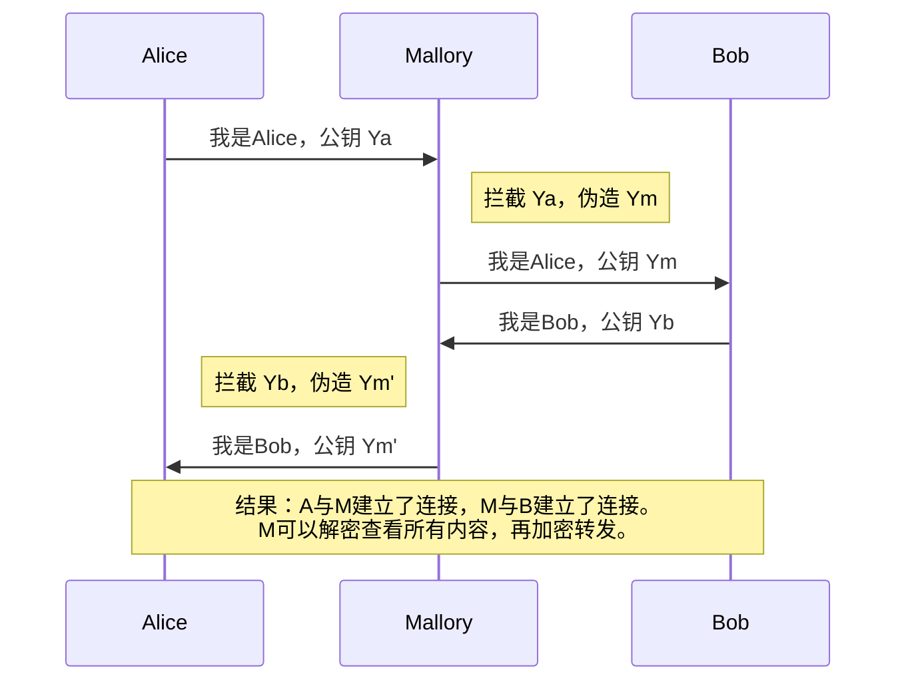
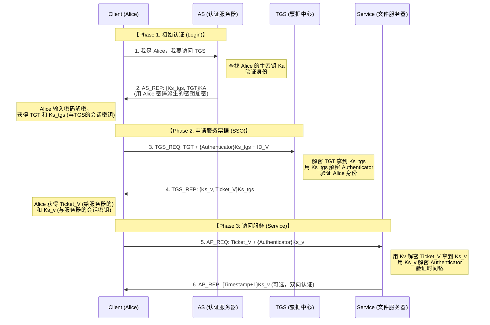

# **密码学复习笔记 (Part 1)**

# **序言：在不可信网络上构建安全通信**

## **1. TCP/IP：互联优先，安全缺失**

我们正视互联网的根本矛盾：**TCP/IP 协议栈设计的核心是鲁棒性，而非安全性。**
当数据离开网卡，穿越路由器和交换机时，在链路层和网络层默认是**明文传输**的。任何中间节点（恶意 WiFi、被攻陷的路由器）都可以：

* **截获 (Interception)**：破坏保密性。
* **篡改 (Modification)**：破坏完整性。
* **伪造 (Fabrication)**：破坏真实性。

**密码学的使命，就是通过数学手段，在本质不可信的信道上构建逻辑上的安全管道。**

## **2. 核心演进逻辑 (The Big Picture)**

* **Phase 1 保密性**：解决“防窃听”。从古典密码 $\to$ DES/AES $\to$ 分组工作模式。
  * *遗留问题：密钥如何分发？如何防篡改？*
* **Phase 2 信任与完整性**：解决“防篡改”和“密钥协商”。引入 Hash $\to$ RSA/DH $\to$ 数字签名。
  * *遗留问题：如何防中间人攻击（公钥归属问题）？*
* **Phase 3 & 4 基础设施与协议**：解决“大规模信任”。引入 PKI/CA $\to$ SSL/TLS, Kerberos。

---

# **Phase 1: 保密性的实现与演进**

## **0. 引言：古典密码的致命缺陷**

**Phase 1的核心任务：实现保密性（Confidentiality），防止窃听者Eve读取明文。**

在现代密码学诞生之前，人类使用了两千多年的古典密码（Caesar、Vigenère、Playfair）都存在致命缺陷：

* **安全性依赖于算法的保密性（Security by Obscurity）**。一旦算法泄露（通过逆向工程、内部人员叛变等），整个系统立即崩溃，所有历史通信都将暴露。
* 更糟糕的是，古典密码的密钥空间极小（Caesar仅26种可能），且对频率分析（Frequency Analysis）毫无抵抗力。
* 二战期间，盟军破解Enigma密码机的案例证明：**算法复杂度不等于密码强度，密钥管理才是核心。**

**现代密码学的根本转变**：遵循**Kerckhoffs原则**——系统的安全性应完全依赖于密钥（Key），算法可以完全公开。这一原则催生了DES、AES等标准算法，它们的设计细节完全透明，却能在密钥保密的前提下保持安全性。

## **1. 逻辑演进：从算法保密到密钥保密**

* **古典密码 (Classical Cryptography)**：
  * **核心缺陷**：安全性依赖于“算法不公开”。
  * **两大原子操作**：
    * **代换 (Substitution)**：字符替换（如 Caesar）。这是 **混淆 (Confusion)** 的雏形。
    * **置换 (Permutation)**：位置打乱（如 栅栏密码）。这是 **扩散 (Diffusion)** 的雏形。
* **现代密码学 (Modern Cryptography)**：
  * **Kerckhoffs 原则**：系统的安全性应完全依赖于 **密钥 (Key)**，算法是公开的。
  * **分类**：
    * **流密码 (Stream Cipher)**：逐比特异或（如 RC4）。
    * **分组密码 (Block Cipher)**：将明文切块（如 64bit），整块加密。这是本阶段重点。

---

## **2. 核心架构：Feistel 网络结构 (The Feistel Network)**

这是 DES 的灵魂。Horst Feistel 设计这种结构的**根本目的**是：**让加密和解密使用完全相同的硬件电路/代码，只需逆序使用子密钥。**

### **2.1 结构解析**

将 $2w$ 位的明文均分为左右两半：$L_{i-1}, R_{i-1}$。

* **迭代公式**：

  $$
  \begin{cases}
  L_i = R_{i-1} \\
  R_i = L_{i-1} \oplus F(R_{i-1}, K_i)
  \end{cases}
  $$

  * **$F$ (轮函数)**：核心非线性部件。
  * **$\oplus$ (XOR)**：异或的可逆性 ($A \oplus B \oplus B = A$) 保证了解密的可行性，无论 $F$ 函数多么复杂甚至不可逆。

### **2.2 设计要素 (Shannon's Theory)**

DES 遵循香农的两大原则：

1. **混淆 (Confusion)**：让密文与密钥的关系尽可能复杂（通过 **S盒** 实现，DES唯一的非线性部件）。
2. **扩散 (Diffusion)**：明文的一位变动应影响密文的很多位（雪崩效应，通过 **P盒** 置换实现）。

---

## **3. 典型实例：DES (Data Encryption Standard)**

### **3.1 关键参数**

* **分组长度**：64 bits。
* **密钥长度**：64 bits（其中 8 位用于校验，**有效密钥 56 bits**）。
* **轮数**：16 轮。

### **3.2 安全性短板与 3DES 的补救**

$2^{56}$ 的密钥空间在现代算力下可被秒破。工业界引入了 **3DES**。

* **结构：EDE (Encrypt-Decrypt-Encrypt)**
  $$
  C = E_{K3}( D_{K2}( E_{K1}(P) ) )
  $$
* **为什么是 E-D-E 而不是 E-E-E？**
  * **兼容性**：当 $K_1=K_2=K_3$ 时，结果等同于单次 DES。允许新设备与旧系统通信。
* **为什么不是双重 DES (2DES)？**
  * **中间相遇攻击 (Meet-in-the-Middle Attack)**：
    对于 $C = E_{K2}(E_{K1}(P))$，攻击者可以：
    1. 正向计算 $X = E_{K1}(P)$
    2. 逆向计算 $X = D_{K2}(C)$
       通过空间换时间，攻击复杂度从 $2^{112}$ 降至 **$2^{57}$**。因此必须用三重加密。

---

## **4. 工程落地：分组工作模式 (Modes of Operation)**

算法只能处理 64位 数据块。处理长文件时，必须采用**工作模式**。

### **4.1 核心概念：语义安全 (Semantic Security)**

**为什么需要 IV/Nonce？**
如果直接使用 $C = E_K(P)$，相同的明文将永远产生相同的密文。攻击者无需破解密钥，只需统计密文模式即可推断信息（如 Linux 企鹅图实验）。
**语义安全**要求：即使明文重复，密文每次也必须不同。

### **4.2 三种典型模式对比**

| 模式                         | 描述 (Mechanism)                                           | 优点 (Pros)                                                             | 缺点 (Cons)                                                      | 典型场景                   |
| :--------------------------- | :--------------------------------------------------------- | :---------------------------------------------------------------------- | :--------------------------------------------------------------- | :------------------------- |
| **ECB** (电子密码本)   | $C_i = E_K(P_i)$ ` ` 各块独立加密                   | 1. 简单 ` `2. **可并行计算**                                 | **极不安全**：模式泄露。` `**违反语义安全。**   | 仅用于加密极短数据(如密钥) |
| **CBC** (密码分组链接) | $C_i = E_K(P_i \oplus C_{i-1})$` `$C_0 = IV$      | 1. 隐蔽明文模式 ` `2. **IV保证语义安全**                     | 1.**加密不可并行** (串行)` `2. 误差传播               | 通用文件加密、IPSec        |
| **CTR** (计数器模式)   | $C_i = P_i \oplus E_K(Nonce \| i)$` `本质变成流密码 | 1.**可并行计算** ` `2. 无需填充 (Padding)` `3. 效率最高 | 必须保证 (Key, Nonce) 唯一，` `否则导致密钥流重用（致命）。 | 现代网络协议、AES-GCM      |

---

## **5. Phase 1总结：保密性已实现，但遗留三大问题**

我们拥有了 AES/CBC，解决了**“看不见”**的问题，但留下了三个死穴：

1. **密钥分发 (Key Distribution)**：Alice 和 Bob 怎么在不安全的网上协商 AES 密钥？
2. **完整性 (Integrity)**：AES 无法防止篡改（攻击者可以翻转密文比特）。
3. **不可否认性 (Non-repudiation)**：Bob 无法证明消息确实是 Alice 发的（因为 Bob 也有密钥）。

**这三个问题催生了 Phase 2：哈希函数与公钥密码学。**

---

# **Phase 2: 信任建立与完整性 (Trust, Integrity & Asymmetric)**

## **1. 完整性的基石：哈希函数 (Hash Functions)**

哈希函数的本质是数据的**“数字指纹”**。

### **1.1 核心特性**

* **单向性 (Pre-image Resistance)**：已知 $y$，求 $x$ 难。
* **抗强碰撞性 (Collision Resistance)**：找任意一对 $x_1 \neq x_2$ 使得 $H(x_1) = H(x_2)$ 难。
  * *注：MD5/SHA-1 因可被碰撞攻击已淘汰。*

### **1.2 深入解剖：MD5 算法结构 (考点)**

MD5 展示了现代哈希的 **Merkle-Damgård 结构**。

* **填充规则 (Padding)**：即便长度符合，也**必须**填充。
  * 规则：先填一个 `1`，然后填无数个 `0`，最后 64 位填**原始长度**。
  * 目的：防止长度扩展攻击，明确消息边界。

---

## **2. 认证的进阶：从 MAC 到 数字签名**

### **2.1 消息认证码 (MAC)**

* **原理**：$T = \text{MAC}(K, M)$。发送方用**共享密钥** $K$ 生成标签。
* **局限**：只能防第三方，**不能防内鬼**。因为 Alice 和 Bob 都有 $K$。即：**无不可否认性**。

### **2.2 数字签名 (Digital Signature)**

利用**公钥密码学**解决抵赖问题。

* **原理**：
  * **签名**：$S = \text{Sign}(PR_{Alice}, H(M))$ —— 用私钥加密哈希。
  * **验证**：$H(M) \stackrel{?}{=} \text{Verify}(PU_{Alice}, S)$ —— 用公钥解密并比对。
* **逻辑闭环**：只有 Alice 有私钥 -> 只有 Alice 能签 -> Alice 无法抵赖。

---

## **3. 公钥密码学的皇冠：RSA 算法**

RSA 的安全性基于**大整数分解难题**。

### **3.1 数学基石 (Math Foundation)**

1. **欧拉函数**：$\phi(n) = (p-1)(q-1)$。
2. **欧拉定理**：$a^{\phi(n)} \equiv 1 \pmod n$。
3. **模逆元**：$e \cdot d \equiv 1 \pmod{\phi(n)}$。

### **3.2 算法过程**

* **密钥生成**：选 $p, q$ -> 算 $n, \phi(n)$ -> 选 $e$ -> 算 $d$。
* **加密**：$C = M^e \pmod n$。
* **解密**：$M = C^d \pmod n$。

### **3.3 为什么解密一定成功？(Hardcore Proof)**

我们要证明 $(M^e)^d \equiv M \pmod n$。

$$
(M^e)^d = M^{ed} = M^{k\phi(n) + 1} = (M^{\phi(n)})^k \cdot M
$$

根据欧拉定理 $M^{\phi(n)} \equiv 1 \pmod n$，故：

$$
1^k \cdot M \equiv M \pmod n
$$

*注：这是 RSA 正确性的根本保障。*

---

## **4. 密钥交换：Diffie-Hellman (DH)**

在没有 RSA 之前，Alice 和 Bob 如何在全世界都能听到的网络上协商出一个**保密的** Session Key？

### **4.1 直观理解：颜色混合**

DH 的精髓在于**单向性**（混合颜色容易，分离颜色难）。

1. **公共底色 (黄色)**：公开的 $g, p$。
2. **私密色 (红/蓝)**：Alice 生成 $X_A$，Bob 生成 $X_B$。
3. **公开混合色 (橙/绿)**：Alice 发送 $Y_A = g^{X_A}$，Bob 发送 $Y_B = g^{X_B}$。
4. **秘密最终色 (棕色)**：
   * Alice: $Y_B$ (绿) + $X_A$ (红) = 棕色。
   * Bob: $Y_A$ (橙) + $X_B$ (蓝) = 棕色。
   * **窃听者**：只看到 黄、橙、绿，无法合成 棕色。

### **4.2 致命缺陷：中间人攻击 (Man-in-the-Middle Attack)**

**DH 没有身份认证**。Mallory 可以卡在中间，分别与 Alice 和 Bob 协商密钥。

---

# **Phase 3: 密钥管理与基础设施 (Infrastructure & Key Management)**

## **0. 引言：从密码学原语到工程系统的鸿沟**

### **0.1 核心矛盾：规模化挑战 (The Scalability Challenge)**

在 Phase 1 和 Phase 2 中，我们手中的武器（AES, RSA, Hash）已经足够强大，但它们都预设了一个理想前提：**通信双方已经拥有了彼此的密钥或公钥。** 然而，在现实的大规模网络中，这个前提本身就是最大的难题。

当我们试图将密码学原语部署到由 $N$ 个用户组成的网络时，面临两个数学上的灾难：

1. **密钥数量的组合爆炸 (对于对称加密)**：
   如果采用两两共享密钥的模式，网络中需要的密钥总数为 $N(N-1)/2$。对于一个 10 万人的大型企业，这意味着需要管理约 50 亿个密钥。这在存储和更新上都是不可接受的。
2. **公钥归属的信任危机 (对于非对称加密)**：
   虽然公钥可以公开，但如果 Alice 收到一个声称属于 Bob 的公钥 $PU_B$，她如何确认这不属于攻击者 Mallory？在 Phase 2 的 DH 协议分析中，我们已经看到**中间人攻击 (MITM)** 是如何利用身份认证的缺失来瓦解整个加密体系的。

### **0.2 解决思路：引入可信第三方 (TTP)**

为了解决上述问题，密码学工程引入了**可信第三方 (Trusted Third Party, TTP)** 的概念。所有的信任不再基于个人之间的私相授受，而是基于对这个权威机构的共同信任。

根据底层使用的密码体制不同，TTP 演化出了两条截然不同的技术路线：

* **对称体制路线**：**KDC (密钥分配中心)** 与 **Kerberos**。依靠中心化的“老大哥”在线分发票据。
* **非对称体制路线**：**PKI (公钥基础设施)** 与 **CA (证书授权中心)**。依靠离线的数字证书和信任链。

---

## **1. 对称密码的中心化治理：KDC 与 Kerberos**

在企业内网、Windows 域环境等**封闭系统**中，所有用户和服务器都归属于同一组织管理，这使得基于对称密码的中心化方案成为最高效的选择。其巅峰之作便是 **Kerberos 协议**。

### **1.1 基础模型：Needham-Schroeder 协议与 KDC**

**KDC (Key Distribution Center)** 的核心逻辑是：既然 Alice 和 Bob 无法直接建立信任，那就在他们之间引入一个双方都信任的 KDC。

* 每个人只与 KDC 共享一个**主密钥 (Master Key)**。
* 当 Alice 想联系 Bob 时，由 KDC 生成一个临时的**会话密钥 (Session Key)**，并分别加密发给 Alice 和 Bob。

**主密钥 vs 会话密钥**：

* **主密钥 ($K_m$)**：长期有效，仅用于加密“会话密钥”，极少在网络传输。
* **会话密钥 ($K_s$)**：一次性使用，用于加密实际数据，用完即弃。**这种分级机制大大降低了主密钥泄露的风险。**

### **1.2 Kerberos 协议深度解析 (The Hydra of Authentication)**

Kerberos（希腊神话中的三头犬）是为了解决开放网络节点身份认证而设计的。它不信任客户端，不信任服务器，也不信任网络，只信任 KDC。

#### **1.2.1 核心组件**

Kerberos 将 KDC 拆分为两个逻辑实体，以支持**单点登录 (SSO)**：

1. **AS (Authentication Server)**：认证服务器。只负责验证“你是谁”，并颁发“TGT”。
2. **TGS (Ticket-Granting Server)**：票据授权服务器。负责验证“TGT”，并颁发访问具体服务的“Service Ticket”。

#### **1.2.2 核心机制：TGT 与 票据**

* **Ticket (票据)**：这是 Kerberos 的灵魂。票据是**“只有 KDC 和目标服务器能读懂的加密数据包”**。
  * 结构：$Ticket = E_{K_{Server}}(ID_{User} || Address || Validity || K_{Session})$
  * **关键点**：用户 Alice 拿到票据后是**解不开**的，她只能像这就好比拿着一封密封的介绍信，原样递交给服务器。
* **TGT (Ticket-Granting Ticket)**：这是访问 TGS 的票据。拥有 TGT 意味着“我已经通过了 AS 的身份验证”。

#### **1.2.3 完整认证流程 (The 3-Pass Logic)**

这是一个经典的**三次往返 (6步)** 交互流程，是考试的绝对重点。

**关键技术细节解析**：

1. **为什么需要 TGT？**
   TGT 的存在使得 Alice 只需要在登录时输入一次密码。之后访问邮件服务器、打印服务器、文件服务器时，只需向 TGS 出示 TGT 换取相应的 Service Ticket，而无需重复输入密码。这就是 **SSO**。
2. **Authenticator (认证符) 的作用**：
   $Authenticator = \{ID_{Alice} || Timestamp\}_{K_{Session}}$。
   它是为了证明**“我就是 TGT/Ticket 的持有者”**。防止黑客截获了 Alice 的 Ticket 后进行重放。
3. **时间戳与防重放**：
   Kerberos 严重依赖时间同步。如果黑客截获了 Step 5 的报文并重放，服务器解密后会发现时间戳与当前系统时间差超过窗口期（默认 5 分钟），从而拒绝服务。这也是为什么域环境时间不同步会导致无法登录。

---

## **2. 公钥密码的去中心化治理：PKI 与 X.509**

在互联网这种**开放环境**下，没有一个 KDC 能掌握全球几十亿用户的主密钥。我们需要一种分布式的、离线的信任模型。**PKI (Public Key Infrastructure)** 应运而生。

### **2.1 核心逻辑：CA 与 数字证书**

PKI 的核心思想是：引入一个权威机构 **CA (Certificate Authority)**，它用自己的**私钥**对“Alice 的身份”和“Alice 的公钥”进行签名，生成**数字证书**。

* **证书 (Certificate)** = 公钥 + 身份信息 + CA签名。
* **验证逻辑**：Bob 信任 CA $\rightarrow$ Bob 验证 CA 的签名有效 $\rightarrow$ Bob 信任证书中的公钥属于 Alice。

### **2.2 X.509 证书标准 (The Standard)**

X.509 v3 是当前使用的标准证书格式。

**证书核心字段**：

* **Version**：版本号（通常是 v3）。
* **Serial Number**：序列号，CA 内部唯一标识。
* **Signature Algorithm**：签名算法（如 sha256WithRSAEncryption）。
* **Issuer**：颁发者（CA 的名字）。
* **Validity**：有效期（Not Before, Not After）。
* **Subject**：主体（证书拥有者，如 `CN=www.google.com`）。
* **Subject Public Key Info**：**核心数据**，主体的公钥。
* **Extensions**：扩展字段（如密钥用途 Key Usage）。
* **Signature Value**：**CA 对上述所有字段 Hash 值的数字签名。**

### **2.3 信任链 (Chain of Trust)**

由于操作系统不可能预装全球所有实体的公钥，PKI 采用了层级信任结构：

1. **Root CA (根 CA)**：自签名证书，信任的锚点（Anchor）。内置在 OS 和浏览器中（如 DigiCert, GlobalSign）。
2. **Intermediate CA (中间 CA)**：由 Root CA 签名授权。负责具体的签发工作。
3. **End-Entity (终端实体)**：由中间 CA 签名。即我们网站或个人使用的证书。

**验证过程（递归）**：
浏览器收到 `baidu.com` 的证书 $\rightarrow$ 发现是 `GlobalSign Intermediate CA` 签发的 $\rightarrow$ 验证中间 CA 的签名 $\rightarrow$ 发现中间 CA 是 `GlobalSign Root CA` 签发的 $\rightarrow$ 在本地受信任列表中找到 Root CA 并验证 $\rightarrow$ **信任链闭环**。

### **2.4 证书撤销 (Revocation)**

如果私钥泄露，证书必须在过期前作废。有两种机制：

1. **CRL (Certificate Revocation List)**：CA 定期发布“黑名单”。缺点是滞后性大，列表体积大。
2. **OCSP (Online Certificate Status Protocol)**：在线证书状态协议。浏览器实时向 CA 查询某个特定序列号的证书状态。

---

## **3. 最终形态：混合加密 (Hybrid Encryption)**

至此，我们完成了基础设施的构建。在实际应用中，我们几乎总是结合使用 Phase 1 (对称) 和 Phase 3 (公钥) 的技术，形成**混合加密体制**。

**标准流程**：

1. **身份认证**：利用 PKI/X.509 验证对方公钥 $PU_B$ 的合法性。
2. **密钥协商**：利用公钥加密体系（RSA 或 ECDH）安全地传输或协商一个临时的**会话密钥 (Session Key)**。
3. **数据传输**：利用协商好的会话密钥，配合对称加密算法（AES-GCM）进行高速、安全的数据传输。

---

## **Phase 3 总结**

基础设施层解决了密码学从“算法”到“系统”的跨越：

* **KDC/Kerberos** 解决了封闭网络中的信任与密钥分发，依靠**在线的票据流转**和**时间戳**抗重放。
* **PKI/CA** 解决了开放网络中的信任锚点，依靠**离线的数字签名**和**信任链**。

这两大体系构成了现代网络安全的基石。接下来，我们将看到这些基础设施是如何在应用层、传输层和网络层被组装成具体的协议。

---

# **Phase 4: 全栈协议落地 (Real-World Protocols)**

## **0. 引言：协议栈大一统**

在这一阶段，我们将不再讨论单一的算法，而是讨论**协议 (Protocol)**。协议是一组规则的集合，它规定了如何组合使用加密、签名、哈希等原语，以满足特定场景的安全需求。

我们将按照 TCP/IP 五层模型，自上而下地剖析四大经典协议：

1. **应用层 (Application)**：PGP (电子邮件)。
2. **传输层 (Transport)**：SSL/TLS (Web 安全)。
3. **网络层 (Network)**：IPSec (基础设施互联)。
4. **特殊业务层**：SET (电子交易，虽然已过时，但其双重签名思想极具教学价值)。

---

## **1. 应用层：电子邮件安全 (PGP)**

**场景特征**：电子邮件是**非实时**、**存储-转发**的通信方式。Alice 发信时 Bob 可能不在线，因此无法进行实时的握手协商。
**PGP (Pretty Good Privacy)** 由 Phil Zimmermann 开发，是混合加密的教科书级应用。

### **1.1 PGP 的五大核心服务**

PGP 不是单一算法，它组合了五个操作，顺序至关重要：

1. **数字签名 (Authentication)**：
   * **操作**：`Sign(PrivKey_A, Hash(Msg))`。
   * **目的**：提供发送方认证和完整性。
2. **压缩 (Compression)**：
   * **操作**：ZIP 算法。
   * **位置**：**在签名之后，加密之前。**
   * **原因 (Why?)**：
     * 存储效率：节省带宽。
     * 安全性：压缩消除了明文的统计冗余（如字符频率），增加了针对密文的密码分析难度。
     * *注意*：如果在签名之前压缩，解压后的文件可能因压缩软件版本不同导致哈希值改变，导致验签失败。
3. **保密性 (Confidentiality)**：
   * **操作**：生成一次性会话密钥 $K_s$，用 $K_s$ 加密消息（IDEA/AES），再用 Bob 的公钥加密 $K_s$（RSA）。
4. **基数转换 (Radix-64 Conversion)**：
   * **操作**：将二进制密文转换为 ASCII 字符串（类似 Base64）。
   * **原因**：SMTP 协议设计之初只支持 7-bit ASCII 文本，直接传输二进制会导致数据损坏。
5. **分段与重组**：处理超大邮件。

### **1.2 信任模型：Web of Trust**

与 X.509 严格的层级 CA 不同，PGP 早期采用 **Web of Trust (信任网)**。

* **核心思想**：每个人都可以充当 CA。
* **操作**：Alice 信任 Bob，Bob 签发了 Carol 的公钥，那么 Alice 也间接信任 Carol。
* *评价*：这种去中心化模型在极客圈很流行，但难以在商业环境中大规模推广，现代 S/MIME 标准已转向使用 X.509 证书。

---

## **2. 传输层：Web 安全 (SSL/TLS)**

**场景特征**：Web 浏览是**实时**、**交互式**的。需要保护 HTTP 流量不被窃听和篡改。
**TLS (Transport Layer Security)** 是 SSL (Secure Sockets Layer) 的继承者。它位于 TCP 之上，应用层之下。

### **2.1 协议架构：两层设计**

TLS 并非单一协议，而是分层结构：

* **底层：记录协议 (Record Protocol)**
  * 负责数据的**分片、压缩、MAC 计算、加密**。
  * 它提供了一个“加密管道”，上层的所有数据（无论是握手消息还是 HTTP 内容）都通过这个管道传输。
* **上层：握手协议 (Handshake Protocol)**
  * 这是 TLS 的大脑。负责在数据传输前协商版本、算法、验证身份、生成密钥。

### **2.2 TLS 握手协议详解 (The 4-Way Handshake)**

#### **Phase 1: 建立安全能力 (Hello)**

* **ClientHello**：客户端发送支持的 TLS 版本、加密套件列表（如 `TLS_RSA_WITH_AES_128_CBC_SHA`）以及**随机数 $N_c$**。
* **ServerHello**：服务器选择确定的版本和套件，并返回**随机数 $N_s$**。

#### **Phase 2: 服务器认证 (Certificate)**

* **Certificate**：服务器发送 X.509 证书链。
* **ServerHelloDone**：告知发送完毕。
* *客户端动作*：验证证书合法性（查 CA、验签名、看有效期、对域名）。

#### **Phase 3: 密钥交换 (Key Exchange)**

* **ClientKeyExchange**：
  * 客户端生成一个 48 字节的**预主密钥 (Pre-Master Secret, PMS)**。
  * 用服务器公钥 $PU_S$ 加密 PMS 发送给服务器。
  * *此时，只有服务器能解密拿到 PMS。*
* **主密钥生成**：双方利用 $PMS, N_c, N_s$ 计算出**主密钥 (Master Secret)**，进而派生出加密密钥、MAC 密钥等。
  * *Why Randoms?* $N_c$ 和 $N_s$ 保证了每次会话密钥的唯一性，防止重放攻击。

#### **Phase 4: 完成 (Finish)**

* **ChangeCipherSpec**：告知对方“以后发的消息都要加密了”。
* **Finished**：**这是第一条加密消息**。内容是之前所有握手消息的 Hash。
  * *作用*：验证握手过程有没有被中间人篡改（例如降级攻击，将强加密算法改为弱算法）。如果解密并验证 Hash 成功，说明通道建立安全。

### **2.3 会话复用 (Session Resumption)**

为了减少握手带来的 2-RTT 延迟，TLS 支持复用：

* **Session ID**：服务器缓存会话状态。
* **Session Ticket**：服务器将会话状态加密发给客户端保存（无状态模式），客户端下次带上 Ticket 即可恢复会话，无需重新计算密钥。

---

## **3. 网络层：基础设施安全 (IPSec)**

**场景特征**：企业需要连接两个异地的数据中心，或者员工需要远程接入内网。需要在 IP 层实现透明加密，上层应用（Web, FTP, Email）无需修改。

### **3.1 两个核心协议：AH 与 ESP**

* **AH (Authentication Header)**：
  * 只提供**完整性**和**源认证**，**不提供加密**。
  * 保护范围覆盖 IP 头和载荷。
  * *现状*：由于无法穿越 NAT（NAT 会修改 IP 头导致 AH 校验失败），且不提供保密性，现在较少单独使用。
* **ESP (Encapsulating Security Payload)**：
  * 提供**保密性 (加密)**、**完整性**和**源认证**。
  * *现状*：IPSec 的绝对主流。

### **3.2 两种工作模式：传输 vs 隧道 (考点)**

这是 IPSec 最容易混淆的概念。

1. **传输模式 (Transport Mode)**：

   * **保护对象**：IP 包的**载荷 (Payload)**（即 TCP/UDP 段）。
   * **IP 头**：保留原 IP 头不加密。
   * **应用**：**端到端**通信（如两台服务器之间直接加密通信）。
   * *结构*：`[原IP头] [ESP头] [加密的TCP段] [ESP尾]`
2. **隧道模式 (Tunnel Mode)**：

   * **保护对象**：**整个原 IP 包**（包括原 IP 头）。
   * **IP 头**：生成一个新的 IP 头（通常是网关地址）。
   * **应用**：**VPN (网关到网关)**。员工连到 VPN 网关，原数据包被封装在隧道包里传输。
   * *结构*：`[新IP头(网关)] [ESP头] [加密的原IP包(含原IP头)] [ESP尾]`

### **3.3 密钥管理：IKE (Internet Key Exchange)**

IPSec 极其复杂，手动配置密钥（SA）很痛苦。IKE 协议基于 Diffie-Hellman，用于自动协商 SA（安全关联），实现密钥的动态生成和轮换。

---

## **4. 电子交易安全：SET (Secure Electronic Transaction)**

**场景特征**：由 Visa/MasterCard 发起。在 90 年代，为了解决“用户不信商家，商家不信用户”的信任死结。虽然因过于复杂已被 SSL/TLS 取代，但其**双重签名**设计是密码学协议设计的巅峰。

### **4.1 核心需求：隐私分离**

* **商家**：需要知道你买了什么（订单 OI），但不需要知道你的信用卡号（支付 PI）。
* **银行**：需要知道扣多少钱（支付 PI），但不需要知道你买的是成人杂志还是圣经（订单 OI）。
* **用户**：希望两者必须绑定，防止商家把我的钱挪作他用，或把我的订单换成别的。

### **4.2 解决方案：双重签名 (Dual Signature)**

Alice 生成两个摘要：$H(OI)$ 和 $H(PI)$。
将它们拼接后再哈希：$H_{POMD} = Hash( H(OI) || H(PI) )$。
用私钥签名：$DS = E_{KR_A}(H_{POMD})$。

**发送给商家的数据**：`OI`, `DS`, `H(PI)`（注意发的是 PI 的哈希，不是 PI 本身）。
**商家验证逻辑**：

1. 计算 $H(OI)$。
2. 结合收到的 $H(PI)$，计算 $H'(POMD) = Hash( H(OI) || H(PI) )$。
3. 解密签名 $DS$，对比 Hash 值。

* **结果**：商家验证了签名的合法性，确认了 OI 是 Alice 发的，且 PI 确实存在并与 OI 关联，但商家**反推不出 PI**。

**结论**：SET 完美实现了**多方互不信任环境下的隐私隔离与交易原子性**。

---

## **Phase 4 总结**

协议层展示了密码学原语如何适应不同的网络环境：

* **PGP** 适应了离线环境，采用“签名+压缩+加密+编码”的流水线。
* **SSL/TLS** 适应了实时 Web 环境，设计了复杂的握手协议来协商密钥及身份。
* **IPSec** 适应了底层网络互联，通过隧道模式构建 VPN。
* **SET** 展示了通过复杂的哈希组合实现精细的隐私控制。

---

# **Phase 5: 课程知识总结 (Grand Unification)**

## **1. 全景回顾**

回顾整个密码学课程，我们实际上是在搭建一座安全大厦，每一层都依赖下一层的稳固：

1. **地基：保密性 (Phase 1)**

   * 我们从古典密码的失败中吸取教训，确立了 **Kerberos原则**。
   * 利用 **Feistel 结构** 和 **SP 网络**，制造了 **DES/AES** 这样的坚固盾牌。
   * 通过 **CBC/CTR** 模式，让盾牌能防护任意大小的数据流。
   * *核心成果*：数据看不懂。
2. **支柱：完整性与认证 (Phase 2)**

   * 为了防止盾牌后的数据被篡改，我们引入了 **Hash 函数**。
   * 为了证明盾牌的持有者身份，我们引入了 **公钥密码 (RSA/ECC)** 和 **数字签名**。
   * *核心成果*：数据改不了，来源赖不掉。
3. **横梁：信任基础设施 (Phase 3)**

   * 为了在茫茫人海中分发密钥，我们建立了 **KDC (Kerberos)** 和 **PKI (CA/X.509)**。
   * 它们将单纯的数学信任转化为制度信任，解决了“你是谁”的终极问题。
   * *核心成果*：密钥分发安全，身份可信。
4. **屋顶：全栈协议 (Phase 4)**

   * 最后，我们将上述所有组件封装进 **PGP, TLS, IPSec**。
   * 这些协议在应用层、传输层、网络层全方位地保护着我们的数字生活。
   * *核心成果*：构建了可用的安全互联网。

## **2. 核心考点与思维模型 (Final Checklist)**

在面对考试或工程问题时，请通过以下模型进行分析：

* **CIA 模型**：任何协议分析，先问三个问题：如何保密？(AES)，如何防篡改？(Hash/MAC)，如何认证？(Signature/Cert)。
* **中间人攻击 (MITM)**：这是所有密钥交换协议（DH, 原始 socket）的噩梦。防御的唯一手段是**身份认证**（证书或预共享密钥）。
* **重放攻击 (Replay)**：这是所有认证协议（Kerberos, 握手）的噩梦。防御手段是**时效性**（时间戳）或**唯一性**（Nonce）。
* **混合加密**：这是效率与安全的妥协。永远是用 RSA/DH 换密钥，用 AES 传数据。

## **3. 结语：安全是一个过程，不是一个产品**

密码学课程的结束，只是安全工程的开始。
DES 被破解告诉我们算力的增长会让今天的安全变成明天的漏洞（所有密钥都要有有效期）。
MD5 的碰撞告诉我们数学理论的突破会颠覆基础设施（算法敏捷性的重要）。
SSL 到 TLS 的演进告诉我们协议设计总会有缺陷（前向保密、侧信道攻击）。

作为计算机专业的学生，掌握这些原理不仅仅是为了通过考试，更是为了在未来的系统设计中，能够本能地识别风险，并正确地使用这些数学工具来捍卫数据的尊严。
