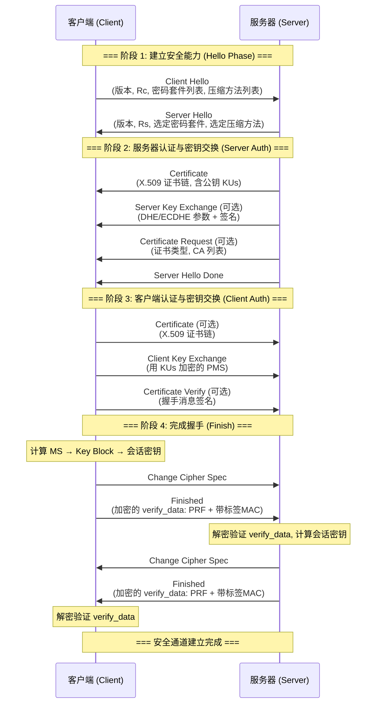

# **第十一章 Web 安全学习笔记 (精简重构版)**

## **一、 Web 安全体系概述**

Web 安全防护构建在网络协议栈的不同层次上，各层分工明确：

| 层次             | 协议/技术         | 核心功能                                                                            |
| :--------------- | :---------------- | :---------------------------------------------------------------------------------- |
| **网络层** | **IPSec**   | **透明传输**：为 IP 数据包提供加密和认证，对上层透明。                        |
| **传输层** | **SSL/TLS** | **安全管道**：在 TCP 之上建立端到端安全通道，保障机密性与完整性（如 HTTPS）。 |
| **应用层** | **SET**     | **特定业务**：针对特定应用（如信用卡支付）的安全协议，处理特殊业务逻辑。      |

## **二、 SSL/TLS 协议详解**

**SSL/TLS** (Secure Sockets Layer / Transport Layer Security) 是位于 **TCP 之上、应用层之下** 的安全协议，为 HTTP 等应用提供端到端的安全通道。

### **2.1 体系结构与核心概念**

SSL/TLS 包含两个核心子协议：

1. **SSL 握手协议 (Handshake Protocol)**：**（上层/控制面）** 负责在通信开始前验证身份、协商加密算法并生成共享密钥。
2. **SSL 记录协议 (Record Protocol)**：**（底层/数据面）** 负责使用握手产生的密钥，对应用层数据进行封装、加密和完整性校验。

> **连接 (Connection) vs. 会话 (Session)**
>
> * **会话 (Session)**：**长期、握手建立**。定义了一组安全参数（主密钥、加密套件）。建立成本高。
> * **连接 (Connection)**：**短期、数据传输**。通过复用"会话"来避免频繁的握手，提高效率。

#### **安全性细节**

* **抗重放攻击**：握手过程中交换的随机数（$R_c, R_s$）及连接中使用的 **128 位随机序列号** 有效防止了重放攻击。
* **密钥长度限制**：课件提及由于历史上的出口限制，早期浏览器可能仅支持 56 位对称密钥和 512 位非对称密钥，而现代安全标准要求至少 128 位对称密钥和 1024 位非对称密钥。

---

### **2.2 SSL 握手协议 (Handshake Protocol)**

这是 SSL/TLS 最关键的阶段，目标是在不安全的信道上**协商出一份双方共享的“会话密钥”**。

#### **2.2.1 握手消息参数定义（按实际握手流程顺序）**

| 阶段 | 消息                          | 参数                                                       | 描述                                                                         |
| ---- | ----------------------------- | ---------------------------------------------------------- | ---------------------------------------------------------------------------- |
| 0    | Hello Request                 | 无                                                         | 服务器请求客户端重新发起握手（可选，用于会话重协商）                         |
| 1    | **Client Hello**        | **版本，随机数，会话ID，密码套件列表，压缩方法列表** | **客户端发起SSL/TLS会话，提供支持的协议版本和算法列表**                |
| 1    | **Server Hello**        | **版本，随机数，会话ID，选定密码套件，选定压缩方法** | **服务器响应，从客户端提供的列表中选择协议版本和算法**                 |
| 2    | **Certificate**         | **X.509 v3 证书链**                                  | **服务器发送自己的证书（含公钥），供客户端验证身份**                   |
| 2    | Server_Key_Exchange           | 密钥交换参数，签名                                         | 服务器发送额外的密钥交换参数（可选，仅在特定算法如DHE/ECDHE时需要）          |
| 2    | Certificate Request           | 证书类型，可接受的CA列表                                   | 服务器请求客户端提供证书进行身份认证（可选）                                 |
| 2    | **Server Hello Done**   | **无**                                               | **服务器表示Hello阶段消息发送完毕**                                    |
| 3    | Certificate                   | X.509 v3 证书链                                            | 客户端发送自己的证书（可选，仅当服务器请求时）                               |
| 3    | **Client_Key_Exchange** | **加密的预主密钥（如:RSA）或密钥交换参数（如:DH）**  | **客户端发送密钥交换信息，用于生成主密钥**                             |
| 3    | Certificate Verify            | 握手消息的签名                                             | 客户端用私钥签名之前的握手消息，证明拥有证书私钥（可选，仅当发送了证书时）   |
| 4    | **Change Cipher Spec**  | **无**                                               | **通知对方后续消息将使用协商的加密参数（独立协议，非握手协议一部分）** |
| 4    | **Finished**            | **带标签的MAC（包含所有握手消息的Hash与标签）**      | **第一条加密消息，包含verify_data，用于验证握手完整性和密钥正确性**    |

#### **2.2.2 握手流程图示**

#### **2.2.3 详细阶段解析**

##### **第一阶段：建立安全能力 (Phase 1: Hello)**

协商协议版本、加密套件，并交换随机数。

$$
C \to S: \text{Client Hello} \ (\text{Version}, R_c, \text{Cipher Suites}, \text{Compression Methods})
$$

$$
S \to C: \text{Server Hello} \ (\text{Version}, R_s, \text{Selected Cipher Suite}, \text{Compression Method})
$$

* **流程叙述**：
  * 客户端首先发送 **Client Hello**，包含：支持的协议版本、随机数 $R_c$、密码套件列表、压缩方法列表
  * 服务器从客户端提供的列表中选择一组参数，并通过 **Server Hello** 返回：选定的协议版本、随机数 $R_s$、选定的密码套件、压缩方法
  * *注：两个随机数 $R_c$ 和 $R_s$ 作为密钥生成的熵源（Salt），增强密钥的随机性并防止重放攻击。*

##### **第二阶段：服务器认证与密钥交换 (Phase 2: Server Auth)**

服务器证明身份，并根据需要请求客户端认证。

$$
S \to C: \text{Certificate} \ (\text{X.509 Chain}, KU_s)
$$

$$
S \to C: \text{Server Key Exchange (可选)} \ (\text{Params}, \text{Signature})
$$

$$
S \to C: \text{Certificate Request (可选)} \ (\text{Cert Types}, \text{CA List})
$$

$$
S \to C: \text{Server Hello Done}
$$

* **流程叙述**：
  * **Certificate**：服务器发送 X.509 证书链（含服务器公钥 $KU_s$）。客户端收到后验证证书的合法性和信任链。
  * **Server Key Exchange**（可选）：当选用的密码套件需要额外的密钥交换参数时（如 DHE、ECDHE 算法），服务器在此发送临时公钥参数和签名。
  * **Certificate Request**（可选）：若服务器要求双向认证（如网银U盾、企业VPN场景），在此请求客户端提供证书，并指定可接受的证书类型和受信任的CA列表。
  * **Server Hello Done**：服务器发送此消息表示 Hello 阶段结束，等待客户端响应。

##### **第三阶段：客户端认证与密钥交换 (Phase 3: Client Auth & Key Exchange)**

客户端回应认证请求，并生成传输密钥种子。

$$
C \to S: \text{Certificate (可选)} \ (\text{X.509 Chain})
$$

$$
C \to S: \text{Client Key Exchange} \ (E_{KU_s}(PMS) \ \text{或 DH 参数})
$$

$$
C \to S: \text{Certificate Verify (可选)} \ (\text{Sign}_{KR_c}(\text{Handshake Messages}))
$$

* **流程叙述**：
  * **Certificate**（可选）：若阶段 2 收到 **Certificate Request**，客户端需在此发送自己的 X.509 证书链。
  * **Client Key Exchange**：**核心步骤**。客户端生成 **预主密钥 (Pre-Master Secret, $PMS$)**，并根据密码套件进行处理：
    * **RSA 模式**：用服务器公钥 $KU_s$ 加密 $PMS$ 后发送。
    * **DHE/ECDHE 模式**：发送客户端的 DH 公钥参数。
  * **Certificate Verify**（可选）：若客户端发送了证书，必须用自己的私钥 $KR_c$ 对之前所有握手消息的摘要进行签名，证明自己确实拥有证书对应的私钥（防止证书被冒用）。

*此时，双方均可拥有 $PMS$（RSA 模式下服务器用私钥解密，DH 模式下双方通过 DH 协议计算），并拥有 $R_c, R_s, PMS$ 三个关键参数。*

##### **第四阶段：完成握手 (Phase 4: Finish)**

切换加密模式，并验证握手完整性。

**1. 密钥推导**（双方各自独立计算）：

> **PRF (Pseudo-Random Function，伪随机函数)**：
>
> 本质是**基于 HMAC** 和哈希函数（如 MD5+SHA-1 或 SHA-256）构建；
>
> 不同的是，SSL/TLS 使用 PRF 从有限的密钥材料**生成任意长度的伪随机输出**。

**步骤 1.1：生成主密钥 (Master Secret)**

$$
MS = \text{PRF}(PMS, \ "\text{master secret}", \ R_c \ || \ R_s)
$$

* $PMS$：预主密钥（Pre-Master Secret），通过密钥交换获得
* $R_c, R_s$：客户端和服务器随机数，作为盐值增强随机性
* $MS$：48 字节的主密钥，作为后续所有密钥的根密钥

**步骤 1.2：扩展密钥块 (Key Block)**

$$
\text{Key Block} = \text{PRF}(MS, \ "\text{key expansion}", \ R_s \ || \ R_c)
$$

* **Key Block 用途**：通过 PRF 将主密钥扩展为足够长的密钥材料，用于生成本次连接所需的所有对称密钥和初始化向量。
* **从 Key Block 中依次提取**（按顺序切分）：
  * $\text{MAC}_{\text{client}}$：客户端 MAC 密钥（用于客户端发送数据的完整性保护）
  * $\text{MAC}_{\text{server}}$：服务器 MAC 密钥（用于服务器发送数据的完整性保护）
  * $\text{Enc}_{\text{client}}$：客户端加密密钥（用于加密客户端发送的数据）
  * $\text{Enc}_{\text{server}}$：服务器加密密钥（用于加密服务器发送的数据）
  * $\text{IV}_{\text{client}}$：客户端初始化向量（用于分组密码的 CBC 模式等）
  * $\text{IV}_{\text{server}}$：服务器初始化向量

**2. 握手验证**（消息交互）：

$$
C \to S: \text{Change Cipher Spec}
$$

$$
C \to S: \text{Finished} \ (E_{\text{Enc}_{\text{client}}}(\text{verify\_data}_{\text{client}}))
$$

> *其中 $\text{verify\_data}_{\text{client}}$ 本质是**带标签的 MAC***

$$
\text{verify\_data}_{\text{client}} = \text{PRF}(MS, \ "\text{client finished}", \ \text{Hash}(\text{all handshake messages}))
$$

$$
S \to C: \text{Change Cipher Spec}
$$

$$
S \to C: \text{Finished} \ (E_{\text{Enc}_{\text{server}}}(\text{verify\_data}_{\text{server}}))
$$

$$
\text{verify\_data}_{\text{server}} = \text{PRF}(MS, \ "\text{server finished}", \ \text{Hash}(\text{all handshake messages}))
$$

**流程叙述**：

* **Change Cipher Spec**：这是一个独立的协议消息（非握手协议），通知对方"从下一条消息开始，将使用刚才协商的加密参数和密钥"。
* **Finished 消息结构**：这是握手协议中第一条（也是唯一一条）被加密的消息，包含 **verify_data**，即**带标签的 MAC (Labeled MAC)**：

  * ***标签 (Label)**：固定字符串 `"client finished"` 或 `"server finished"`，用于区分客户端和服务器的验证数据，防止消息混淆和重放攻击。*
  * ***所有握手消息的哈希（all handshake msgs hash）**：对前三个阶段握手消息（从 Client Hello 到 Change Cipher Spec 之前的所有消息）计算哈希值。*
  * **最终生成：**使用**主密钥 $MS$、标签、握手消息哈希**通过 PRF 生成固定长度（通常 12 字节）的校验值 verify_data。
  * **加密传输**：使用刚才协商的对称加密密钥（$\text{Enc}_{\text{client}}$ 或 $\text{Enc}_{\text{server}}$）加密 verify_data 后发送。
* **验证过程**：

  1. 接收方使用对应的解密密钥解密 **Finished** 消息，得到 verify_data
  2. 接收方独立计算：对所有收到的握手消息计算哈希值，使用相同的标签和主密钥通过 PRF 生成 verify_data
  3. 比对接收到的 verify_data 与自己计算的 verify_data 是否一致
* **安全保证**：如果校验通过，证明：

  * **密钥正确性**：双方密钥推导一致（能正确解密和验证）
  * **握手完整性**：所有握手消息未被篡改（哈希值一致，防止降级攻击等中间人攻击）
  * **身份绑定**：通过标签确保客户端和服务器的 verify_data 不能互换，防止重放攻击

至此，握手成功，可以开始使用记录协议传输应用数据

### **2.3 SSL 记录协议 (Record Protocol)**

握手成功后，记录协议使用协商好的**会话密钥**来保护应用层数据的传输。

**处理流程公式：**

$$
\text{App\_Data}
\xrightarrow{\text{分片}} \text{Blocks}
\xrightarrow{\text{压缩}} \text{Comp}
\xrightarrow{\text{加MAC}} \text{Auth}
\xrightarrow{\text{加密}} \text{Encrypted}
\xrightarrow{\text{加头}} \text{SSL\_Record}
$$

**步骤解析：**

1. **分片 (Fragment)**：将数据切分为 $\le 16\text{KB}$ 的块。
2. **压缩 (Compress)**：可选（通常为无损压缩）。
3. **计算 MAC**：使用协商的 MAC 密钥计算完整性校验码。
   * $M = \text{MAC}(Key_{MAC}, \text{SeqNum} + \text{Data})$
4. **加密 (Encrypt)**：使用协商的对称加密密钥加密"数据 + MAC"。
   * $E = \text{Encrypt}(Key_{Enc}, \text{Data} + M)$
5. **封装**：添加 SSL 记录头，包含 **内容类型 (Content Type)**、**主/次版本号 (Major/Minor Version)**、**压缩长度 (Compressed Length)**，然后通过 TCP 发送。

## **三、 安全电子交易 (SET) 协议**

**SET (Secure Electronic Transaction)**：用于互联网信用卡支付的开放标准，重点在于**多方信任**与**隐私隔离**。

### **3.1 参与方**

* **持卡人 (Cardholder)**
* **商家 (Merchant)**
* **支付网关 (Gateway)**：连接 Internet 与银行专用网的接口。
* **发卡行 (Issuer)**
* **收单行 (Acquirer)**：商家开设账户的银行，负责处理商家的支付卡认证和资金结算。
* **CA 中心**：为所有参与方颁发 X.509 v3 证书。

### **3.2 核心技术：双重签名 (Dual Signature)**

**目标**：解决隐私隔离问题。

* 商家只能看到订单信息 (OI)，看不到支付信息 (PI)。
* 银行只能看到支付信息 (PI)，看不到订单信息 (OI)。
* **两者必须关联**，防止替换攻击。

#### **构造流程 (由持卡人完成)**

1. **摘要计算**：

   $$
   PIMD = H(PI)
   $$

   $$
   OIMD = H(OI)
   $$
2. **合并摘要**：

   $$
   POMD = H(PIMD \ || \ OIMD)
   $$
3. **签名**：

   $$
   DS = E_{KR_c}(POMD)
   $$

#### **验证与隔离流程**

| 接收方         | 接收到的数据     | 隐私保护效果                     |
| :------------- | :--------------- | :------------------------------- |
| **商家** | $OI, PIMD, DS$ | **不可见 PI** (无账号信息) |
| **银行** | $PI, OIMD, DS$ | **不可见 OI** (无购物清单) |

### **3.3 SET 交易流程 (The Transaction Flow)**

符号约定：$C$ (持卡人), $M$ (商家), $G$ (支付网关), $K_s$ (一次性对称密钥).

#### **3.3.0. 交易初始化 (Initiate Phase)**

**目标**：持卡人获取商家和支付网关的合法证书，建立信任关系。

* **Step 1: 初始化请求 ($C \to M$)**

  * **持卡人**发送初始化请求 (Initiate Request)，请求**商家和支付网关的证书**。
* **Step 2: 初始化应答 ($M \to C$)**

  * **商家**生成初始化应答 (Initiate Response)，包括：
    * 商家私钥**签名的交易标识** (Transaction ID)
    * **商家证书** (Merchant Certificate)
    * 支付**网关的密钥交换证书** (Gateway Key-Exchange Certificate)
* **Step 3: 证书验证 (由持卡人 $C$ 完成)**

  * **持卡人**验证商家和网关证书的合法性（验证签名、证书链、有效期等）。
  * **只有验证通过**，持卡人才开始生成订单信息 $OI$、支付信息 $PI$ 和一次性对称密钥 $K_s$。

#### **3.3.1. 购买请求 (Purchase Request)**

**目标**：$C$ 将数据安全分发给 $M$ 和 $G$，实现信息隔离。

* **Step 1: 数据准备 (由持卡人 $C$ 完成)**

  * *生成订单信息 $OI$ 与支付信息 $PI$。*
  * *生成双重签名：$DS = E_{KR_c}( H( H(PI) \ || \ H(OI) ) )$。*
  * *生成临时对称密钥：$K_s$。*
* **Step 2: 发送请求 ($C \to M$)**
  持卡人将数据分为“商家部分”和“网关部分”,一并发送给商家：

  $$
  C \to M: \Big\{ \ \underbrace{OI, \ PIMD, \ DS}_{\text{商家可见部分}}, \ \ \underbrace{ \mathcal{E}_{Dig}(G) }_{\text{给网关的数字信封}} \ \Big\}
  $$

  > **其中：数字信封 $\mathcal{E}_{Dig}(G)$**
  >
  > $$
  > \mathcal{E}_{Dig}(G) = \{ \ E_{KU_G}(K_s), \ \ E_{K_s}(PI, \ OIMD, \ DS) \ \}
  > $$
  >
  > * ***$E_{KU_G}(K_s)$**：用网关公钥加密对称密钥（密钥分发）。*
  > * ***$E_{K_s}(\dots)$**：用对称密钥加密支付详情（数据机密性）。*
  >

#### **3.3.2. 支付认证 (Payment Authorization)**

**目标**：$M$ 验证订单，$G$ 验证支付，双方互不可见核心数据。

##### **Step 1: 商家验证 (Merchant Verification)**

* **验证签名**：$M$ 收到数据后，利用手中的 $OI$ 和 $PIMD$ 验证双重签名：

  $$
  D_{KU_c}(DS) \stackrel{?}{=} H( PIMD \ || \ H(OI) )
  $$

##### **Step 2: 转发请求 ($M \to G$)**

* $M$ 将数字信封转发给网关，并发起认证请求：
  $$
  M \to G: \{ \ \mathcal{E}_{Dig}(G), \ \text{Auth\_Req}, \ \text{Cert}_M \ \}
  $$

##### **Step 3: 网关处理 (Gateway Processing)**

* **解包**：$G$ 利用私钥 $KR_G$ 解开信封：

  1. ***获取密钥**：$K_s = D_{KR_G}( E_{KU_G}(K_s) )$*
  2. ***获取数据**：$\{ PI, OIMD, DS \} = D_{K_s}( \text{Encrypted\_Data} )$*
* **验证签名**：$G$ 利用手中的 $PI$ 和 $OIMD$ 验证双重签名：

  $$
  D_{KU_c}(DS) \stackrel{?}{=} H( H(PI) \ || \ OIMD )
  $$
* **交易一致性检查**：网关需验证解密出的支付信息与商家转发的请求中的**交易标识 (Transaction ID)** 是否一致，确保持卡人针对的是同一笔交易付款。

##### **Step 4: 金融网络认证 (Bank Authorization)**

网关验证签名无误后，充当了互联网与传统金融网络之间的桥梁。

* **4.1 银行交互**：

  * 网关通过专用的金融专线（非公开互联网）向发卡行发送授权请求。
  * $$
    G \leftrightarrow \text{Banking Network} \leftrightarrow \text{Issuer}
    $$
  * **内容**：检查用户信用卡额度、账户状态等。
  * **结果**：获得发卡行的批准代码 (Auth Code) 或拒绝理由。
* **4.2 生成响应并签名**：

  * 网关将银行的认证结果打包，并加上**网关的数字签名**，发送回商家。
  * $$
    G \to M: \{ \text{Response}, \ S_{KR_G}(\text{Response}) \}
    $$
  * *目的：防止商家伪造银行的“支付成功”通知。只有网关签名的回复才被视为有效。*

##### **Step 5: 商家确认与完结**

* 商家收到网关的 $S_{KR_G}(\text{Response})$ 后，验证网关签名。
* 若结果为“批准 (Approved)”，商家通知用户交易成功，并安排发货。

##### **3.3.3. 资金获取 (Payment Capture)**

商家发货后，请求划款。

$$
M \to G: \{ \text{Capture\_Req}, \ \text{TransactionID}, \ \text{Amount} \}
$$

$$
G \leftrightarrow \text{Bank}: \text{Clearing \& Settlement}
$$

### **3.4 SET 关键特性实现 (原理映射)**

将安全目标映射到具体的密码学原语：

| 特性                                | 实现技术 (公式化表达)                                                               | 作用                                                                            |
| :---------------------------------- | :---------------------------------------------------------------------------------- | :------------------------------------------------------------------------------ |
| **隐私保护** (Privacy)        | **双重签名 (Dual Signature)**   $DS = E_{KR_c}(POMD)$                  | 核心特性。隔离$OI$ 与 $PI$，实现 **“商家不知卡号，银行不知商品”**。 |
| **机密性** (Confidentiality)  | **数字信封 (Digital Envelope)**   $E_{KU}(K_s) + E_{K_s}(\text{Data})$ | 结合公钥算法的安全性与对称算法的高效性，保护$PI$ 不被窃听。                   |
| **完整性** (Integrity)        | **哈希与签名**   $Verify(H(\text{Data}), DS)$                          | 防止交易金额、订单内容在传输中被篡改。                                          |
| **身份认证** (Authentication) | **X.509 证书**   $Verify(Cert_C, Cert_M, Cert_G)$                      | 确保交易三方（持卡人、商家、网关）身份真实，防止欺诈。                          |
