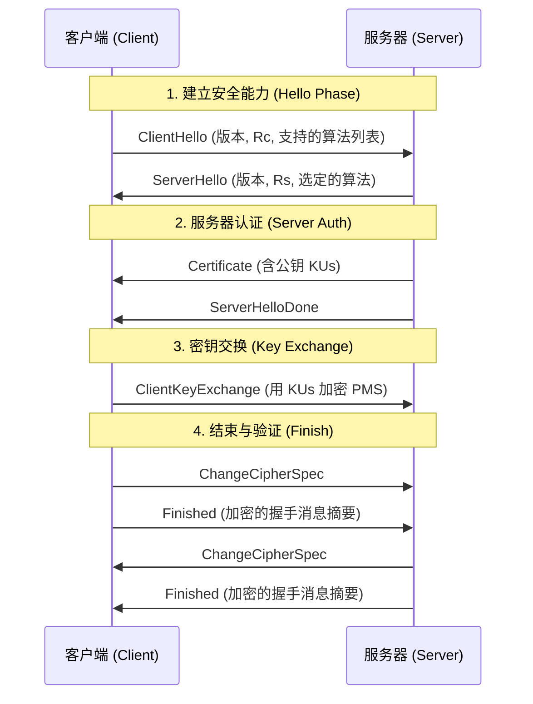

# **第十一章 Web 安全学习笔记 (精简重构版)**

## **一、 Web 安全体系概述**

Web 安全防护构建在网络协议栈的不同层次上，各层分工明确：

| 层次             | 协议/技术         | 核心功能                                                                            |
| :--------------- | :---------------- | :---------------------------------------------------------------------------------- |
| **网络层** | **IPSec**   | **透明传输**：为 IP 数据包提供加密和认证，对上层透明。                        |
| **传输层** | **SSL/TLS** | **安全管道**：在 TCP 之上建立端到端安全通道，保障机密性与完整性（如 HTTPS）。 |
| **应用层** | **SET**     | **特定业务**：针对特定应用（如信用卡支付）的安全协议，处理特殊业务逻辑。      |

## **二、 SSL/TLS 协议详解**

**SSL/TLS** (Secure Sockets Layer / Transport Layer Security) 是位于 **TCP 之上、应用层之下** 的安全协议，为 HTTP 等应用提供端到端的安全通道。

### **2.1 体系结构与核心概念**

SSL/TLS 包含两个核心子协议：

1. **SSL 握手协议 (Handshake Protocol)**：**（上层/控制面）** 负责在通信开始前验证身份、协商加密算法并生成共享密钥。
2. **SSL 记录协议 (Record Protocol)**：**（底层/数据面）** 负责使用握手产生的密钥，对应用层数据进行封装、加密和完整性校验。

> **连接 (Connection) vs. 会话 (Session)**
>
> * **会话 (Session)**：**长期、握手建立**。定义了一组安全参数（主密钥、加密套件）。建立成本高。
> * **连接 (Connection)**：**短期、数据传输**。通过复用“会话”来避免频繁的握手，提高效率。

---

### **2.2 SSL 握手协议 (Handshake Protocol)**

这是 SSL/TLS 最关键的阶段，目标是在不安全的信道上**协商出一份双方共享的“会话密钥”**。

#### **2.2.1 核心参数定义**

| 符号               | 全称              | 说明                                                                         |
| :----------------- | :---------------- | :--------------------------------------------------------------------------- |
| **$R_c$**  | Client Random     | **客户端随机数**，明文传输，用于后续生成密钥的“盐”。                 |
| **$R_s$**  | Server Random     | **服务器随机数**，明文传输，用于后续生成密钥的“盐”。                 |
| **$PMS$**  | Pre-Master Secret | **预主密钥**，由客户端生成的 46 字节随机数，**密钥生成的种子**。 |
| **$MS$**   | Master Secret     | **主密钥**，由 $R_c, R_s, PMS$ 共同计算得出。                        |
| **$KU_s$** | Server Public Key | 服务器公钥（从证书中获取）。                                                 |

#### **2.2.2 握手流程图示**

#### **2.2.3 详细阶段解析**

##### **第一阶段：建立安全能力 (Phase 1: Hello)**

协商协议版本、加密套件，并交换随机数。

$$
C \to S: \text{ClientHello}
$$

$$
S \to C: \text{ServerHello}
$$

* **流程叙述**：
  * 客户端首先发送支持的算法列表和随机数 $R_c$。
  * 服务器从中选定一种算法，并发回服务器随机数 $R_s$。
  * *注：这两个随机数将作为后续生成密钥的干扰项（Salt），防止重放攻击。*

##### **第二阶段：服务器认证与密钥交换 (Phase 2: Server Auth)**

服务器证明身份，并根据需要请求客户端认证。

$$
S \to C: \text{Certificate}
$$

$$
S \to C: \text{ServerKeyExchange (Optional)}
$$

$$
S \to C: \text{CertificateRequest (Optional)}
$$

$$
S \to C: \text{ServerHelloDone}
$$

* **流程叙述**：
  * **Certificate**：服务器发送数字证书（含公钥 $KU_s$）。客户端收到后需向 CA 验证其合法性。
  * **ServerKeyExchange**（图中有）：若证书公钥不足以进行密钥交换（如使用 DHE 算法），服务器需额外发送密钥参数。
  * **CertificateRequest**（图中有）：若服务器配置了需要验证客户端身份（如网银U盾场景），会在此发出请求。
  * **ServerHelloDone**：发出信号，告知客户端“我的信息发送完毕，该你了”。

##### **第三阶段：客户端认证与密钥交换 (Phase 3: Client Auth & Key Exchange)**

客户端回应认证请求，并生成传输密钥种子。

$$
C \to S: \text{Certificate (Optional)}
$$

$$
C \to S: \text{ClientKeyExchange}
$$

$$
C \to S: \text{CertificateVerify (Optional)}
$$

* **流程叙述**：
  * **Certificate**（图中有）：若 Phase 2 收到了请求，客户端需在此发送自己的证书。
  * **ClientKeyExchange**：**核心步骤**。客户端生成 **预主密钥 ($PMS$)**，用服务器公钥加密发送。*此时，双方均拥有 $R_c, R_s, PMS$。*
  * **CertificateVerify**（图中有）：若发送了客户端证书，客户端还需用**私钥**对之前的握手消息签名，证明自己确实是证书的持有者。

##### **第四阶段：结束与验证 (Phase 4: Finish)**

切换加密模式，并验证握手完整性。

1. **密钥计算**（内部动作）：

   * 双方利用 $R_c, R_s, PMS$ 独立计算出**主密钥 ($MS$)** 和 **会话密钥块**。
2. **握手验证**（消息交互）：

   $$
   C \to S: \text{ChangeCipherSpec}
   $$

   $$
   C \to S: \text{Finished}
   $$

   $$
   S \to C: \text{ChangeCipherSpec}
   $$

   $$
   S \to C: \text{Finished}
   $$

* **流程叙述**：
  * **ChangeCipherSpec**：告知对方“接下来的消息将使用刚计算出的**会话密钥**加密”。
  * **Finished**：这是第一条被加密的消息，包含之前所有握手消息的摘要（Hash）。
  * **验证**：双方解密并校验摘要。如果一致，说明握手过程中没有被中间人篡改（如降级攻击），安全通道建立成功。

### **2.3 SSL 记录协议 (Record Protocol)**

握手成功后，记录协议使用协商好的**会话密钥**来保护应用层数据的传输。

**处理流程公式：**

$$
\text{App\_Data}
\xrightarrow{\text{分片}} \text{Blocks}
\xrightarrow{\text{压缩}} \text{Comp}
\xrightarrow{\text{加MAC}} \text{Auth}
\xrightarrow{\text{加密}} \text{Encrypted}
\xrightarrow{\text{加头}} \text{SSL\_Record}
$$

**步骤解析：**

1. **分片 (Fragment)**：将数据切分为 $\le 16\text{KB}$ 的块。
2. **压缩 (Compress)**：可选（通常为无损压缩）。
3. **计算 MAC**：使用协商的 MAC 密钥计算完整性校验码。
   * $M = \text{MAC}(Key_{MAC}, \text{SeqNum} + \text{Data})$
4. **加密 (Encrypt)**：使用协商的对称加密密钥加密“数据 + MAC”。
   * $E = \text{Encrypt}(Key_{Enc}, \text{Data} + M)$
5. **封装**：添加 SSL 记录头（含类型、版本、长度），通过 TCP 发送。

## **三、 安全电子交易 (SET) 协议**

**SET (Secure Electronic Transaction)**：用于互联网信用卡支付的开放标准，重点在于**多方信任**与**隐私隔离**。

### **3.1 参与方**

* **持卡人 (Cardholder)**
* **商家 (Merchant)**
* **支付网关 (Gateway)**：连接 Internet 与银行专用网的接口。
* **发卡行 (Issuer)** & **收单行 (Acquirer)**
* **CA 中心**：为所有参与方颁发 X.509 v3 证书。

### **3.2 核心技术：双重签名 (Dual Signature)**

**目标**：解决隐私隔离问题。

* 商家只能看到订单信息 (OI)，看不到支付信息 (PI)。
* 银行只能看到支付信息 (PI)，看不到订单信息 (OI)。
* **两者必须关联**，防止替换攻击。

#### **构造流程 (由持卡人完成)**

1. **摘要计算**：

   $$
   PIMD = H(PI)
   $$

   $$
   OIMD = H(OI)
   $$
2. **合并摘要**：

   $$
   POMD = H(PIMD \ || \ OIMD)
   $$
3. **签名**：

   $$
   DS = E_{KR_c}(POMD)
   $$

#### **验证与隔离流程**

| 接收方         | 接收到的数据     | 验证公式 (验证 DS 是否匹配)                           | 隐私保护效果                     |
| :------------- | :--------------- | :---------------------------------------------------- | :------------------------------- |
| **商家** | $OI, PIMD, DS$ | $D_{KU_c}(DS) \stackrel{?}{=} H(PIMD \ || \ H(OI))$ | **不可见 PI** (无账号信息) |
| **银行** | $PI, OIMD, DS$ | $D_{KU_c}(DS) \stackrel{?}{=} H(H(PI) \ || \ OIMD)$ | **不可见 OI** (无购物清单) |

### **3.3 SET 交易流程**

#### **1. 购买请求 (Purchase Request)**

* **持卡人操作**：
  1. 验证商家与网关证书。
  2. 生成 $OI$ 和 $PI$。
  3. 生成一次性对称密钥 $K_s$。
  4. **打包发送给商家**：
     * **给商家看**：$OI, DS, PIMD$。
     * **给银行看 (通过商家转发)**：**数字信封** $\{ E_{KU_{gateway}}(K_s), E_{K_s}(PI, DS, OIMD) \}$。

#### **2. 支付认证 (Payment Authorization)**

* **商家操作**：
  1. 验证 $DS$ 确认订单 $OI$ 无误。
  2. 将“给银行看”的数据包转发给 **支付网关**。
* **支付网关操作**：
  1. 解开数字信封获取 $K_s$，解密得到 $PI$。
  2. 验证 $DS$ 确认支付指令有效。
  3. 向发卡行申请额度认证。
  4. 返回认证结果（批准/拒绝）给商家。

#### **3. 资金获取 (Payment Capture)**

* 商家发货后，向网关发送请求，网关通过银行网络完成转账清算。

### **3.4 SET 关键特性实现**

1. **机密性**：使用 **数字信封 (Digital Envelope)** (对称密钥加密数据 + 公钥加密对称密钥)。
2. **完整性**：使用 **哈希 + 数字签名**。
3. **身份认证**：基于 **X.509 数字证书** 的信任链。
4. **隐私保护**：通过 **双重签名** 实现信息的按需披露。
