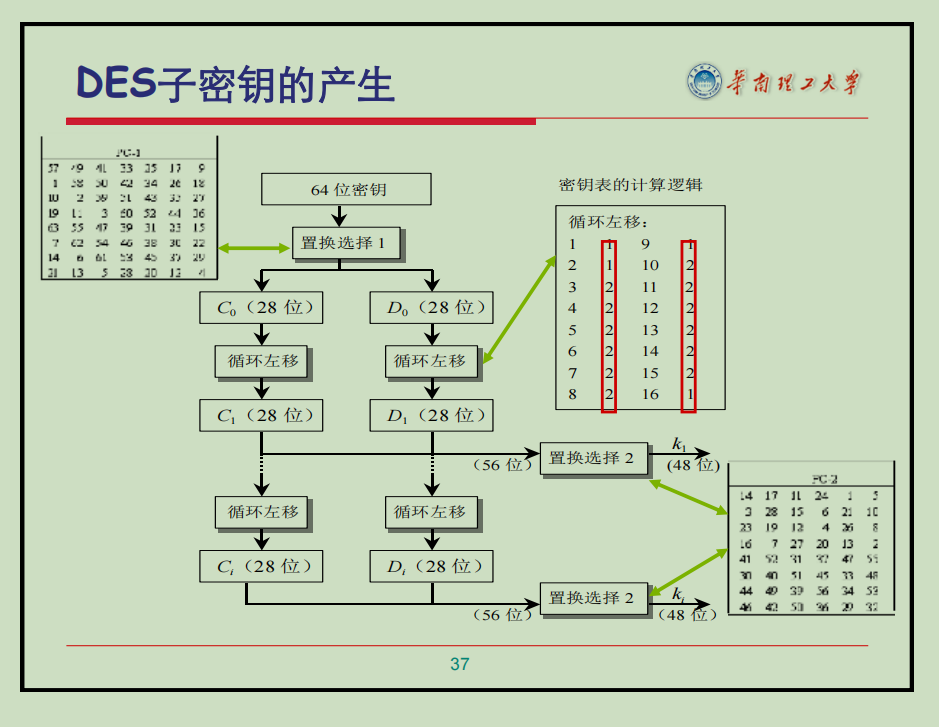

# 第三章 分组密码与DES 学习笔记

## 1. 分组密码与Feistel密码

### 1.1 什么是分组密码 (Block Cipher)？

* **核心思想**：将要加密的明文消息分割成固定长度的“组”（Block），然后使用同一个密钥对每个组分别进行加密。
* **过程**：
  1. **划分**：将明文序列划分为长度为n的组。
  2. **加密**：在密钥的控制下，将每个明文组变换成等长的密文组。
* **本质**：分组密码可以看作是一个非常庞大的、可逆的“代换”操作。对于一个n位的分组，存在 2^(2^n) 种可能的可逆变换。

### 1.2 混乱 (Confusion) 与扩散 (Diffusion)

这是由信息论创始人克劳德·香农（Claude Shannon）提出的设计理想密码系统的两个基本原则：

* **混乱 (Confusion)**：使密文的统计特性与密钥之间的关系尽可能复杂。简单来说，就是让攻击者无法通过分析密文来推断出密钥的任何信息。主要通过“代换”（S盒）来实现。
* **扩散 (Diffusion)**：将明文的统计结构扩散、打乱到长串的密文中。简单来说，就是让明文中的任何一位变化，都能影响到密文中的许多位。主要通过“置换”（P盒）来实现。

现代分组密码的基础就是基于“代换-置换网络”（Substitution-Permutation Network, SPN）来实现混乱和扩散。

### 1.3 Feistel 密码结构

这是现代许多对称分组密码（包括DES）所采用的核心结构。

* **设计思想**：

  1. 将输入的明文块分成左右两半：L0 和 R0。
  2. 进行多轮（Rounds）迭代处理。
  3. 在每一轮迭代中，使用一个“轮函数” F 来处理数据。
* **加密过程（第 i 轮）**：

  * 新的左半部分直接来自上一轮的右半部分：L(i) \= R(i-1)
  * 新的右半部分由上一轮的左半部分与轮函数 F 的输出进行异或（XOR）得到：R(i) \= L(i-1) XOR F(R(i-1), K(i))
  * 其中 K(i) 是第 i 轮所使用的子密钥。
* **Feistel网络单轮加密流程图**:
  上一轮输入 (L(i-1), R(i-1))

```plaintext
                         +-------------------+
        R(i-1) --------->|      轮函数 F     |<--- 子密钥 K(i)
                         |   F(R(i-1),K(i))  |
                         +---------+---------+
                                        |
                                        v
L(i-1) ----------------> [  XOR  ] -----------------> R(i)
                                        ^
                                        |
                                    F 输出

L(i) = R(i-1)
R(i) = L(i-1) XOR F(R(i-1), K(i))

本轮输出 (L(i), R(i))
```

   本轮输出 (L(i), R(i))

* 解密过程：
  Feistel结构最巧妙的优点在于：无论轮函数 F 多么复杂，加密和解密的过程都非常相似，只需将子密钥按相反的顺序使用即可。这大大简化了硬件实现。

## 2. S-DES (简化版DES)

S-DES是一个教学版的DES，它保留了DES的核心思想，但参数规模小得多，便于理解和手动计算。

* **输入**：8位明文，10位密钥。
* **输出**：8位密文。
* **结构**：包含初始置换（IP）、两轮复杂的轮函数、一个中间交换（SW）和逆初始置换（IP^-1）。
* **S-DES 整体加密流程图**:

```plaintext
  8位明文
  |
  +--------------+
   |   初始置换     |
   |      IP        |
  +--------------+
  | (分成 L0, R0)
  +-------------------+
  |   轮函数 f(K1)    |  <--- K1
  +-------------------+
  | (得到 L1, R1)
  +--------------+
  |     交换 SW    |
  +--------------+
  | (输入 R1, L1)
  +-------------------+
  |   轮函数 f(K2)    |  <--- K2
  +-------------------+
  | (得到 L2, R2)
  +--------------+
   | 逆初始置换     |
   |     IP^-1      |
  +--------------+
  |
  8位密文
```

### 2.1 S-DES 密钥生成详解

从10位主密钥 K 生成两个8位的子密钥 K1 和 K2。这个过程本身就是一个迷你的加密过程，目的是打乱和变换原始密钥。

1. **P10置换 (Permutation 10\)**
   * **什么是置换？** 置换就是“重新排列位置”。P10置换表规定了如何将输入的10个比特重新排序(而p8置换同理)。
   * **工作原理**：假设P10置换表是 (3, 5, 2, 7, 4, 10, 1, 9, 8, 6)。这意味着，输出的第1位是输入的第3位，输出的第2位是输入的第5位，以此类推。它只改变位置，不改变比特的值。
2. **分割**
   * **工作原理**：将经过P10置换后的10位密钥，简单地从中间分开，变成左、右两个各5位的部分。
3. **生成K1**
   * **循环左移1位 (LS-1)**：对分割后的左、右两个5位部分分别执行循环左移1位。
   * **P8置换 (Permutation 8\)**：将在上一步移位后合并成的10位密钥中，根据P8置换表，挑选出8位并重新排列，得到第一个子密钥 K1。
4. **生成K2**
   * **循环左移2位 (LS-2)**：在生成K1的移位结果的基础上，再对左、右两半分别执行循环左移2位。
   * **P8置换**：将再次移位并合并后的10位密钥，通过同一个P8置换表，生成第二个子密钥 K2。

#### 2.1.1 密钥生成实例

假设主密钥 K \= (1010000010)。P10置换表为 (3, 5, 2, 7, 4, 10, 1, 9, 8, 6\)P8置换表为 (6, 3, 7, 4, 8, 5, 10, 9\)

1. **P10置置换**
   * 输入 (K): 1 0 1 0 0 0 0 0 1 0 (位置 1 到 10\)
   * 输出: 1 0 0 0 0 0 1 1 0 0
2. **分割**
   * 输入: 1000001100
   * 左半部分 (L): 10000
   * 右半部分 (R): 01100
3. **生成 K1**
   * 循环左移1位 (LS-1):
     * L: 10000 \-\> 00001
     * R: 01100 \-\> 11000
   * 合并: 0000111000
   * P8置换:
     * 输入: 0 0 0 0 1 1 1 0 0 0 (位置 1 到 10\)
     * 输出 (K1): 10100100
4. **生成 K2**
   * 在LS-1结果上再循环左移2位 (LS-2):
     * L: 00001 \-\> 00100
     * R: 11000 \-\> 00011
   * 合并: 0010000011
   * P8置换:
     * 输入: 0 0 1 0 0 0 0 0 1 1 (位置 1 到 10\)
     * 输出 (K2): 01000011

最终，我们从主密钥 1010000010 得到了两个子密钥:
K1 \= 10100100
K2 \= 01000011

### 2.2 S-DES 加密流程详解

1. **初始置換 (IP \- Initial Permutation)**
   * **工作原理**：IP是一个固定的置换表，它将输入的8个比特按照一个预设的规则重新排列位置。
   * **互逆关系**：每一个置换操作（IP），都有一个唯一的逆置换操作（IP^-1）。如果在IP操作之后立即执行IP^-1操作，数据就会恢复到原始的顺序。
   * **作用**：在DES设计的年代，初始和最终置换主要是为了方便数据在硬件上的加载。从现代密码学角度看，它们不提供任何加密强度。
2. **第一轮 (使用K1)**
   * 将经过IP置换的数据分为左右各4位 (L0, R0)。
   * **轮函数 f(R0, K1)**：这是S-DES最核心的部分。
     1. **扩展/置换 (E/P)**：将4位的右半部分R0扩展成8位，以便和8位的子密钥进行异或。
     2. **与子密钥 K1 异或**：将E/P扩展后的8位数据与8位的子密钥K1进行按位异或（XOR）操作。
     3. **S盒代换**：将异或后的8位数据分为两半，分别输入S0盒和S1盒（4位输入，2位输出）。这是算法中唯一的非线性组件，是安全性的关键。
     4. **P4置换**：将两个S盒输出的2位结果（共4位）合并，再通过P4置换表进行最后一次重排，得到轮函数最终结果。
   * **计算第一轮输出 (L1, R1)**：
     * L1 \= R0
     * R1 \= L0 XOR f(R0, K1)
3. **中间交换 (SW \- Swap)**
   * **工作原理**：这是一个简单的操作，**就是将第一轮生成的左右两半 (L1, R1) 的位置互换**，得到 (R1, L1)。
   * **作用**：将交换后的结果 (R1, L1) 作为第二轮轮函数的输入。这是S-DES结构的一个特定步骤，在DES中并不是。
4. **第二轮 (使用K2)**
   * 将交换后的数据 (R1, L1) 作为输入，重复整个轮函数过程，但这一次使用的是第二个子密钥 K2。
   * **计算第二轮输出 (L2, R2)**：
     * L2 \= L1
     * R2 \= R1 XOR f(L1, K2)
   * **注意**：在最后一轮之后，**不再进行交换**。
5. **逆初始置换 (IP^-1)**
   * 将第二轮的输出 (L2, R2) 合并，然后通过逆初始置换表得到最终的8位密文。

#### 2.2.1 加密流程实例

假设 明文 P \= (01101011)，使用上一节生成的子密钥 K1 \= 10100100 和 K2 \= 01000011。置换表和S盒如下：

* IP: (2, 6, 3, 1, 4, 8, 5, 7\)
* E/P: (4, 1, 2, 3, 2, 3, 4, 1\)
* P4: (2, 4, 3, 1\)
* IP^-1: (4, 1, 3, 5, 7, 2, 8, 6\)
* S0盒: \[\[1,0,3,2\], \[3,2,1,0\], \[0,2,1,3\], \[3,1,3,2\]\]
* S1盒: \[\[0,1,2,3\], \[2,0,1,3\], \[3,0,1,0\], \[2,1,0,3\]\]

1. **初始置换 (IP)**
   * 输入 (P): 01101011
   * 输出: 10100111
   * 分割: L0 \= 1010, R0 \= 0111
2. **第一轮 (使用 K1 \= 10100100\)**
   * **轮函数 f(R0, K1)**:
     * E/P扩展 (对R0 \= 0111): 输出 10111110
     * 异或 K1: 10111110 XOR 10100100 \= 00011010
     * S盒代换:
       * S0盒输入: 0001 \-\> 行1, 列0 \-\> 查表得3 \-\> 二进制 11
       * S1盒输入: 1010 \-\> 行2, 列1 \-\> 查表得0 \-\> 二进制 00
       * S盒总输出: 1100
     * P4置换 (对1100): 输出 1001 (轮函数最终结果)
   * **计算 L1, R1**:
     * L1 \= R0 \= 0111
     * R1 \= L0 XOR (P4结果) \= 1010 XOR 1001 \= 0011
   * 第一轮输出为 (L1, R1) \= (0111, 0011\)
3. **中间交换 (SW)**
   * 交换L1和R1的位置，作为第二轮的输入。
   * 第二轮输入: (R1, L1) \= (0011, 0111\)
4. **第二轮 (使用 K2 \= 01000011\)**
   * **轮函数 f(L1, K2)**: (注意，此时轮函数操作对象是 L1 \= 0111\)
     * E/P扩展 (对L1 \= 0111): 输出 10111110
     * 异或 K2: 10111110 XOR 01000011 \= 11111101
     * S盒代换:
       * S0盒输入: 1111 \-\> 行3, 列3 \-\> 查表得2 \-\> 二进制 10
       * S1盒输入: 1101 \-\> 行3, 列2 \-\> 查表得0 \-\> 二进制 00
       * S盒总输出: 1000
     * P4置换 (对1000): 输出 0001 (轮函数最终结果)
   * **计算 L2, R2**:
     * L2 \= L1 \= 0111
     * R2 \= R1 XOR (P4结果) \= 0011 XOR 0001 \= 0010
   * 第二轮输出 (最终输出): (L2, R2) \= (0111, 0010\)
5. **逆初始置换 (IP^-1)**
   * 输入: 01110010 (合并L2, R2)
   * 输出 (密文 C): 10101100

因此，明文 01101011 经过S-DES加密后，得到的密文为 10101100。

### 2.3 S-DES 解密流程详解

S-DES的解密是加密的逆过程。通过逆序使用子密钥（先用K2，再用K1）并应用Feistel结构的逆向公式，可以从密文恢复出明文。

我们从加密的最终状态 (L2, R2)（即 IP(C)）开始回溯。

**加密过程回顾:**

* 第一轮后: (L1, R1) 其中 L1 \= R0 且 R1 \= L0 XOR f(R0, K1)
* 交换后: (R1, L1)
* 第二轮后: (L2, R2) 其中 L2 \= L1 且 R2 \= R1 XOR f(L1, K2)

**解密推导 (从 L2, R2 开始):**

1. **恢复 (R1, L1) (使用 K2):**
   * 根据第二轮加密公式 L2 \= L1，我们可以直接得到 L1 \= L2。
   * 根据第二轮加密公式 R2 \= R1 XOR f(L1, K2)，利用异或的自反性，我们可以推导出 R1 \= R2 XOR f(L1, K2)。因为已经知道 L1=L2，所以 R1 \= R2 XOR f(R2, K2)。
   * 至此，我们已经从 (L2, R2) 恢复出了 (R1, L1)。
2. **撤销交换 (SW^-1):**
   * 加密过程中有 (L1, R1) \-\> SW \-\> (R1, L1) 的步骤。
   * 因此，我们将上一步恢复的 (R1, L1) 交换回来，得到 (L1, R1)。
3. **恢复 (L0, R0) (使用 K1):**
   * 根据第一轮加密公式 L1 \= R0，我们可以直接得到 R0 \= L1。
   * 根据第一轮加密公式 R1 \= L0 XOR f(R0, K1)，我们可以推导出 L0 \= R1 XOR f(R0, K1)。因为已经知道 R0=L1，所以 L0 \= R1 XOR f(L1, K1)。
   * 至此，我们已经从 (L1, R1) 恢复出了 (L0, R0)，这正是初始置换后的明文。

最后，对 (L0, R0) 执行逆初始置换 IP^-1 即可得到原始明文P。

## 3. DES (数据加密标准)

DES是真正被广泛应用的加密标准，其结构比S-DES复杂得多，但基本原理——Feistel网络、S盒、P盒、密钥调度——是完全一致的。

* **输入**：64位明文，64位密钥（其中56位有效，8位为奇偶校验位）。
* **输出**：64位密文。
* **核心结构**：一个包含16轮的Feistel网络。

### 3.1 DES 加密主流程

1. **初始置换 (IP)**：对64位明文块进行初始重排。
2. **16轮Feistel迭代**：
   * 将数据分为左右两个32位的块 (L0, R0)。
   * 对每一轮 i (从1到16)执行相同的轮函数：
     * L(i) \= R(i-1)
     * R(i) \= L(i-1) XOR F(R(i-1), K(i))
3. **最终交换**：完成16轮后，得到(L16, R16)。将左右两半进行最后一次交换，形成 (R16, L16)。
4. **逆初始置换 (IP^-1)**：对交换后的64位数据进行逆置换，得到最终的64位密文。

### 3.2 DES 密钥生成详解

从64位主密钥生成16个48位的子密钥，过程比S-DES复杂。

1. **PC-1置换 (置换选择1)**：从64位输入密钥中去掉8个校验位（每字节的第8位），并对剩下的56位进行置换。
2. **分割**：将56位分为左右两个28位 (C0, D0)。
3. **16轮迭代生成**：
   * 对于第 i 轮 (i 从 1 到 16)：
     * **循环左移**：根据一个预设的调度表，将 C(i-1) 和 D(i-1) 分别循环左移1位或2位，得到 C(i) 和 D(i)。在第1, 2, 9, 16轮移1位，其余轮移2位。
     * **PC-2置换 (置换选择2)**：将 C(i) 和 D(i) 合并成56位，并通过PC-2置换表进行压缩，从56位中选出48位，得到该轮的子密钥 K(i)。



### 3.3 DES 轮函数 f 详解

**DES 单轮函数 f 内部流程图**:

```plaintext
右半部分 R(i-1) (32位)
        |
+------------------+
|    扩展置换 E    |
|  (32位 -> 48位)  |
+------------------+
        |
        v
子密钥 K(i) -------> +-----(XOR)-----> (48位)
                       |
                       v
+------------------+
| S盒代换 (S1...S8)|
|  (48位 -> 32位)  |
+------------------+
        |
        v
+------------------+
|    P盒置换 P     |
+------------------+
        |
        v
轮函数 f 的输出 (32位)
```

1. **扩展置换 (E)**：
   1. 将32位输入 R(i-1) 扩展为48位，为了让数据与48位的本轮子密钥长度匹配。
   2. 置换同时能产生雪崩效应。
2. **密钥混合**：将扩展后的48位数据与48位的本轮子密钥 K(i) 进行异或。
3. **S盒代换**：
   1. 将48位结果分为8个6位的块，每个块送入一个对应的S盒（S1-S8）。
   2. 每个S盒是一个固定的查找表，将6位输入转换为4位输出。这是DES中唯一的非线性操作，是其安全性的关键。
4. **P盒置换**：将8个S盒输出的（共32位）数据进行一次简单的置换，以进一步增强扩散效果。

### 3.4 DES 加密流程实例

为简明起见，我们仅详细演算第一轮，并简述后续过程。

* **明文 P (Hex)**: 0123456789ABCDEF
* **密钥 K (Hex)**: 133457799BBCDFF1
* **预期密文 C (Hex)**: 85E813540F0AB405

1. **初始置换 (IP)**
   * 对64位的明文P进行IP置换，得到置换后的数据IP(P)。
   * IP(P) (Hex): C000C000F0AAF0AA
   * 分割为 L0 和 R0 (各32位):
     * L0 (Hex): C000C000
     * R0 (Hex): F0AAF0AA
2. **子密钥生成 (仅K1)**
   * 对64位密钥K进行PC-1置换，得到56位的C0和D0。
   * 对C0和D0进行1位循环左移，得到C1和D1。
   * 将C1和D1合并，并通过PC-2置换，得到第一个48位的子密钥K1。
   * K1 (Hex): 1B1A011728033834
3. **第一轮 (使用 K1)**
   * **计算轮函数 f(R0, K1)**:

     1. **扩展R0**: 将32位的R0通过扩展置换E表，扩展为48位。
     2. **异或K1**: 将扩展后的R0与48位的K1进行异或。
     3. **S盒代换**: 将异或结果分为8组（每组6位），分别输入8个S盒，得到8个4位输出，合并为32位。
     4. **P盒置换**: 对S盒的32位输出进行P盒置换，得到轮函数的最终结果。
     5. f(R0, K1) 的计算结果 (Hex): 20008041
   * **计算 L1, R1**:

     * L1 \= R0 \= 0111
     * R1 \= L0 XOR f(R0, K1) \= 1010 XOR 1001 \= 0011
   * 第一轮输出为 (L1, R1) \= (0111, 0011\)
4. **后续15轮**
   * 将 (L1, R1) 作为第二轮的输入，使用子密钥K2重复上述过程，得到(L2, R2)。
   * ... 此过程共迭代16次，直到计算出 (L16, R16)。
5. **最终交换与逆初始置换 (IP^-1)**
   * 经过16轮后，得到 L16, R16。
   * 进行最后一次交换，得到 (R16, L16)。
   * 将 (R16, L16) 合并，并执行逆初始置换 (IP^-1)，最终得到64位密文。
   * 密文 C (Hex): 85E813540F0AB405

### 3.5 DES 解密流程详解

DES解密过程是加密过程的逆运算。其核心在于Feistel结构允许使用完全相同的轮函数F，只需从头开始，但按相反的顺序提供子密钥（从K16到K1）。

**加密终态回顾:** 加密的最后几步是将第16轮的输出 (L16, R16) 进行交换，得到 (R16, L16)，然后执行 IP^-1 得到密文 C。 即: C \= IP^-1(R16, L16)。

**解密流程公式推导:**

1. **逆向初始置换:**
   * 首先对密文 C 执行初始置换 IP，这会撤销加密的最后一步 IP^-1。
   * IP(C) \= IP(IP^-1(R16, L16)) \= (R16, L16)。
   * 我们将这个结果作为解密第一轮的输入，记为 (D0\_L, D0\_R)，所以 D0\_L \= R16 且 D0\_R \= L16。
2. **解密第一轮 (使用K16):**
   * 输入为 (D0_L, D0_R) = (R16, L16)。
   * 计算输出 (D1_L, D1_R)：
     * D1_L = L16
     * D1_R = R16 XOR f(L16, K16)
   * 根据加密公式：L16 = R15, R16 = L15 XOR f(R15, K16)。
   * 替换后：
     * D1_L = L15
     * D1_R = L15
   * 第一轮解密输出为 (D1_L, D1_R) = (L15, R15)。
3. **解密第二轮 (使用K15):**
   * 输入为 (D1\_L, D1\_R) \= (L15,R15)。
   * 同理，应用轮函数和密钥 K15，输出 (D2\_L, D2\_R) 将会是 (R14, L14)。
4. **... (后续13轮)**
5. **解密第十六轮 (使用K1):**
   * 经过15轮解密后，输入为 (D15\_L, D15\_R) \= (R1, L1)。
   * 应用轮函数和密钥 K1，输出 (D16\_L, D16\_R):
     * D16\_L \= D15\_R \= L1
     * D16\_R \= D15\_L XOR F(D15\_R, K1) \= R1 XOR F(L1, K1)
   * 根据加密第一轮的公式 L1 \= R0 且 R1 \= L0 XOR F(R0, K1)，我们进行替换：
     * D16\_L 变为 R0。
     * D16\_R 变为 (L0 XOR F(R0, K1)) XOR F(R0, K1)，化简为 L0。
   * 因此，16轮解密后的最终输出是 (R0, L0)。
6. **最终交换:**
   * 我们得到的 (R0, L0) 是加密初始状态 (L0, R0) 的左右交换形式。为了恢复原始顺序，需要执行一次交换。
   * (R0, L0) \-\> SWAP \-\> (L0, R0)。
7. **逆初始置换 (IP^-1):**
   * 对 (L0, R0) 执行 IP^-1，即可得到原始明文 P。
   * P \= IP^-1(L0, R0)。

## 4. DES 的设计原理与密码分析

### 4.1 设计原理

DES 的设计遵循“混乱”和“扩散”两大原则：

1. **混乱 (Confusion)**

   * 通过 S 盒（S-boxes）实现非线性替换，隐藏密钥与密文之间的关系。
   * S 盒将输入的 6 位数据映射为 4 位输出，打乱线性关系，使密钥的微小变化导致密文的显著变化。
2. **扩散 (Diffusion)**

   * 通过 P 盒（P-boxes）和 Feistel 结构实现明文变化的传播。
   * P 盒重新排列 S 盒输出的位，增强数据的扩散效果。
   * Feistel 结构通过左右数据块的交替处理和 16 轮迭代，将明文的微小变化扩散到整个密文块。

这两者的结合确保了 DES 的安全性，使得攻击者难以通过分析密文推断明文或密钥。

### 4.2 密码分析与强度

* **密钥长度**：DES的56位密钥是其最大的弱点。在现代计算能力下，2^56 种可能的密钥可以通过\*\*暴力破解（Brute-force Attack）\*\*在很短时间内被穷尽。
* **差分密码分析**：一种选择明文攻击。DES的16轮结构和S盒设计使其具有较强的抗差分分析能力。
* **线性密码分析**：一种已知明文攻击。通过找到加密过程中明文、密钥、密文之间的线性近似关系来破解密码。

## 5. DES 的工作模式 (Modes of Operation)

为了加密长度超过64位的消息，需要定义不同的工作模式。

### 5.1 电子密码本 (Electronic Codebook - ECB)

* **工作方式**：最简单的模式，每个明文块都独立地使用相同的密钥进行加密。
* **公式**：C(i) \= E(K, P(i))
* **优点**：简单，可并行计算。
* **缺点**：**极其不安全！** 相同的明文块会产生相同的密文块，无法隐藏数据模式。

### 5.2 密码分组链接 (Cipher Block Chaining - CBC)

* **工作方式**：在加密当前明文块之前，先将其与前一个密文块进行异或。第一个块需要一个初始向量 (IV)。
* **公式**：C(i) \= E(K, P(i) XOR C(i-1)) (其中 C(0) \= IV)
* **优点**：隐藏了明文的模式，是应用最广泛的模式之一。
* **缺点**：加密过程是串行的，无法并行。

### 5.3 计数器模式 (Counter - CTR)

* **工作方式**：将分组密码变成一个流密码。它加密一个“计数器”值，然后将加密结果与明文块异或。
* **公式**：C(i) \= P(i) XOR E(K, Counter(i))
* **优点**：可以并行计算，可随机访问数据块，效率高。
* **缺点**：计数器值决不能与同一密钥重用，否则会造成严重的安全问题。

## 6. 说明

### 6.1 SW 操作的作用

#### 🧩 一、DES 每轮迭代的基本结构

DES 是典型的 **Feistel 网络**，每一轮迭代关系为：

$$
\begin{cases}
L_i = R_{i-1} \\
R_i = L_{i-1} \oplus f(R_{i-1}, K_i)
\end{cases}
$$

#### 🔁 二、16 轮后的结果

经过 16 轮后得到：

$$
(L_{16}, R_{16})
$$

#### 🧮 三、**情况 1：执行 SW（标准 DES）**

加密结束后，DES 会 **交换左右两半**：

$$
\text{输出为 } (R_{16}, L_{16})
$$

然后再经过逆初始置换 ( $IP^{-1}$ )。

##### 🔓 解密时

设密文经过初始置换 ( $IP$ ) 后为：

$$
(L_0', R_0') = (R_{16}, L_{16})
$$

则第 1 轮解密（使用子密钥逆序 $K_{16}, K_{15}, \dots, K_1$）仍然遵循相同结构：

$$
\begin{cases}
L_i' = R_{i-1}' \\
R_i' = L_{i-1}' \oplus f(R_{i-1}', K_{17-i})
\end{cases}
$$

我们验证第 1 轮：

$$
L_1' = R_0' = L_{16}
$$

$$
R_1' = L_0' \oplus f(R_0', K_{16}) = R_{16} \oplus f(L_{16}, K_{16})
$$

而根据加密第 16 轮的定义：

$$
R_{16} = L_{15} \oplus f(R_{15} = L_{16} , K_{16})
$$

因此：

$$
R_1' = ( L_{15} \oplus f(R_{15}, K_{16})) \oplus f(R_{15}, K_{16}) = L_{15}
$$

于是我们得到：

$$
(L_1', R_1') = (L_{16}, L_{15})
$$

即回到前一轮的状态（对称成立）。

✅ **结论**：执行 SW 后，解密能正确反推每一轮，只需反转密钥顺序即可。

#### ❌ 四、**情况 2：不执行 SW**

若不交换，输出即为：

$$
(L_{16}, R_{16})
$$

##### 解密时（仍然执行 $IP$）

此时：

$$
(L_0', R_0') = (L_{16}, R_{16})
$$

如果继续使用同样的轮结构和反序密钥：

$$
\begin{cases}
L_i' = R_{i-1}' \\
R_i' = L_{i-1}' \oplus f(R_{i-1}', K_{17-i})
\end{cases}
$$

第 1 轮时：

$$
L_1' = R_0' = R_{16}
$$

$$
R_1' = L_0' \oplus f(R_0', K_{16}) = L_{16} \oplus f(R_{16}, K_{16})
$$

而加密的第 16 轮为：

$$
R_{16} = L_{15} \oplus f(R_{15}, K_{16})
$$

且 $L_{16} = R_{15}$

代入可得：

$$
R_1' = R_{15} \oplus f(L_{15} \oplus f(R_{15}, K_{16}), K_{16})
$$

这已经**无法化简回 $L_{15}$**，说明结构错位、不可对称。

#### 🧭 五、对比总结

| 情况         | 输出顺序             | 解密时输入                            | 结构关系     | 能否对称复用 |
| ------------ | -------------------- | ------------------------------------- | ------------ | ------------ |
| ✅ 执行 SW   | $(R_{16}, L_{16})$ | $(L_0′, R_0′) = (R_{16}, L_{16})$ | 对称回溯成立 | ✅ 可以      |
| ❌ 不执行 SW | $(L_{16}, R_{16})$ | $(L_0′, R_0′) = (L_{16}, R_{16})$ | 无法还原每轮 | ❌ 不行      |

#### ✅总结

> DES 最后一轮后的 SW 操作（交换 $L_{16}$ 和 $R_{16}$）是为了保证加解密过程在 Feistel 结构上完全对称，使得解密时仅需反转密钥顺序即可恢复原文。
> 若不交换，结构错位，解密将无法简单复用同样的轮函数。

### 6.2 主密钥长度与密码安全性说明

#### 1. 密钥空间与蛮力攻击

* 主密钥的长度 $k$ 决定了密钥空间的大小：$2^k$。
* 密钥空间越大，蛮力攻击（Brute-Force Attack）破解密码的难度越高。
  * **SDES 的 10 bit 密钥**：$2^{10} = 1024$ 种可能，现代计算机可在毫秒内穷尽。
  * **AES 的 128 bit 密钥**：$2^{128}$ 是天文数字，穷尽所有可能需要超过宇宙的寿命。

#### 2. SDES 和 DES 的密钥长度设计

* **SDES 的 10 bit 密钥**：
  * 设计为教学用途，便于手工计算和理解加密原理。
  * 不追求安全性，仅用于演示。
* **DES 的 56 bit 密钥**：
  * 1970年代的权衡结果，当时 $2^{56}$ 足够抵抗蛮力攻击。
  * 随着计算能力提升，1990年代已被证明不安全。1998年，专用设备“Deep Crack”几天内破解了 DES。

#### 3. 主密钥长度与子密钥生成

* 主密钥通过密钥生成算法扩散为多轮子密钥（如 DES 的 16 轮，每轮 48 bit）。
* **主密钥过短的风险**：
  * 原材料不足导致子密钥间存在数学关联性，易被分析攻击（如关联密钥攻击）利用。
  * 例如，用 SDES 的 10 bit 密钥生成 DES 的子密钥，安全性会大幅降低。
