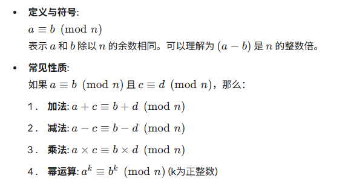
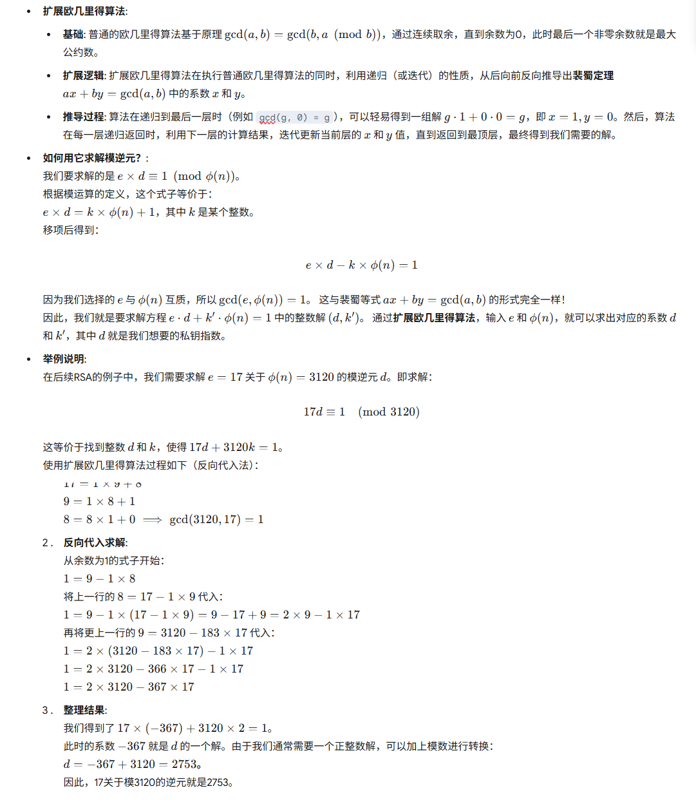
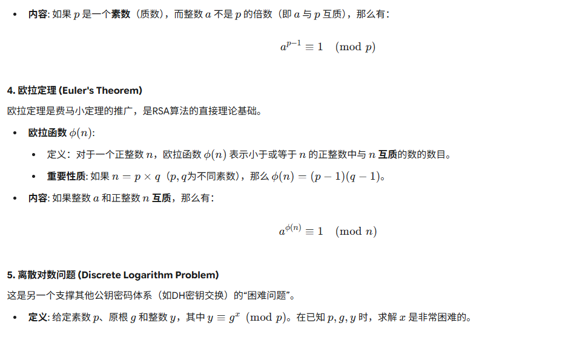
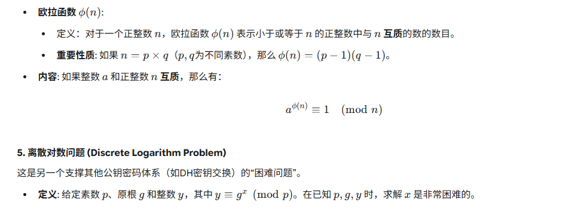
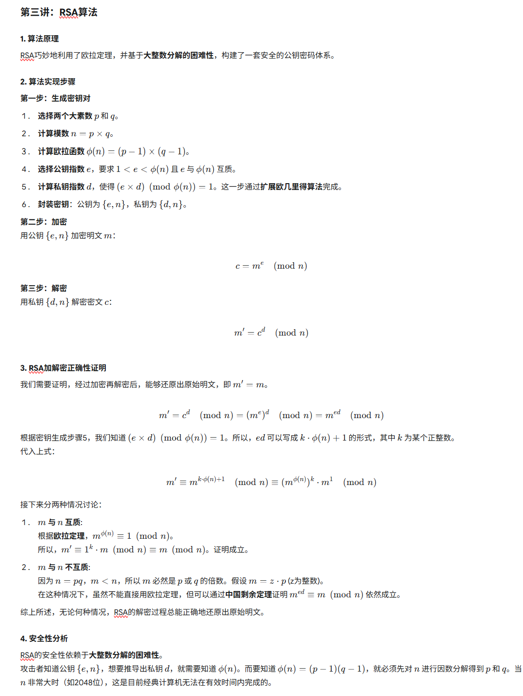

# **第五章 公钥密码学与RSA学习笔记**

## 第一讲：公钥密码体系

### 1. 核心思想

公钥密码体系，又称非对称密码体系，它的出现是为了解决传统对称密码体系中的两大难题：**密钥分发**和 **数字签名** 。

其核心思想在于，将加密和解密的密钥进行分离，使用两个数学上相关联但又不同的密钥。

### 2. 主要构成

* **公钥 (Public Key)**
  * 可以被公之于众，任何人都可以获取。
  * 用于**加密**数据和 **验证签名** 。
  * 好比一个可以接收信件的保险箱投递口，谁都可以往里投信。
* **私钥 (Private Key)**
  * 由用户自己严格保管，绝不外泄。
  * 用于**解密**数据和 **生成签名** 。
  * 好比打开保险箱的唯一钥匙，只有持有者才能取出信件。
* **密钥对 (Key Pair)**
  * 公钥和私钥成对出现，在数学上具有紧密的关联性。
  * 通过一个密钥（公钥）加密的信息，只能通过与之配对的另一个密钥（私钥）才能解密。
  * 从公钥很难（在计算上几乎不可能）推导出私钥。

### 3. 主要工作模式

#### 模式一：加密通信

这是公钥密码体系最主要的应用场景，用于保证数据的机密性。

* **流程** :

1. **接收方B** 生成一对密钥（公钥B，私钥B）。
2. B 将自己的**公钥B**公开，任何人都可以获取。
3. **发送方A** 想要给B发送机密信息，他会使用B的**公钥B**对信息进行加密。
4. A 将加密后的密文发送给B。
5. B 收到密文后，使用自己持有的**私钥B**进行解密，得到原始信息。

* **安全性** : 即使中间人截获了密文，并且也知道B的公钥，无法解密信息。

#### 模式二：数字签名 (优化版)

用于 **验证信息的来源（身份认证）**和**保证信息的完整性（防篡改）** 。核心思想是“我用我的私钥做个标记，你们用我的公钥来验证这个标记对不对”。

##### 流程图概览

* **签名方 (A)** : `文件原文` -> `[哈希函数]` -> `摘要(指纹)` -> `[使用A的私钥加密]` -> `数字签名`
* **验证方 (B)** :

1. `数字签名` -> `[使用A的公钥解密]` -> `解密出的摘要 (指纹A)`
2. `文件原文` -> `[哈希函数]` -> `新计算的摘要 (指纹B)`
3. **核心步骤：比较 `指纹A` 和 `指纹B` 是否完全一样？**

##### 详细步骤分解

**第1部分：发送方 A 的签名过程**

1. **生成摘要** ：A 准备发送一份文件。他首先使用一种 **哈希函数** （例如 SHA-256）对**文件原文**进行运算，生成一个固定长度的、独一无二的字符串。这个字符串称为**摘要 (Digest)** 或  **数字指纹** 。

* **特性** ：无论原文多长，摘要长度固定；原文任何微小的改动，都会导致摘要发生巨大变化。

1. **加密摘要** ：A 使用自己的 **私钥** ，对上一步生成的“数字指纹”进行加密。
2. **形成签名** ：这个 **加密后的“数字指纹”** ，就是本次操作的 **数字签名** 。
3. **发送** ：A 将**文件原文**和这个**数字签名**打包，一同发送给接收方 B。

**第2部分：接收方 B 的验证过程**

1. **分离文件和签名** ：B 收到数据后，将其分为**文件原文**和**数字签名**两部分。
2. **解密签名，得到指纹A** ：B 使用发送方 A 的 **公钥** （这是公开的）对**数字签名**进行解密。如果能成功解密，就会得到一个摘要。我们称之为“ **指纹A** ”。
3. **计算原文，得到指紋B** ：B 对接收到的 **文件原文** ，使用与 A 相同的 **哈希函数** （例如 SHA-256）重新计算一遍，也会得到一个摘要。我们称之为“ **指纹B** ”。
4. **对比指纹** ：B 将“ **指纹A** ”和“ **指纹B** ”进行精确对比。

##### 验证结论

* **如果 指纹A === 指纹B** ：验证成功！这同时说明了两点：
* **身份可信** ：因为只有 A 的公钥才能正确解密由 A 的私钥加密的签名，所以这份文件确实来源于 A。
* **完整性** ：因为文件原文计算出的“指纹B”与解密出的“指纹A”完全一致，证明文件在传输过程中没有被任何人篡改过。

公钥密码体系的安全性，建立在几个关键的数学“难题”之上。这些难题保证了加密过程（正向计算）很容易，而破解过程（逆向推导）在计算上几乎不可能。

### **1\. 模运算 (Modular Arithmetic)**

模运算是数论的基础，也是公钥密码学的核心运算。

### **2\. 扩展欧几里得算法与模逆元**

这是计算RSA私钥指数  的关键工具。

### **3\. 费马小定理 (Fermat's Little Theorem)**

这是数论中的一个重要定理，为RSA算法的正确性提供了理论依据。

### **4\. 欧拉定理 (Euler's Theorem)**

欧拉定理是费马小定理的推广，是RSA算法的直接理论基础。

### **5\. 离散对数问题 (Discrete Logarithm Problem)**

这是另一个支撑其他公钥密码体系（如DH密钥交换）的“困难问题”。

## **第三讲：RSA算法**

