# **第9章 电子邮件安全 (Email Security)**

## **1. 电子邮件安全概誮**

电子邮件（Email）是互联网最广泛的应用，但基于 SMTP 协议的默认传输機制存在安全隐患。本章核心解决两个问题：**身份认证（Authentication）**与**保密性（Confidentiality）**。

### **1.1 安全目标**

* **保密性 (Confidentiality)**：防止邮件内容在传输和存储中被非授权窃听。
* **身份认证 (Authentication)**：确认发件人确实是其声称的身份（防止伪造）。
* **消息完整性 (Message Integrity)**：确保邮件内容在传输中未被篡改。
* **源的不可否认性 (Non-repudiation of origin)**：发件人无法抵赖曾发送过该邮件。

## **2. PGP (Pretty Good Privacy)**

### **2.1 概述**

PGP 是由 Phil Zimmermann 开发的综合性安全工具，提供电子邮件和文件存储的保密与认证服务。

* **定位**：偏向个人用户，去中心化。
* **特点**：不依赖单一算法，而是将多种公认安全的算法集成在一个通用应用程序中。

### **2.2 PGP 使用的算法体系**

PGP 采用**混合加密体制**（Hybrid Cryptosystem），结合了公钥密码体制的便利性和对称密码体制的高效率。

| 功能               | 算法 / 标准            | 说明                                                |
| :----------------- | :--------------------- | :-------------------------------------------------- |
| **数字签名** | DSS/SHA 或 RSA/SHA     | 确保认证性、完整性、不可否认性                      |
| **消息加密** | CAST-128 / IDEA / 3DES | **对称加密**：用于加密邮件正文（速度快）      |
| **密钥交换** | RSA 或 Diffie-Hellman  | **公钥加密**：用于加密会话密钥（Session Key） |
| **数据压缩** | ZIP                    | 签名之后，加密之前进行                              |
| **邮件兼容** | Radix-64 (Base64)      | 将二进制密文转换为 ASCII 文本                       |

### **2.3 符号约定 (Notation)**

为了描述严谨，采用以下密码学术语及符号：

* $K_S$：一次性会话密钥 (Session Key, 128-bit)
* $KR_A / KU_A$：用户 A 的私钥 / 公钥
* $KR_B / KU_B$：用户 B 的私钥 / 公钥
* $H(\cdot)$：Hash 函数 (如 SHA-1)
* $E_{KU}(\cdot) / D_{KR}(\cdot)$：公钥加密 / 私钥解密 (Public-Key Op)
* $E_{KR}(\cdot) / D_{KU}(\cdot)$：私钥签名 / 公钥验签 (Public-Key Op)
* $E_{K}(\cdot) / D_{K}(\cdot)$：对称加密 / 对称解密 (Symmetric Op)
* $Z(\cdot)$：ZIP 压缩算法
* $R64(\cdot)$：Radix-64 编码
* $||$：连接操作 (Concatenation)

## **3. PGP 完整工作流程 (The PGP Protocol Flow)**

本节描述 Alice 向 Bob 发送一封**既签名又加密**的邮件的完整过程。这是 PGP 最典型的应用场景，涵盖了保密性、认证性、完整性和不可否认性。

### **3.1 符号定义 (Notation)**

为了描述严谨，规定以下符号：

* $M$：原始邮件内容 (Message)
* $H$：Hash 函数 (SHA-1)
* $Z$：压缩算法 (ZIP)
* $R64$：Radix-64 (Base64) 转换
* $K_S$：一次性会话密钥 (Session Key)
* $KR_A, KU_A$：Alice 的私钥、公钥
* $KR_B, KU_B$：Bob 的私钥、公钥
* $E_{Key}(\cdot), D_{Key}(\cdot)$：加密与解密操作

### **3.2 发送方流程 (Sender: Alice)**

Alice 的 PGP 客户端将执行以下四个步骤：**签名 $\to$ 压缩 $\to$ 加密 $\to$ 编码**。

#### **3.2.1 Step 1: 数字签名 (Digital Signature)**

* **目的**：身份认证、消息完整性、不可否认性。
* **操作**：

  1. 对明文 $M$ 计算哈希值：$h = H(M)$。
  2. 使用 **Alice 的私钥 ($KR_A$)** 对 $h$ 进行加密，生成签名 $S$。
  3. 将签名拼接到明文后面。
* **公式**：

  $$
  S = E_{KR_A}(H(M))
  $$

  $$
  \text{Data}_1 = M \ || \ S
  $$

#### **3.2.2 Step 2: 数据压缩 (Compression)**

* **目的**：减少数据冗余（增强安全性）、节省传输带宽。
* **注意**：压缩必须在**签名之后**（为了存储方便，签名通常针对明文），**加密之前**（压缩后的数据熵高，更难被密码分析）。
* **操作**：
  1. 对“明文+签名”的组合体进行 ZIP 压缩。
* **公式**：
  $$
  T = Z( M \ || \ S )
  $$

#### **3.2.3 Step 3: 混合加密 (Hybrid Encryption)**

* **目的**：保密性 (Confidentiality)。
* **操作**：

  1. **生成密钥**：生成一个 128-bit 的随机一次性会话密钥 $K_S$。
  2. **对称加密 (消息)**：使用 $K_S$ 对压缩数据 $T$ 进行对称加密（如 CAST-128, IDEA, 3DES），得到密文 $C$。
  3. **非对称加密 (密钥)**：使用 **Bob 的公钥 ($KU_B$)** 对 $K_S$ 进行加密，得到加密后的密钥 $k$。
* **公式**：

  $$
  C = E_{K_S}(T) \quad (\text{消息密文})
  $$

  $$
  k = E_{KU_B}(K_S) \quad (\text{密钥密文})
  $$

#### **3.2.4 Step 4: 编码 (Radix-64 Encoding)**

* **目的**：邮件兼容性（将二进制流转换为 ASCII 文本）。
* **操作**：
  1. 将“加密后的密钥 $k$”与“消息密文 $C$”拼接。
  2. 进行 Radix-64 编码。
* **最终发送的数据**：
  $$
  \text{Output} = R64( k \ || \ C )
  $$

### **3.3 接收方流程 (Receiver: Bob)**

Bob 收到邮件后，PGP 客户端执行逆向操作：**解码 $\to$ 解密 $\to$ 解压 $\to$ 验签**。

#### **3.3.1 Step 1: 解码 (Decoding)**

* 将邮件内容的 ASCII 字符还原为二进制数据，分离出"密钥密文 $k$"和"消息密文 $C$"。

#### **3.3.2 Step 2: 解密 (Decryption)**

* **解密会话密钥**：Bob 使用 **自己的私钥 ($KR_B$)** 解密 $k$，恢复出会话密钥 $K_S$。
  $$
  K_S = D_{KR_B}(k)
  $$
* **解密消息**：Bob 使用 $K_S$ 对密文 $C$ 进行对称解密，得到压缩数据 $T$。
  $$
  T = D_{K_S}(C)
  $$

#### **3.3.3 Step 3: 解压缩 (Decompression)**

* 对 $T$ 进行解压，分离出 **原始明文 $M$** 和 **数字签名 $S$**。
  $$
  M \ || \ S = \text{Unzip}(T)
  $$

#### **3.3.4 Step 4: 验证签名 (Verification)**

* **计算摘要**：Bob 对收到的明文 $M$ 计算哈希值 $h' = H(M)$。
* **解密签名**：Bob 使用 **Alice 的公钥 ($KU_A$)** 解密签名 $S$，得到原始摘要 $h$。
  $$
  h = D_{KU_A}(S)
  $$
* **比对**：判断 $h' == h$。
  * 若相等：认证通过（确实是 Alice 发的，且未被篡改）。
  * 若不等：报警，丢弃。

### **3.4 PGP 完整流程图 (Mermaid Diagram)**

```mermaid
graph TD
    %% 样式定义
    classDef process fill:#e1f5fe,stroke:#01579b,stroke-width:2px;
    classDef data fill:#fff9c4,stroke:#fbc02d,stroke-width:2px,stroke-dasharray: 5 5;
    classDef key fill:#f8bbd0,stroke:#880e4f,stroke-width:2px;

    %% 发送方 Alice
    subgraph Sender_Alice [发送方: Alice]
        direction TB
        M(明文 Message):::data
        H_alg[Hash 算法]:::process
        Digest(摘要 Hash):::data
        Sign_alg[签名算法: RSA]:::process
        KRa(Alice 私钥 KRa):::key
        Sig(数字签名 S):::data
  
        Concat1((拼接))
        ZIP[压缩: ZIP]:::process
        Compressed(压缩数据 T):::data
  
        Ks_gen[生成一次性会话密钥 Ks]:::process
        Ks(会话密钥 Ks):::key
        Sym_Enc[对称加密: IDEA/3DES]:::process
        Msg_Cipher(消息密文 C):::data
  
        KUb(Bob 公钥 KUb):::key
        Asym_Enc[公钥加密: RSA]:::process
        Key_Cipher(密钥密文 k):::data
  
        Concat2((拼接))
        R64[Radix-64 编码]:::process
        Final_Mail(最终邮件):::data

        %% 连线逻辑
        M --> H_alg --> Digest
        Digest --> Sign_alg 
        KRa --> Sign_alg
        Sign_alg --> Sig
  
        M --> Concat1
        Sig --> Concat1
        Concat1 --> ZIP --> Compressed
  
        Compressed --> Sym_Enc
        Ks_gen --> Ks
        Ks --> Sym_Enc
        Sym_Enc --> Msg_Cipher
  
        Ks --> Asym_Enc
        KUb --> Asym_Enc
        Asym_Enc --> Key_Cipher
  
        Key_Cipher --> Concat2
        Msg_Cipher --> Concat2
        Concat2 --> R64 --> Final_Mail
    end

    Final_Mail == Internet ==> Receiver_Bob

    %% 接收方 Bob
    subgraph Receiver_Bob [接收方: Bob]
        direction TB
        Recv_Mail(收到邮件):::data
        R64_Dec[Radix-64 解码]:::process
        Split1((分离))
  
        K_Cipher_B(密钥密文 k):::data
        M_Cipher_B(消息密文 C):::data
  
        KRb(Bob 私钥 KRb):::key
        Asym_Dec[公钥解密]:::process
        Ks_Recv(恢复的 Ks):::key
  
        Sym_Dec[对称解密]:::process
        Comp_Recv(恢复的压缩数据 T):::data
        UnZIP[解压缩]:::process
        Split2((分离))
  
        M_Recv(恢复的明文 M):::data
        S_Recv(恢复的签名 S):::data
  
        H_alg2[Hash 算法]:::process
        H_new(计算出的摘要 h'):::data
  
        KUa(Alice 公钥 KUa):::key
        Ver_Alg[验签算法]:::process
        H_org(解密的摘要 h):::data
  
        Compare{比较 h' == h ?}:::process

        %% 连线逻辑
        Recv_Mail --> R64_Dec --> Split1
        Split1 --> K_Cipher_B
        Split1 --> M_Cipher_B
  
        K_Cipher_B --> Asym_Dec
        KRb --> Asym_Dec
        Asym_Dec --> Ks_Recv
  
        M_Cipher_B --> Sym_Dec
        Ks_Recv --> Sym_Dec
        Sym_Dec --> Comp_Recv
  
        Comp_Recv --> UnZIP --> Split2
        Split2 --> M_Recv
        Split2 --> S_Recv
  
        M_Recv --> H_alg2 --> H_new
        S_Recv --> Ver_Alg
        KUa --> Ver_Alg
        Ver_Alg --> H_org
  
        H_new --> Compare
        H_org --> Compare
    end
```

### **3.5 数学模型总结 (Summary Formula)**

整个 PGP 发送过程可以用一个嵌套的数学公式概括，解密一层层剥离即可：

$$
\text{PGP\_Output} = R64 \left[ \underbrace{E_{KU_B}(K_S)}_{\text{加密密钥}} \ \Bigg|\Bigg| \ \underbrace{E_{K_S} \Big( Z \big( M \ || \ E_{KR_A}(H(M)) \big) \Big)}_{\text{加密消息}} \right]
$$

* **最内层**：$E_{KR_A}(H(M))$ 是对摘要的签名。
* **中间层**：$Z(\dots)$ 是压缩。
* **加密层**：$E_{K_S}(\dots)$ 是对称加密。
* **最外层**：$E_{KU_B}(K_S)$ 保护会话密钥，$R64$ 处理传输格式。

### **3.6 PGP 密钥管理 (Key Management)**

PGP 采用去中心化机制，核心逻辑可概括为：**“基于信任网认证的公开发布”**。

#### **3.6.1 信任模型：Web of Trust (信任网)**

不同于 S/MIME 的层级化 PKI，PGP 建立在**用户互信**基础上。

* **信任锚点 (Trust Anchor)**：无中心 CA。每个用户都是独立的“CA”，由用户自己决定信任谁。
* **信任传递 (Transitivity)**：
  * **直接信任**：A 验证 B 身份 $\to$ A 用私钥对 B 公钥签名。
  * **推荐信任 (Introducer)**：A 信任 B，B 信任 C $\to$ A 间接信任 C（需验证 B 对 C 的签名）。

#### **3.6.2 存储结构：密钥环 (Key Ring)**

客户端通过两个独立的数据结构管理密钥：

1. **私钥环 (Private Key Ring)**：
   * 存储用户**自己**的公钥/私钥对。
2. **公钥环 (Public Key Ring)**：
   * 存储**其他人**的公钥。
   * **关键字段**：除了公钥本身，还包含**“签名列表”**（谁认证了这把钥匙）和**“信任级别”**（我多大程度上信赖这个签名者）。

#### **3.6.3 分发与认证机制 (Distribution & Authentication)**

本质还是公钥分发的问题，这里是使用变相的“**公开发布**”方法

**1. 分发机制：解决“可访问性” (Accessibility)**

* **方式**：**公开发布 (Public Announcement)**。
* **实现**：上传至 **PGP Keyserver**、附在邮件/网页中。
* **风险**：信道不安全，存在 **MITM (中间人攻击)** 风险。任何人可上传 ID 为 "Bob" 的伪造公钥。

**2. 认证机制：解决“真实性” (Authenticity)**

* **核心**：PGP 的公钥不仅仅是密钥，还是**PGP 格式的数字证书**。

  * **结构**：$ {Certificate} = KU_{Bob} \ || \ {ID}_{Bob} \ || \ {Signatures}({by Alice, Carol...}) $
* **验证逻辑**：接收方下载公钥后，**不会自动信任**，而是执行以下校验。

  1. 检查该公钥上是否有**签名**。
  1. 检查签名者（如 Alice）是否在我的**公钥环**中，且被标记为“受信”。
  1. 使用 Alice 的公钥验证签名是否有效。
* **结论**：若签名有效且签名者受信 $\to$ 接受该公钥。

## **4. S/MIME (Secure/Multipurpose Internet Mail Extensions)**

### **4.1 简介**

S/MIME 是 MIME（多用途互联网邮件扩展）的安全增强版，主要用于工业界和商业环境。它不是像 PGP 那样的单一应用程序，而是内置于邮件客户端（如 Outlook, Thunderbird）的协议标准。

### **4.2 与 PGP 的核心区别**

| 维度                 | PGP                                                  | S/MIME                                                |
| :------------------- | :--------------------------------------------------- | :---------------------------------------------------- |
| **应用场景**   | 个人、极客、非正式组织                               | 商业、企业、政府                                      |
| **信任模型**   | **Web of Trust (分布式)** 依赖用户间的相互背书 | **PKI (中心化)**  依赖权威 CA 机构 (X.509 证书) |
| **密钥分发**   | 交换公钥文件或上传至 PGP Keyserver                   | 通过 X.509 数字证书传递                               |
| **主要支持者** | 开源社区                                             | 工业界 (RSA Security, Microsoft 等)                   |

### **4.3 关键技术组件**

* **数字证书**：严格遵循 **X.509 v3** 标准。
* **PKI (公钥基础设施)**：包含 CA (证书颁发机构)、RA (注册机构)、CRL (证书吊销列表)。
* **加密流程**：与 PGP 逻辑相似（也是混合加密、先签名后加密），但数据格式封装遵循 PKCS 标准。

---
